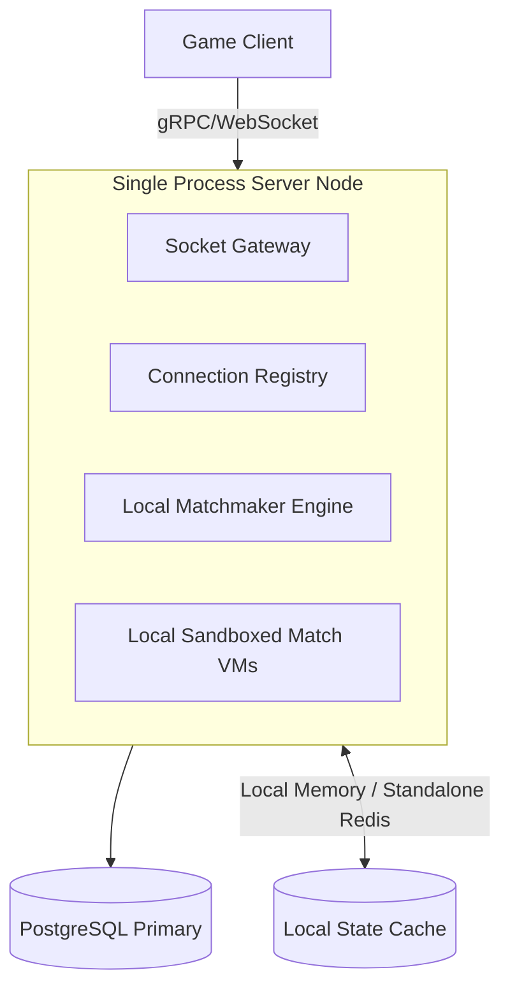
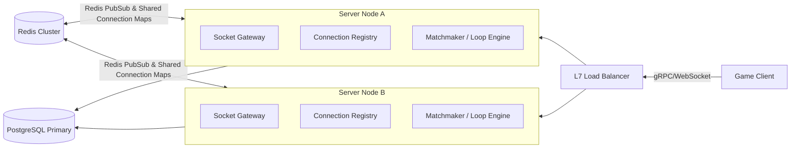
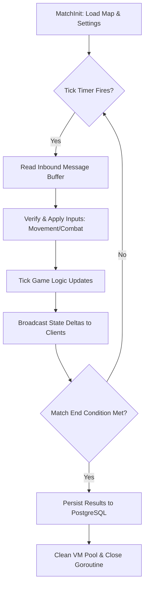
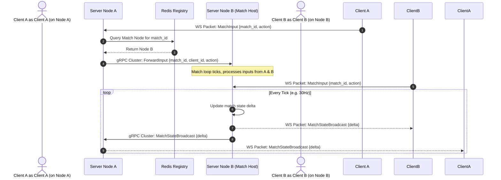
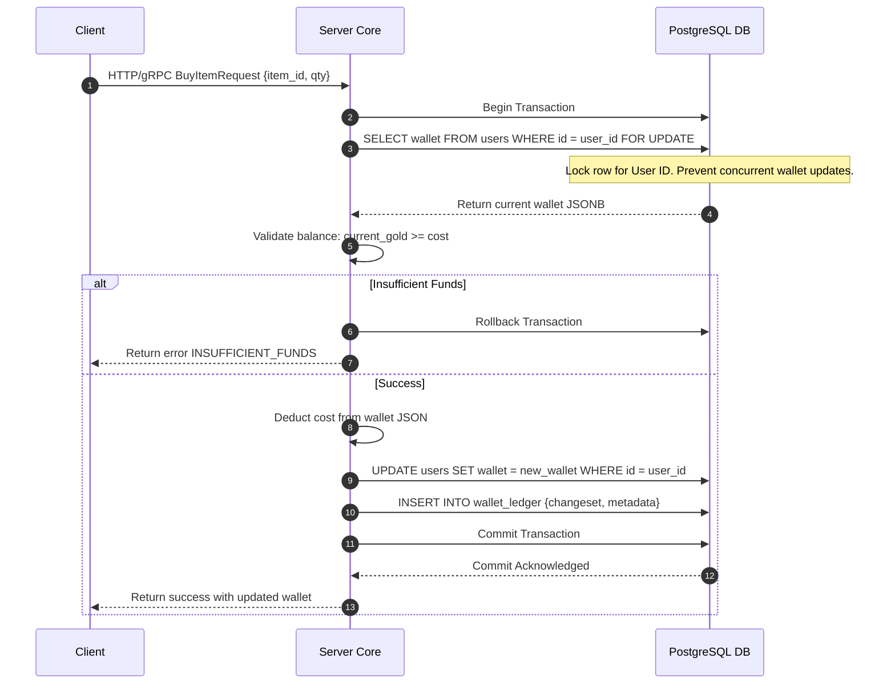

# High Level Design (HLD)

> **Project:** Ultimate Game Engine — Multiplayer Game Server  
> **Technical Design:** High Level Design (HLD)  
> **Version:** 1.0  
> **Last Updated:** 2026-07-02  
> **Status:** Draft  
> **Priority:** Technical Architecture

---

## 1. System Topology & Infrastructure

The game server framework supports two distinct topologies: **Single-Node** and **Multi-Node Distributed**.

### 1.1 Single-Node Topology

In local development or small-scale deployments, the game server operates as a monolithic, single-process node. All internal communication is handled in-memory.



### 1.2 Multi-Node Distributed Topology

For production and high concurrency workloads, the game server scales horizontally as a cluster of stateless compute nodes situated behind a Layer 7 load balancer. Shared state and inter-node synchronization are offloaded to a Redis cluster.



---

## 2. Real-Time Socket Gateway Design

The Socket Gateway is the entry point for all long-lived, bi-directional client connections.

### 2.1 Connection Handshake and Upgrades
1. Client issues HTTP `GET /v2/stream` with a Bearer JWT token in headers or query parameters.
2. The Gateway validates the JWT signature, extracts user ID/session ID, and checks the connection rate limits.
3. Upon success, HTTP connection is upgraded to WebSocket (RFC 6455).
4. The active connection is registered in the node's local **Connection Registry**.

### 2.2 Heartbeats and Eviction
- **Ping Interval**: The server sends a WebSocket ping frame every **15 seconds**.
- **Pong Deadline**: The client must reply with a pong frame within **30 seconds**. If missed, the socket is disconnected.
- **Grace Window**: Eviction triggers a **30-second grace window**. If the client reconnects with the same session token to any node in the cluster, they resume their active streams without state loss.

---

## 3. Matchmaker Engine Design

The Matchmaker operates as a high-performance matching loop that runs asynchronously inside the server core.

```mermaid
sequenceDiagram
    autonumber
    actor Client A
    actor Client B
    participant Gateway as Socket Gateway
    participant Redis as Redis Cache
    participant Matchmaker as Matchmaker Worker
    participant Loop as Authoritative Loop
    
    Client A->>Gateway: WS: ticket_submit {queue="ranked_pvp"}
    Gateway->>Redis: SADD/ZADD ticket into queue pool
    
    Client B->>Gateway: WS: ticket_submit {queue="ranked_pvp"}
    Gateway->>Redis: SADD/ZADD ticket into queue pool
    
    loop Every 1000ms
        Matchmaker->>Redis: Fetch all queued tickets for "ranked_pvp"
        Matchmaker->>Matchmaker: Sort tickets by wait time & skill rating
        Matchmaker->>Matchmaker: Run pairing evaluation (MMR range expansion)
        Note over Matchmaker: Pair found: Client A & Client B!
        Matchmaker->>Redis: Remove Client A & B tickets
        Matchmaker->>Loop: Spawn Authoritative Match Loop
        Loop-->>Matchmaker: Return match ID & connection token
        Matchmaker->>Gateway: Publish match event to Client A & B sessions
    end
    
    Gateway-->>Client A: WS: matchmaker_matched {match_id, token}
    Gateway-->>Client B: WS: matchmaker_matched {match_id, token}
```

---

## 4. Authoritative Loop Engine Design

Authoritative matches run in dedicated goroutines on the server nodes, enforcing state rules and validation.



### 4.5 Inter-Node Message Routing Sequence

Depending on the operational mode, message routing behaves as follows:
- **Single-Node Mode:** WebSocket message inputs bypass external networks and are dispatched directly to local VM goroutine queues using in-memory channels.
- **Multi-Node Mode:** A distributed Redis Registry maps active `match_id` values to the hosting `node_id`. Nodes use a peer-to-peer gRPC mesh to forward client inputs and broadcast state deltas across node boundaries.



---

## 5. Social Adjacency Graph Engine

The social system is built on a directed edge graph model persisted in the `user_edge` database table.

### 5.1 Mutual Friendship Edges
A mutual friendship consists of two distinct rows in `user_edge`:
- Row 1: `(source_id = User A, destination_id = User B, state = 0)`
- Row 2: `(source_id = User B, destination_id = User A, state = 0)`

### 5.2 Edge Mutation Lifecycle
- **Add Friend Request**: Inserts edge `A -> B` with state `1` (invite sent) and edge `B -> A` with state `2` (invite received) inside a transaction.
- **Accept Friend Request**: Updates both edges to state `0` (friend).
- **Block User**: Inserts edge `A -> B` with state `3` (blocked) and deletes any existing `B -> A` edge to prevent interaction.

---

## 6. Economy Transaction Pipelines

To prevent virtual currency double-spends and database race conditions, wallet modifications follow a strict pessimistic locking transaction pipeline.



---

## 7. Linked Documents
- [SAD (Software Architecture Document)](./SAD.md)
- [TDD Index](../TDD/00_index.md) (Technical Design Documents Index)
