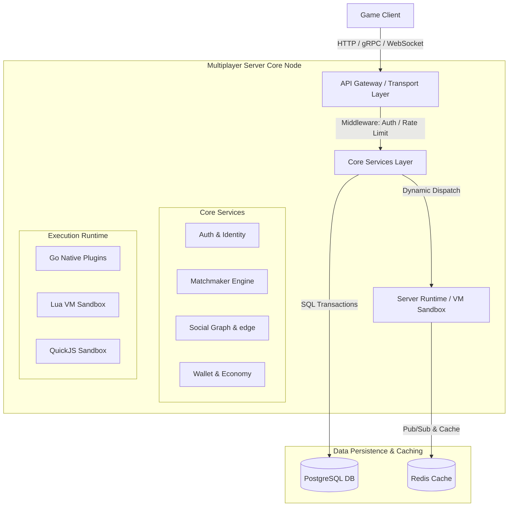
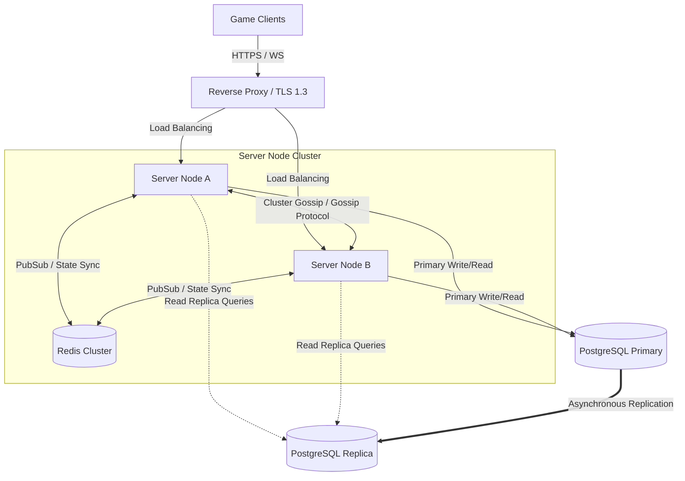

# Software Architecture Document (SAD)

> **Project:** Ultimate Game Engine — Multiplayer Game Server  
> **Technical Design:** Software Architecture Document (SAD)  
> **Version:** 1.0  
> **Last Updated:** 2026-07-02  
> **Status:** Draft  
> **Priority:** Technical Architecture

---

## 1. Purpose & Scope

This document provides a comprehensive architectural overview of the **Ultimate Game Engine Multiplayer Game Server** framework. It details the logical structure, process models, deployment topology, and core mechanisms that allow the server to support real-time and session-based multiplayer game genres (e.g. FPS, MOBA, RTS, RPG, card, and casual games) at scale.

---

## 2. Architectural Representation

The framework leverages a **layered service-oriented architecture** composed of four distinct layers:

### 2.1 Logical Layering
1. **API Gateway / Transport Layer**: Handles TCP connections, upgrades WebSockets, deserializes payloads (JSON/Protobuf), checks rate limits, and validates JWT headers.
2. **Core Services Layer**: Business-level services (User Authentication, Leaderboards, Matchmaking, Friends, Parties, Guilds, Economy, IAP Validation).
3. **Execution Runtime (VM Sandbox)**: Ephemeral, isolated virtual machines (Lua/JavaScript) or compiled Go plugins executing server-side custom logic, match loops, and event hooks.
4. **Data Persistence Layer**: PostgreSQL (transactional persistence) and Redis (real-time presence, cluster pub/sub, matchmaker tickets).

### 2.2 Deployment Topology (Process View)
The server runs as a multi-node cluster behind a reverse proxy (e.g., NGINX/Envoy) with TLS termination.

### 2.3 Single-Node vs. Multi-Node Operational Modes

The game server operates across two execution profiles, allowing seamless transitions from local development to production clustering:

#### Single-Node Profile (Development & Small Scale)
- **State Localization:** Ephemeral state (matchmaker tickets, active presence, session blocklists) is maintained in local memory structures (Go maps/channels) or a standalone Redis instance.
- **Authoritative Matches:** All VM sandboxes run within the single process, executing loops on local threads.
- **Inter-Service Communication:** Handled via local direct method calls, sync primitives, and internal Go channels, introducing zero network overhead.
- **Storage:** Direct connection from the single node to the primary PostgreSQL database.

#### Multi-Node Profile (Horizontal Production Scale)
- **Stateless Compute Nodes:** Multiple application nodes run statelessly behind a Layer 7 Load Balancer. User identity is validated cryptographically via stateless JWTs on any node.
- **Distributed State Mesh:** Ephemeral state is shifted to a distributed Redis Cluster. Tickets are stored in sorted sets, and match locations are tracked in a hash registry.
- **Redlock Coordination:** Multi-node operations (such as tournament reward sweeps or matchmaking tick checks) use Redis-based distributed locks (Redlock) to ensure only one coordinator node processes a queue at a time.
- **gRPC Routing Mesh:** Nodes establish a peer-to-peer gRPC mesh. Client WebSocket packets landing on Node A are forwarded over gRPC to Node B if Node B is hosting the client's authoritative match.
- **Storage Scalability:** Offloads read queries to PostgreSQL read replicas and supports CockroachDB for multi-region scale.

---

## 3. Architectural Goals & Constraints

- **Throughput & Scale**: Support up to **10,000 concurrent WebSocket connections** and **500 active authoritative match loops** per node.
- **Latency (SLA)**: WebSocket packet routing p99 <5ms; RPC execution p99 <200ms; database query p99 <50ms (for indexed read replica queries).
- **Zero-Downtime Migration**: Database schema updates must execute transactionally with no table lockouts on active tables.
- **Security & Cheat Prevention**: Authoritative match loop coordinates and actions must validate server-side in isolated runtime threads.

---

## 4. Key Architectural Mechanisms

### 4.1 Authentication & Session Lifecycles
Authentication relies on standard cryptographic JWTs signed using HMAC-SHA256 (HS256) or RS256. Upon verification, the gateway generates:
1. **Access Token**: Short-lived (1 hour) token containing user ID, username, and role claims.
2. **Refresh Token**: Long-lived (30 days) single-use cryptographically random UUID. On use, a new refresh token is issued (token rotation) to prevent session hijacking.

### 4.2 Optimistic Concurrency Control (OCC)
For the NoSQL-style user storage engine, writes enforce OCC using MD5 value hashes as version strings. If the client writes an object with a version that does not match the current database row version, the update fails with `409 Conflict`, requiring the client to reload and merge.

### 4.3 Atomic Wallet Mutations
Virtual wallet ledger writes require `SELECT FOR UPDATE` pessimistic locks on the user's wallet JSONB field to guarantee that multiple concurrent mutations (e.g. parallel loot box openings) do not result in double-spends or negative balances.

### 4.4 Sandboxed Logic Execution
Custom RPC functions, matchmaking filters, and game loop updates execute in memory-isolated Lua threads or QuickJS/V8 isolates with no direct access to filesystem, OS, or inter-vm memory namespaces.

---

## 5. High-Level Data Model

- **`users`**: Base identity data with `wallet` JSONB and social provider links.
- **`user_device`**: Device-linked data for hardware tracking, push notifications, and bans.
- **`user_edge`**: Directed social adjacency list `(source_id, state, position)` with unique constraint `(source_id, destination_id)`.
- **`leaderboard_record`**: Composite index `(leaderboard_id, score DESC, subscore DESC, update_time ASC) INCLUDE (expiry_time)` for rank and tournament query optimization.
- **`storage`**: Key-value data with GIN index on `value` JSONB supporting JSON path operations.

---

## 6. Performance & Security Considerations

### Performance
- **Connection Health Checks**: Use `db.PingContext()` with backoffs to maintain database pool resilience.
- **Table Partitioning**: Implement monthly range partitioning on `message` and `wallet_ledger` tables when records exceed 50 million rows.
- **Read-Replica Routing**: Route all analytical and read-only searches (friend listings, leaderboard scans) to replicas, reserving primary for transactional writes.

### Security
- **Sandbox CPU/Memory Budgets**: Limit VM instances to **64 MB memory** and **10M instructions** to prevent CPU starvation.
- **Input Filtering**: Enforce 4 KB payload size caps on all WebSocket and RPC incoming payloads.
- **TLS Hardening**: Disable legacy TLS versions; support TLS 1.3 only with AES-GCM and ChaCha20-Poly1305 cipher suites.

---

## 7. Linked Documents
- [BRD Index](../BRD/00_index.md) (Business Requirements Index)
- [PRD Index](../PRD/00_index.md) (Product Requirements Index)
- [TDD Index](../TDD/00_index.md) (Technical Design Index)
