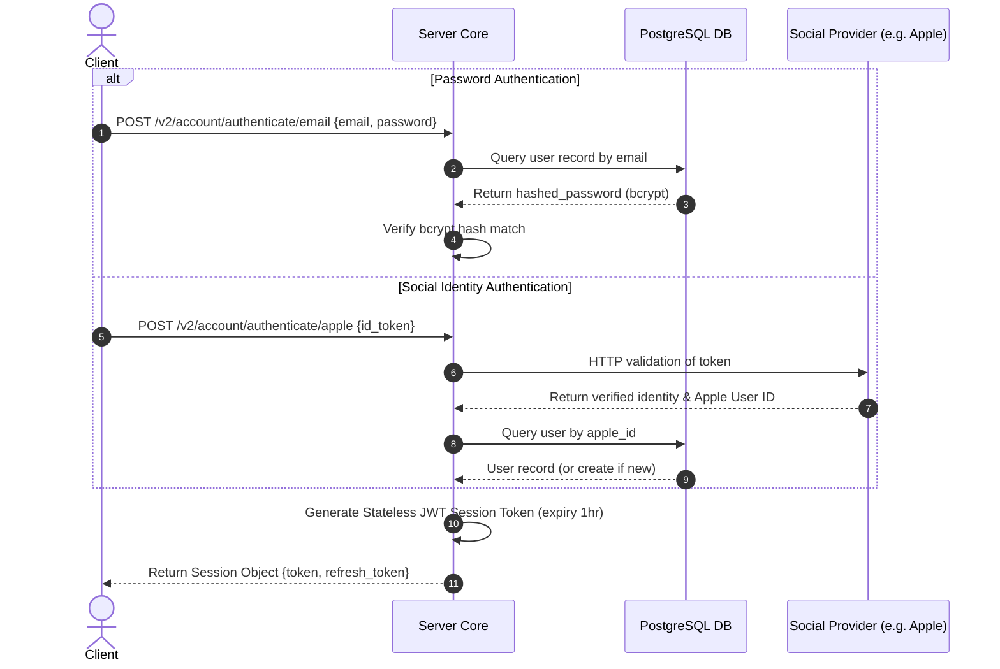

# TDD-01: User Authentication

> **Project:** Ultimate Game Engine — Multiplayer Game Server  
> **Technical Design:** User Authentication  
> **Version:** 1.0  
> **Last Updated:** 2026-07-01  
> **Status:** Draft  
> **Priority:** Technical Architecture

---

## 1. Purpose & Scope

Define the technical design for a comprehensive user authentication system that supports multiple identity providers, session management, and account linking. This system serves as the foundational identity layer for all other game server features.

---

Refer to [BRD-01](../BRD/01_user_authentication.md) for the business requirements and [PRD-01](../PRD/01_user_authentication.md) for the API surface.

---

## 2. Architecture & Design Flow

Authentication flow verifies client identity using password hashes or third-party OAuth provider endpoints. Once identity is verified, the server generates a cryptographically signed JWT token.

### Authentication Sequence Flow


---

## 3. Database Schema & Data Models

### Raw DDL Schemas

```sql
-- Users Table
CREATE TABLE IF NOT EXISTS users (
    id                        UUID PRIMARY KEY,
    username                  VARCHAR(128) NOT NULL CONSTRAINT users_username_key UNIQUE,
    display_name              VARCHAR(255),
    avatar_url                VARCHAR(512),
    lang_tag                  VARCHAR(18) NOT NULL DEFAULT 'en',
    location                  VARCHAR(255),
    timezone                  VARCHAR(255),
    metadata                  JSONB NOT NULL DEFAULT '{}',
    wallet                    JSONB NOT NULL DEFAULT '{}',
    email                     VARCHAR(255) UNIQUE,
    password                  BYTEA CHECK (length(password) < 32000),
    facebook_id               VARCHAR(128) UNIQUE,
    google_id                 VARCHAR(128) UNIQUE,
    gamecenter_id             VARCHAR(128) UNIQUE,
    steam_id                  VARCHAR(128) UNIQUE,
    custom_id                 VARCHAR(128) UNIQUE,
    apple_id                  VARCHAR(128) UNIQUE,
    facebook_instant_game_id  VARCHAR(128) UNIQUE,
    edge_count                INT NOT NULL DEFAULT 0 CHECK (edge_count >= 0),
    create_time               TIMESTAMPTZ NOT NULL DEFAULT now(),
    update_time               TIMESTAMPTZ NOT NULL DEFAULT now(),
    verify_time               TIMESTAMPTZ NOT NULL DEFAULT '1970-01-01 00:00:00 UTC',
    disable_time              TIMESTAMPTZ NOT NULL DEFAULT '1970-01-01 00:00:00 UTC'
);

-- User Device Table
CREATE TABLE IF NOT EXISTS user_device (
    PRIMARY KEY (id),
    FOREIGN KEY (user_id) REFERENCES users (id) ON DELETE CASCADE,

    id                  VARCHAR(128) NOT NULL,
    user_id             UUID NOT NULL,
    preferences         JSONB NOT NULL DEFAULT '{}',
    push_token_amazon   VARCHAR(512) NOT NULL DEFAULT '',
    push_token_android  VARCHAR(512) NOT NULL DEFAULT '',
    push_token_huawei   VARCHAR(512) NOT NULL DEFAULT '',
    push_token_ios      VARCHAR(512) NOT NULL DEFAULT '',
    push_token_web      VARCHAR(512) NOT NULL DEFAULT '',

    UNIQUE (user_id, id)
);

-- User Tombstone Table
CREATE TABLE IF NOT EXISTS user_tombstone (
    PRIMARY KEY (create_time, user_id),

    user_id        UUID NOT NULL UNIQUE,
    create_time    TIMESTAMPTZ NOT NULL DEFAULT now()
);
```

### Table Indexes

```sql
-- Social / Provider Lookup Indexes
CREATE UNIQUE INDEX IF NOT EXISTS idx_users_email ON users(email) WHERE email IS NOT NULL;
CREATE UNIQUE INDEX IF NOT EXISTS idx_users_apple_id ON users(apple_id) WHERE apple_id IS NOT NULL;
CREATE UNIQUE INDEX IF NOT EXISTS idx_users_google_id ON users(google_id) WHERE google_id IS NOT NULL;
CREATE UNIQUE INDEX IF NOT EXISTS idx_users_facebook_id ON users(facebook_id) WHERE facebook_id IS NOT NULL;
CREATE UNIQUE INDEX IF NOT EXISTS idx_users_gamecenter_id ON users(gamecenter_id) WHERE gamecenter_id IS NOT NULL;
CREATE UNIQUE INDEX IF NOT EXISTS idx_users_steam_id ON users(steam_id) WHERE steam_id IS NOT NULL;
CREATE UNIQUE INDEX IF NOT EXISTS idx_users_custom_id ON users(custom_id) WHERE custom_id IS NOT NULL;
CREATE UNIQUE INDEX IF NOT EXISTS idx_users_facebook_instant_game_id ON users(facebook_instant_game_id) WHERE facebook_instant_game_id IS NOT NULL;
CREATE INDEX IF NOT EXISTS idx_users_display_name_trgm ON users USING GIN (display_name gin_trgm_ops);
CREATE INDEX IF NOT EXISTS idx_user_device_user_id ON user_device(user_id);
`````

---

## 4. Algorithmic Logic & Execution Flow

### Token Issuance Logic
1. Receive login request containing credentials or third-party token verification.
2. Calculate/validate credentials:
   - For password logins, match using a bcrypt algorithm with work factor `12`.
   - For refresh token updates, cryptographically verify the token and ensure it is not on the distributed blocklist (e.g., Redis).
3. Build JWT payload claims containing:
   - `sub` (Subject): Player's `user_id`.
   - `usn` (Username): Player's unique username.
   - `iat` (Issued At) and `exp` (Expiry Time): Calculated dynamically.
4. Sign token using HMAC-SHA256 (HS256) or RS256 with the configured secret key.

### Go Session Generation Example

```go
package main

import (
	"errors"
	"time"
	"github.com/golang-jwt/jwt/v4"
	"golang.org/x/crypto/bcrypt"
	"github.com/google/uuid"
)

type Claims struct {
	UserID   string `json:"sub"`
	Username string `json:"usn"`
	jwt.RegisteredClaims
}

func VerifyAndGenerateSession(hashedPassword []byte, suppliedPass string, userID string, username string, secretKey []byte, expirySec int64) (string, string, error) {
	// 1. Password verification
	err := bcrypt.CompareHashAndPassword(hashedPassword, []byte(suppliedPass))
	if err != nil {
		return "", "", errors.New("UNAUTHORIZED")
	}

	// 2. Generate JWT Payload
	claims := Claims{
		UserID:   userID,
		Username: username,
		RegisteredClaims: jwt.RegisteredClaims{
			ExpiresAt: jwt.NewNumericDate(time.Now().Add(time.Duration(expirySec) * time.Second)),
			IssuedAt:  jwt.NewNumericDate(time.Now()),
		},
	}

	// 3. Sign JWT
	tokenObj := jwt.NewWithClaims(jwt.SigningMethodHS256, claims)
	token, err := tokenObj.SignedString(secretKey)
	if err != nil {
		return "", "", err
	}

	// 4. Generate random cryptographically secure Refresh Token
	refreshToken := uuid.New().String()

	return token, refreshToken, nil
}
```

---

## 5. Performance & Security Considerations

### Performance
- **Throughput Target**: Authentication endpoints must sustain ≥5,000 req/sec per node with p99 latency <100ms.
- **Bcrypt Work Factor**: Set to `12` (≈250ms per hash on modern hardware). Do not exceed `14` to avoid login latency spikes.
- **Session Cache**: Active sessions are validated statelessly via JWT signatures, eliminating database lookups on every authenticated request.
- **Connection Pool**: Auth queries should use a dedicated read-replica connection pool to isolate login traffic from write-heavy game operations.

### Security
- **Brute-Force Protection**:
  - Track failed login attempts per account and per IP address.
  - After **5 consecutive failures**, impose a **15-minute temporary lockout** on the account.
  - After **20 failures from a single IP within 10 minutes**, block the IP for 1 hour.
  - Log all lockout events with severity `WARN` for security monitoring.
- **Password Policy**:
  - Minimum length: **8 characters**.
  - Must contain at least one uppercase letter, one lowercase letter, and one digit.
  - Reject passwords found in the top 10,000 common password lists.
- **JWT Key Management**:
  - Minimum secret key length: **256 bits** for HS256; **2048 bits** RSA for RS256.
  - Keys must be loaded from environment variables or a secrets manager (Vault, KMS). Never hardcode.
  - Support **dual-key verification** during key rotation: accept tokens signed by both old and new keys for a configurable grace window (default 24 hours).
- **Refresh Token Rotation**:
  - Issue a new refresh token on every use (single-use rotation).
  - If a previously used refresh token is presented, revoke the entire token family (potential theft detected).
- **Session Revocation**: On password change or account disable, write the user's ID to a distributed Redis blocklist to reject all active JWTs until they naturally expire.
- **Rate Limiting**: Apply per-endpoint token bucket limits:
  - `/v2/account/authenticate/*`: 10 requests/minute per IP.
  - `/v2/account/session/refresh`: 30 requests/minute per user.
- **Input Validation**:
  - Email: Max 255 characters, RFC 5322 format validation.
  - Password: Max 128 characters (prevent bcrypt DoS with extremely long inputs).
  - Username: Max 64 characters, alphanumeric + underscore only.

---

## 6. Linked Documents
- [BRD-01](../BRD/01_user_authentication.md) (Business Requirements Document)
- [PRD-01](../PRD/01_user_authentication.md) (Product Requirements Document)
