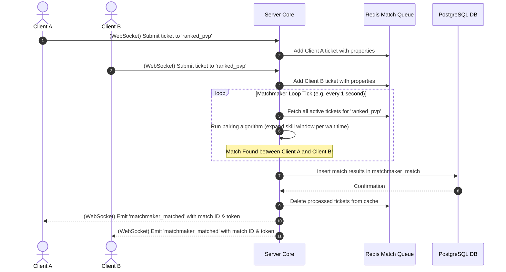

# TDD-02: Multiplayer Matchmaking

> **Project:** Ultimate Game Engine — Multiplayer Game Server  
> **Technical Design:** Multiplayer Matchmaking  
> **Version:** 1.0  
> **Last Updated:** 2026-07-01  
> **Status:** Draft  
> **Priority:** Technical Architecture

---

## 1. Purpose & Scope

Define the technical design for a flexible matchmaking system that pairs players into compatible game sessions based on skill, region, game mode, and custom properties. The system supports solo players, parties, and custom matchmaking logic.

---

Refer to [BRD-02](../BRD/02_multiplayer_matchmaking.md) for the business requirements and [PRD-02](../PRD/02_multiplayer_matchmaking.md) for the API surface.

---

## 2. Architecture & Design Flow

The matchmaking engine processes queued tickets asynchronously using an interval loop (ticks). When matchmaking forms a compatible match, a WebSocket payload notifies players with a one-time connection token.

### Matchmaking System Flow


---

## 3. Database Schema & Data Models

### Raw DDL Schemas

```sql
-- Matchmaking Ticket Table
CREATE TYPE ticket_status AS ENUM ('queued', 'matched', 'cancelled', 'expired');

CREATE TABLE IF NOT EXISTS matchmaking_ticket (
    ticket_id         UUID PRIMARY KEY DEFAULT gen_random_uuid(),
    user_id           UUID NOT NULL REFERENCES users(id) ON DELETE CASCADE,
    queue_name        VARCHAR(64) NOT NULL,
    skill_rating      DOUBLE PRECISION DEFAULT 1000.0 NOT NULL,
    region            VARCHAR(32) NOT NULL,
    properties        JSONB DEFAULT '{}'::jsonb NOT NULL,
    party_members     UUID[] DEFAULT '{}'::uuid[] NOT NULL,
    min_count         INT NOT NULL,
    max_count         INT NOT NULL,
    count_multiple    INT,
    reverse_precision BOOLEAN DEFAULT FALSE NOT NULL,
    status            ticket_status DEFAULT 'queued' NOT NULL,
    created_at        TIMESTAMPTZ DEFAULT CURRENT_TIMESTAMP NOT NULL,
    expires_at        TIMESTAMPTZ NOT NULL,
    matched_at        TIMESTAMPTZ
);

-- Matchmaker Match Result Table
CREATE TYPE match_status AS ENUM ('pending', 'active', 'completed', 'cancelled');

CREATE TABLE IF NOT EXISTS matchmaker_match (
    match_id          UUID PRIMARY KEY DEFAULT gen_random_uuid(),
    queue_name        VARCHAR(64) NOT NULL,
    players           JSONB NOT NULL, -- Array of objects: [{"user_id": "...", "username": "..."}]
    match_token       VARCHAR(256) NOT NULL,
    properties        JSONB DEFAULT '{}'::jsonb NOT NULL,
    region            VARCHAR(32) NOT NULL,
    created_at        TIMESTAMPTZ DEFAULT CURRENT_TIMESTAMP NOT NULL,
    status            match_status DEFAULT 'pending' NOT NULL
);
```

### Table Indexes

```sql
-- Index for quick polling of active matchmaking tickets within a queue
CREATE INDEX IF NOT EXISTS idx_matchmaking_ticket_lookup 
ON matchmaking_ticket (queue_name, status, created_at)
WHERE status = 'queued';

-- GIN index for querying tickets based on custom property JSON matching
CREATE INDEX IF NOT EXISTS idx_matchmaking_ticket_properties 
ON matchmaking_ticket USING gin (properties);

-- Index to optimize matchmaking ticket user lookup and cascade deletes
CREATE INDEX IF NOT EXISTS idx_matchmaking_ticket_user_id ON matchmaking_ticket(user_id);
```

---

## 4. Algorithmic Logic & Execution Flow

### Matchmaking Matching & Window Expansion Algorithm
1. The matchmaking engine ticks every `1000ms`.
2. For each queue (e.g., `ranked_pvp`):
   - Query all tickets where `status = 'queued'`.
   - Sort tickets by `created_at` in ascending order (longest waiting first).
   - For each ticket $T$:
     - Calculate elapsed wait time: $W = \text{now} - T.\text{created\_at}$.
     - Determine the allowed skill delta range based on $W$ (based on the progression curve).
     - Filter candidate tickets whose skill ratings fall within $[T.\text{skill} - \delta, T.\text{skill} + \delta]$ and match $T.\text{region}$.
     - If `reverse_precision` is active, verify bidirectional compatibility: ensure $T$'s properties also satisfy each candidate ticket's parameters.
     - Group matching candidates up to the queue's `max_count`. If candidates reach `min_count`, form a match.

### Skill Range Expansion Config
```
Wait Time (seconds) | Skill Delta Range Allowed (±)
------------------- | ----------------------------
0-5 seconds         | ±50 MMR
5-10 seconds        | ±75 MMR
10-20 seconds       | ±125 MMR
20-30 seconds       | ±200 MMR
30-60 seconds       | ±350 MMR
>60 seconds         | ±500 MMR (Maximum cap)
```

### Go Matching Evaluator Example

```go
package main

import (
	"math"
	"time"
)

type Ticket struct {
	TicketID    string
	UserID      string
	SkillRating float64
	CreatedAt   time.Time
	Region      string
}

func GetSkillDelta(waitSeconds float64) float64 {
	if waitSeconds < 5 {
		return 50
	}
	if waitSeconds < 10 {
		return 75
	}
	if waitSeconds < 20 {
		return 125
	}
	if waitSeconds < 30 {
		return 200
	}
	if waitSeconds < 60 {
		return 350
	}
	return 500
}

func EvaluatePairing(t1, t2 Ticket) bool {
	if t1.Region != t2.Region {
		return false
	}

	now := time.Now()
	wait1 := now.Sub(t1.CreatedAt).Seconds()
	wait2 := now.Sub(t2.CreatedAt).Seconds()

	delta1 := GetSkillDelta(wait1)
	delta2 := GetSkillDelta(wait2)

	diff := math.Abs(t1.SkillRating - t2.SkillRating)

	// Both tickets must satisfy each other's skill range constraints
	return diff <= delta1 && diff <= delta2
}
```

---

## 6. Performance & Security Considerations

### Performance
- **Tick Loop Scalability**: The matchmaker evaluates all queued tickets per tick. At >5,000 concurrent tickets, apply **bucket-based skill grouping** (partition tickets into ±100 MMR bands) to reduce pairing evaluation from O(N²) to O(N × B) where B is bucket size.
- **Maximum Ticket Pool**: Cap at **10,000 active tickets per queue**. Beyond this threshold, reject new submissions with `RESOURCE_EXHAUSTED` and alert operators.
- **Ticket TTL**: Enforce `expires_at` strictly. Expired tickets must be garbage-collected every tick cycle, not left in the queue.
- **Memory Budget**: Each ticket should consume ≤2 KB in-memory. With 10,000 tickets, total matchmaker memory ≤20 MB per queue.
- **Latency Target**: Each matchmaker tick must complete within **500ms** (p99). If tick processing exceeds this, split queues across dedicated goroutines.

### Security
- **Rate Limiting**: Max **1 active matchmaking ticket per user** at any time. Reject duplicate submissions with `ALREADY_EXISTS`.
- **Input Validation**:
  - `skill_rating`: Must be within `[0, 10000]` range. Reject outliers.
  - `queue_name`: Max 64 characters, alphanumeric and underscore only.
  - `properties` JSONB: Max 4 KB, max nesting depth of 3.
  - `min_count` / `max_count`: Must satisfy `2 ≤ min_count ≤ max_count ≤ 100`.
- **Abuse Prevention**: Track ticket submission frequency per user. If a user submits and cancels >10 tickets within 5 minutes, impose a 5-minute matchmaking cooldown.
- **Match Token Security**: The `match_token` issued on match formation must be cryptographically random (≥128 bits), single-use, and expire within 30 seconds.

---

## 5. Linked Documents
- [BRD-02](../BRD/02_multiplayer_matchmaking.md) (Business Requirements Document)
- [PRD-02](../PRD/02_multiplayer_matchmaking.md) (Product Requirements Document)
