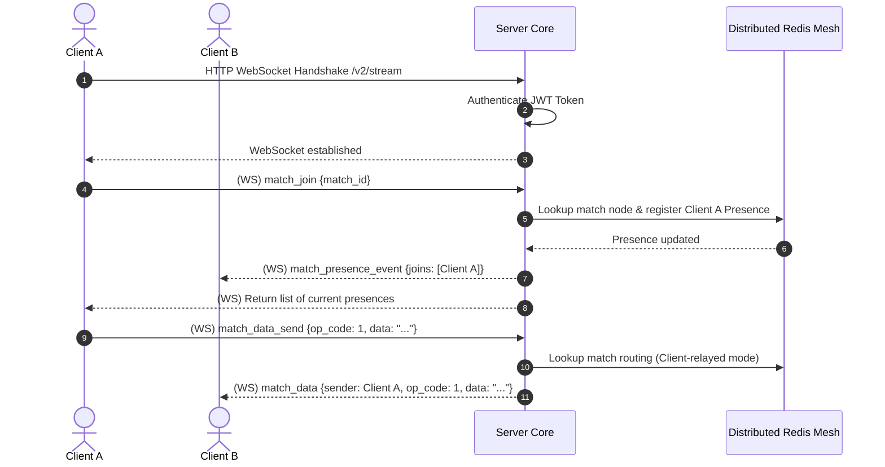

# TDD-03: Realtime Multiplayer

> **Project:** Ultimate Game Engine — Multiplayer Game Server  
> **Technical Design:** Realtime Multiplayer  
> **Version:** 1.0  
> **Last Updated:** 2026-07-01  
> **Status:** Draft  
> **Priority:** Technical Architecture

---

## 1. Purpose & Scope

Define the technical design for a realtime multiplayer infrastructure that supports low-latency game state synchronization, presence tracking, and reliable/unreliable message delivery over persistent connections. This system enables a wide range of game genres including FPS, MOBA, RTS, racing, board games, and card games.

---

Refer to [BRD-03](../BRD/03_realtime_multiplayer.md) for the business requirements and [PRD-03](../PRD/03_realtime_multiplayer.md) for the API surface.

---

## 2. Architecture & Design Flow

The multiplayer engine supports client-relayed matches (where packets are forwarded without parsing) and server-authoritative matches (where tick loops evaluate input).

### Connection and Event Relay Sequence


---

## 3. Distributed In-Memory State (Redis)

Active match listings and registration metadata are held entirely in distributed cache (Redis) to support fast multi-node queries and avoid PostgreSQL write contention.

### Match Metadata (Redis Hash)
- **Key:** `match:metadata:{match_id}`
- **Fields:** `label`, `player_count`, `max_size`, `authoritative`, `node` (the specific Server Node hosting the match tick loop).

### In-Memory Structures
```typescript
interface Presence {
  userId: string;
  sessionId: string;
  username: string;
  node: string;
  status: string; // Custom status JSON string
  isSpectator: boolean;
  joinedAt: Date;
}

interface MatchSessionRegistry {
  matchId: string;
  label: string;
  authoritative: boolean;
  handlerName?: string;
  maxSize: number;
  presences: Map<string, Presence>; // Key: sessionId
  createdAt: Date;
}
```

---

## 4. Algorithmic Logic & Execution Flow

### Connection Heartbeat & Timeout Handling
1. Upon connection, the socket starts a read timeout tracking window (default: `30 seconds`).
2. The server sends ping frames at regular intervals (default: `15 seconds`).
3. If a client fails to reply with a pong or send a message before the timeout elapsed, the connection is considered dead.
4. Upon disconnect:
   - The user is placed in a "disconnected" state, starting the `reconnect_grace_sec` grace period (default: `30s`).
   - If the client reconnects with the same session token within `30s`, they rejoin active matches automatically.
   - If the grace period expires, they are evicted from all match registries, and presence leave events are broadcast.

### Presence and Routing in Operational Profiles

State representation and message relay behavior differ based on the deployment scale:
- **Single-Node Mode:**
  - **In-Memory Registries:** Active client connections and room registrations are stored locally in a thread-safe map (`sync.Map`) representing `MatchSessionRegistry`.
  - **Local Relay:** When a client broadcasts data in client-relayed mode, the local node iterates over the local presence map and writes directly to each participant's WebSocket write buffer.
- **Multi-Node Mode:**
  - **Redis-Backed Synchronization:** Client connections are distributed across multiple server nodes. Active matches, room registries, and metadata are maintained globally in Redis (`match:metadata:{match_id}`).
  - **Pub/Sub Broadcasts:** In client-relayed matches, when Node A receives a packet from Client A:
    - Node A publishes the message payload to a cluster-wide Redis Pub/Sub channel (`match:relay:{match_id}`).
    - All nodes subscribing to the match channel receive the payload and relay it to their locally connected participants.

### Go WebSocket Message Routing Example

```go
package main

import (
	"encoding/json"
	"github.com/gorilla/websocket"
)

type Envelope struct {
	Cid     string          `json:"cid,omitempty"`
	Payload json.RawMessage `json:"match_data_send,omitempty"`
}

type MatchDataSend struct {
	MatchId  string `json:"match_id"`
	OpCode   int64  `json:"op_code"`
	Data     string `json:"data"` // base64 encoded
	Reliable bool   `json:"reliable"`
}

func RouteMessage(conn *websocket.Conn, envelope []byte, broadcastChan chan<- MatchDataSend) {
	var env Envelope
	if err := json.Unmarshal(envelope, &env); err != nil {
		return
	}

	if env.Payload != nil {
		var payload MatchDataSend
		if err := json.Unmarshal(env.Payload, &payload); err == nil {
			// Send into processing queue or broadcast directly to other connections
			broadcastChan <- payload
		}
	}
}
```

---

## 6. Performance & Security Considerations

### Performance
- **Connection Limits**: Max **10,000 concurrent WebSocket connections per node**. Beyond this, return `503 Service Unavailable` and route new connections to other cluster nodes.
- **Per-Connection Memory**: Allocate fixed-size read/write buffers of **4 KB each** (8 KB total per connection). Use `bufio.Reader` pooling to reclaim buffers on disconnect.
- **Message Throughput**: Max **60 inbound messages per second per connection**. Excess messages are dropped silently with a rate-limit counter metric.
- **Broadcast Batching**: Outbound state broadcasts to match participants should be coalesced into a single write per tick cycle rather than per-message fan-out.
- **Match Registry**: Use a `sync.Map` or sharded concurrent map for O(1) match lookups. Avoid global mutex contention on the registry.
- **Latency Target**: WebSocket message relay (client→server→client) must complete within **5ms** (p99) for client-relayed matches.

### Security
- **Handshake Authentication**: The WebSocket upgrade request **must** include a valid JWT in the query parameter or header. Reject unauthenticated upgrades immediately.
- **Handshake Timeout**: If the client does not complete the WebSocket handshake within **5 seconds**, close the TCP connection.
- **Message Size Limit**: Max inbound WebSocket frame size: **4 KB** (4096 bytes). Frames exceeding this limit trigger an immediate connection close with code `1009` (Message Too Big).
- **Origin Validation**: Enforce `Origin` header checking against a configurable allowlist to prevent cross-site WebSocket hijacking.
- **Presence Spoofing**: Clients must not be able to set arbitrary `userId` or `sessionId` in presence events. The server must inject these from the authenticated session context.
- **Reconnection Security**: On reconnect within the grace period, re-validate the session token. Expired or revoked tokens must not allow automatic rejoin.

---

## 5. Linked Documents
- [BRD-03](../BRD/03_realtime_multiplayer.md) (Business Requirements Document)
- [PRD-03](../PRD/03_realtime_multiplayer.md) (Product Requirements Document)
