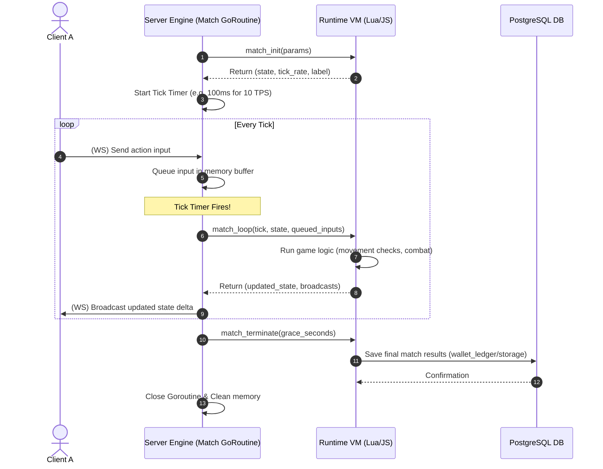

# TDD-04: Authoritative Game Server

> **Project:** Ultimate Game Engine — Multiplayer Game Server  
> **Technical Design:** Authoritative Game Server  
> **Version:** 1.0  
> **Last Updated:** 2026-07-01  
> **Status:** Draft  
> **Priority:** Technical Architecture

---

## 1. Purpose & Scope

Define the technical design for an authoritative game server where game logic executes server-side, preventing cheating and ensuring fair gameplay. The server validates all player actions, owns game state, and distributes results to clients.

---

Refer to [BRD-04](../BRD/04_authoritative_game_server.md) for the business requirements and [PRD-04](../PRD/04_authoritative_game_server.md) for the API surface.

---

## 2. Architecture & Design Flow

The authoritative server engine spawns a dedicated goroutine/thread to process each match. The match updates on a tick timer, maintaining and modifying state in memory.

### Authoritative Tick Loop Flow


---

## 3. Database Schema & Data Models

Authoritative matches are ephemeral, stateful processing objects stored in-memory. They do not write persistent state to database tables during active gameplay. At termination, results are logged into custom `storage` collections or `wallet_ledger` entries (see [TDD-12](./12_storage_engine.md) and [TDD-13](./13_economy_system.md)).

Active match metadata is stored dynamically in the Redis Match Registry (see [TDD-03](./03_realtime_multiplayer.md)).

### In-Memory Virtual Machine Isolation
To ensure robustness and isolation, each match runs in its own sandboxed context:
- **TypeScript/JavaScript**: Instantiates a separate QuickJS runtime / V8 Isolate per match, sharing no global variables.
- **Lua**: Spawns an isolated Lua thread (`lua_newthread`) with restricted global tables (disallowing `os`, `io`, or `dofile` access to prevent filesystem tampering).

---

## 4. Algorithmic Logic & Execution Flow

### Authoritative Loop Algorithm
1. Spawns match thread; invokes `match_init` to define starting state and `tick_rate`.
2. Initiates tick timer (e.g., $1000 / \text{tick\_rate}$ milliseconds).
3. The server main loop runs indefinitely:
   - On incoming WebSocket packets, appends the packet payload to the match `input_buffer`.
   - On tick timer trigger:
     - Copies `input_buffer` contents to `active_inputs` and clears `input_buffer` to avoid race conditions.
     - Calls `match_loop(context, state, tick, active_inputs)`.
     - Validates runtime duration; if execution exceeds `match.handler_execution_timeout_ms` (default 50ms), logs warning or terminates to avoid blocking CPU cores.
     - Invokes the broadcast callback to route state updates.
     - If the handler returns `nil` state, breaks loop to initiate termination.

### Go Authoritative Match Handler Template

```go
package main

import (
	"context"
	"database/sql"
	"math"
)

type Presence struct {
	UserID    string
	SessionID string
	Username  string
}

type PlayerState struct {
	X      float64 `json:"x"`
	Y      float64 `json:"y"`
	Health int     `json:"health"`
}

type MatchState struct {
	Players map[string]*PlayerState `json:"players"`
	Phase   string                  `json:"phase"`
}

type Match struct{}

func (m *Match) MatchInit(ctx context.Context, logger interface{}, db *sql.DB, nk interface{}, params map[string]interface{}) (interface{}, int, string) {
	state := &MatchState{
		Players: make(map[string]*PlayerState),
		Phase:   "waiting",
	}
	tickRate := 10
	label := `{"mode":"casual"}`
	return state, tickRate, label
}

func (m *Match) MatchJoinAttempt(ctx context.Context, logger interface{}, db *sql.DB, nk interface{}, dispatcher interface{}, tick int64, state interface{}, presence Presence, metadata map[string]string) (interface{}, bool, string) {
	s := state.(*MatchState)
	allow := len(s.Players) < 4
	rejectReason := ""
	if !allow {
		rejectReason = "Match full"
	}
	return s, allow, rejectReason
}

func (m *Match) MatchJoin(ctx context.Context, logger interface{}, db *sql.DB, nk interface{}, dispatcher interface{}, tick int64, state interface{}, presences []Presence) interface{} {
	s := state.(*MatchState)
	for _, p := range presences {
		s.Players[p.UserID] = &PlayerState{X: 0, Y: 0, Health: 100}
	}
	return s
}

type MsgInput struct {
	X float64 `json:"x"`
	Y float64 `json:"y"`
}

func (m *Match) MatchLoop(ctx context.Context, logger interface{}, db *sql.DB, nk interface{}, dispatcher interface{}, tick int64, state interface{}, messages []interface{}) interface{} {
	s := state.(*MatchState)

	// Simulate validation loop:
	for _, msg := range messages {
		// Mock data parsing:
		var input MsgInput
		senderID := "mock_sender"
		player := s.Players[senderID]
		if player != nil {
			if math.Abs(input.X-player.X) <= 5 {
				player.X = input.X
				player.Y = input.Y
			}
		}
	}

	// End condition check
	if len(s.Players) == 0 {
		return nil // Terminate match
	}

	return s
}

func (m *Match) MatchLeave(ctx context.Context, logger interface{}, db *sql.DB, nk interface{}, dispatcher interface{}, tick int64, state interface{}, presences []Presence) interface{} {
	s := state.(*MatchState)
	for _, p := range presences {
		delete(s.Players, p.UserID)
	}
	return s
}

func (m *Match) MatchTerminate(ctx context.Context, logger interface{}, db *sql.DB, nk interface{}, dispatcher interface{}, tick int64, state interface{}, graceSeconds int) interface{} {
	return nil
}
```

---

## 6. Performance & Security Considerations

### Performance
- **Concurrent Match Limit**: Max **500 active authoritative matches per node**. Beyond this, reject new match creation with `RESOURCE_EXHAUSTED` and redirect to other cluster nodes.
- **Match State Memory Budget**: Max **1 MB** of in-memory state per match. If `MatchState` serialized size exceeds this, log `WARN` and invoke `MatchTerminate` with a grace period.
- **Tick Execution Timeout**: If `match_loop` execution exceeds **50ms** (configurable via `match.handler_execution_timeout_ms`), log a warning. If it exceeds **200ms** for 3 consecutive ticks, forcefully terminate the match.
- **Match Duration Hard Cap**: Matches must not run longer than **4 hours** (configurable). After the hard cap, the server invokes `MatchTerminate` regardless of game state.
- **Goroutine Lifecycle**: On match termination, ensure the match goroutine exits within 5 seconds. Use `context.WithCancel` for clean teardown. Monitor active goroutine count and alert if it exceeds `concurrent_match_limit × 1.1`.
- **Input Buffer Size**: Cap the `input_buffer` at **100 queued messages per tick**. Excess messages are dropped (FIFO overflow).

### Security
- **VM Sandboxing**:
  - Lua: Disable `os`, `io`, `dofile`, `loadfile`, `require` globals. Only allow whitelisted standard library modules.
  - Go Plugins: Run in the same process (no isolation). Vet all `.so` plugins before deployment. Consider a plugin signature verification step.
- **State Tampering**: Clients **must not** be able to directly set game state. All state mutations flow through `match_loop` server-side validation.
- **Input Validation**: Validate all `match_data_send` payloads:
  - Max payload size: **4 KB**.
  - `op_code`: Must be within `[0, 255]` range.
  - Reject malformed JSON/binary payloads before passing to the match handler.
- **Anti-Cheat**: The authoritative model inherently prevents client-side state manipulation. The movement validation example (`Math.Abs(input.X - player.X) <= 5`) should be extended to include:
  - Server-side cooldown enforcement for abilities and attacks.
  - Speed/teleportation detection (max delta per tick based on character speed stat).
  - Action frequency limiting (max actions per tick per player).

---

## 5. Linked Documents
- [BRD-04](../BRD/04_authoritative_game_server.md) (Business Requirements Document)
- [PRD-04](../PRD/04_authoritative_game_server.md) (Product Requirements Document)
