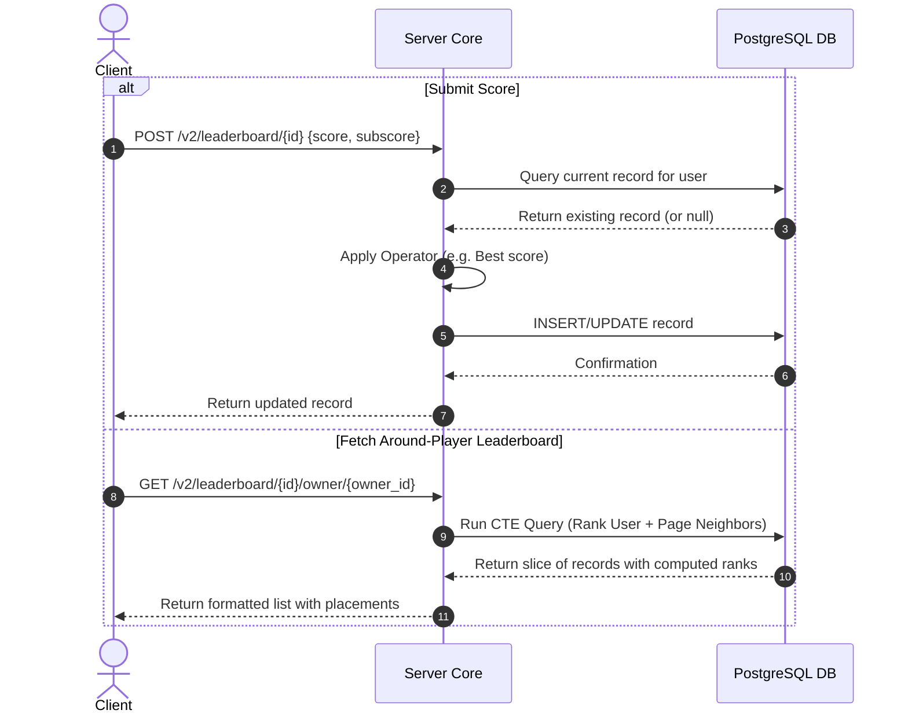

# TDD-05: Leaderboards

> **Project:** Ultimate Game Engine — Multiplayer Game Server  
> **Technical Design:** Leaderboards  
> **Version:** 1.0  
> **Last Updated:** 2026-07-01  
> **Status:** Draft  
> **Priority:** Technical Architecture

---

## 1. Purpose & Scope

Define the technical design for a built-in leaderboard system supporting multiple timeframes, ranking strategies, pagination, and around-player lookups. Leaderboards drive competitive engagement and provide visible progression for players.

---

Refer to [BRD-05](../BRD/05_leaderboards.md) for the business requirements and [PRD-05](../PRD/05_leaderboards.md) for the API surface.

---

## 2. Architecture & Design Flow

The leaderboard system manages configs in PostgreSQL, while updates write records into the database. Dense score queries are indexed to resolve placements dynamically without requiring pre-computed ranks.

### Score Submission & Around-Owner Query Flow


---

## 3. Database Schema & Data Models

### Raw DDL Schemas

```sql
CREATE TABLE IF NOT EXISTS leaderboard (
    id              VARCHAR(128) PRIMARY KEY,
    sort_order      INT DEFAULT 1 NOT NULL, -- 0=ascending, 1=descending
    operator        INT DEFAULT 0 NOT NULL, -- 0=best, 1=set, 2=increment
    reset_schedule  VARCHAR(64), -- Cron expression
    metadata        JSONB DEFAULT '{}'::jsonb NOT NULL,
    authoritative   BOOLEAN DEFAULT FALSE NOT NULL,
    category        INT DEFAULT 0 NOT NULL,
    create_time     TIMESTAMPTZ DEFAULT CURRENT_TIMESTAMP NOT NULL
);

CREATE TABLE IF NOT EXISTS leaderboard_record (
    leaderboard_id  VARCHAR(128) NOT NULL REFERENCES leaderboard(id) ON DELETE CASCADE,
    owner_id        UUID NOT NULL REFERENCES users(id) ON DELETE CASCADE,
    username        VARCHAR(64) NOT NULL,
    score           BIGINT NOT NULL,
    subscore        BIGINT DEFAULT 0 NOT NULL,
    num_score       INT DEFAULT 1 NOT NULL, -- Number of submissions
    metadata        JSONB DEFAULT '{}'::jsonb NOT NULL,
    create_time     TIMESTAMPTZ DEFAULT CURRENT_TIMESTAMP NOT NULL,
    update_time     TIMESTAMPTZ DEFAULT CURRENT_TIMESTAMP NOT NULL,
    expiry_time     TIMESTAMPTZ, -- For reset intervals
    PRIMARY KEY (leaderboard_id, owner_id)
);
```

### Table Indexes

```sql
-- Optimal composite index for querying descending score rankings with covering filter columns (Index-Only Scan)
CREATE INDEX IF NOT EXISTS idx_leaderboard_record_ranking_desc
ON leaderboard_record (leaderboard_id, score DESC, subscore DESC, update_time ASC)
INCLUDE (expiry_time);

-- Optimal composite index for querying ascending score rankings with covering filter columns (Index-Only Scan)
CREATE INDEX IF NOT EXISTS idx_leaderboard_record_ranking_asc
ON leaderboard_record (leaderboard_id, score ASC, subscore ASC, update_time ASC)
INCLUDE (expiry_time);

-- Index to optimize user lookup across leaderboards and cascade deletes
CREATE INDEX IF NOT EXISTS idx_leaderboard_record_owner_id ON leaderboard_record(owner_id);
```

---

## 4. Algorithmic Logic & Execution Flow

### Score Operator Calculations
Upon receiving score $S_{new}$ for user $U$ on leaderboard $L$:
- **Best (`operator = 0`)**:
  - If sorting is descending, save $\max(S_{old}, S_{new})$.
  - If sorting is ascending, save $\min(S_{old}, S_{new})$.
- **Set (`operator = 1`)**:
  - Direct overwrite: save $S_{new}$.
- **Increment (`operator = 2`)**:
  - Cumulative addition: save $S_{old} + S_{new}$.

### Around-Player Rank SQL CTE Query
To fetch the owner and their surrounding players dynamically, the server executes an optimized Common Table Expression (CTE) query:

```sql
WITH RankedLeaderboard AS (
    SELECT 
        owner_id, 
        username, 
        score, 
        subscore, 
        update_time, 
        DENSE_RANK() OVER (ORDER BY score DESC, subscore DESC, update_time ASC) as rank_position
    FROM leaderboard_record
    WHERE leaderboard_id = $1 AND (expiry_time IS NULL OR expiry_time > NOW())
),
TargetPlayer AS (
    SELECT rank_position FROM RankedLeaderboard WHERE owner_id = $2
)
SELECT * FROM RankedLeaderboard
WHERE rank_position BETWEEN 
    (SELECT rank_position - $3 FROM TargetPlayer) AND 
    (SELECT rank_position + $3 FROM TargetPlayer)
ORDER BY rank_position ASC;
```

---

## 6. Performance & Security Considerations

### Performance
- **Rank Caching**: For leaderboards exceeding **100,000 records**, precompute ranks using a **materialized view** refreshed every 60 seconds, or use a **Redis sorted set** as a rank cache with O(log N) lookups.
- **Around-Player Query Optimization**: The `DENSE_RANK()` CTE scans the entire leaderboard. For boards with >1M records, replace with a two-query approach: (1) fetch the player's score, (2) use indexed range scans to fetch neighbors by score value.
- **Read Replica Routing**: All leaderboard read queries (`GET` list, around-player) must be routed to read replicas. Only score submissions hit the primary.
- **Pagination**: Enforce max page size of **100 records** per request. Reject requests for larger pages.
- **Latency Target**: Leaderboard list queries p99 <50ms for boards with ≤100K records.

### Security
- **Score Submission Rate Limiting**: Max **10 score submissions per minute per user per leaderboard**. Prevents score flooding attacks.
- **Authoritative Leaderboards**: When `authoritative = TRUE`, clients cannot submit scores directly. Only server-side code (hooks, match handlers) can write records.
- **Input Validation**:
  - `score` / `subscore`: Must be within `[0, 9223372036854775807]` (int64 max). Reject negative values for non-increment operators.
  - `metadata` JSONB: Max 2 KB per record.
  - Leaderboard `id`: Max 128 characters, alphanumeric, underscores, and hyphens only.
- **Score Integrity**: Log all score writes to an immutable audit trail. Flag anomalous score jumps (e.g., score increases >10× the median delta) for manual review.

---

## 5. Linked Documents
- [BRD-05](../BRD/05_leaderboards.md) (Business Requirements Document)
- [PRD-05](../PRD/05_leaderboards.md) (Product Requirements Document)
