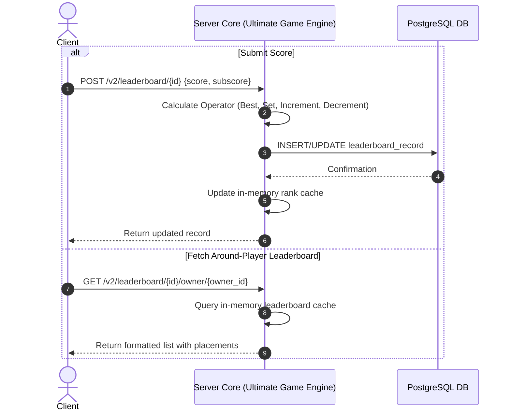

# TDD-05: Leaderboards

> **Project:** Ultimate Game Engine — Multiplayer Game Server  
> **Technical Design:** Leaderboards  
> **Version:** 1.0  
> **Last Updated:** 2026-07-08  
> **Status:** Draft  
> **Priority:** Technical Architecture

---

## 1. Purpose & Scope

Define the technical design for a built-in leaderboard system supporting multiple timeframes, ranking strategies, pagination, and around-player lookups. Leaderboards drive competitive engagement and provide visible progression for players.

---

Refer to [BRD-05](../BRD/05_leaderboards.md) for the business requirements and [PRD-05](../PRD/05_leaderboards.md) for the API surface.

---

## 2. Architecture & Design Flow

The leaderboard system manages configs in PostgreSQL, while updates write records into the database. Ultimate Game Engine maintains an in-memory representation of the leaderboard for rapid calculation and retrieval, providing efficient rank resolution without requiring heavy SQL scanning during gameplay.

### Score Submission & Around-Owner Query Flow


---

## 3. Database Schema & Data Models

### Raw DDL Schemas

```sql
CREATE TABLE IF NOT EXISTS leaderboard (
    PRIMARY KEY (id),
    id             VARCHAR(128) NOT NULL,
    authoritative  BOOLEAN      NOT NULL DEFAULT FALSE,
    sort_order     SMALLINT     NOT NULL DEFAULT 1, -- asc(0), desc(1)
    operator       SMALLINT     NOT NULL DEFAULT 0, -- best(0), set(1), increment(2), decrement(3)
    reset_schedule VARCHAR(64), -- e.g. cron format: "* * * * * * *"
    metadata       JSONB        NOT NULL DEFAULT '{}',
    create_time    TIMESTAMPTZ  NOT NULL DEFAULT now(),
    category       SMALLINT     NOT NULL DEFAULT 0 CHECK (category >= 0),
    description    VARCHAR(255) NOT NULL DEFAULT '',
    duration       INT          NOT NULL DEFAULT 0 CHECK (duration >= 0),
    end_time       TIMESTAMPTZ  NOT NULL DEFAULT '1970-01-01 00:00:00 UTC',
    join_required  BOOLEAN      NOT NULL DEFAULT FALSE,
    max_size       INT          NOT NULL DEFAULT 100000000 CHECK (max_size > 0),
    max_num_score  INT          NOT NULL DEFAULT 1000000 CHECK (max_num_score > 0),
    title          VARCHAR(255) NOT NULL DEFAULT '',
    size           INT          NOT NULL DEFAULT 0,
    start_time     TIMESTAMPTZ  NOT NULL DEFAULT now(),
    enable_ranks   BOOLEAN      NOT NULL DEFAULT true
);

CREATE TABLE IF NOT EXISTS leaderboard_record (
    PRIMARY KEY (leaderboard_id, expiry_time, score, subscore, owner_id),
    FOREIGN KEY (leaderboard_id) REFERENCES leaderboard (id) ON DELETE CASCADE,
    leaderboard_id VARCHAR(128)  NOT NULL,
    owner_id       UUID          NOT NULL,
    username       VARCHAR(128),
    score          BIGINT        NOT NULL DEFAULT 0 CHECK (score >= 0),
    subscore       BIGINT        NOT NULL DEFAULT 0 CHECK (subscore >= 0),
    num_score      INT           NOT NULL DEFAULT 1 CHECK (num_score >= 0),
    max_num_score  INT           NOT NULL DEFAULT 1000000 CHECK (max_num_score > 0),
    metadata       JSONB         NOT NULL DEFAULT '{}',
    create_time    TIMESTAMPTZ   NOT NULL DEFAULT now(),
    update_time    TIMESTAMPTZ   NOT NULL DEFAULT now(),
    expiry_time    TIMESTAMPTZ   NOT NULL DEFAULT '1970-01-01 00:00:00 UTC',
    UNIQUE (owner_id, leaderboard_id, expiry_time)
);
```

### Table Indexes

```sql
CREATE INDEX IF NOT EXISTS leaderboard_create_time_id_idx ON leaderboard (create_time ASC, id ASC);
CREATE INDEX IF NOT EXISTS duration_start_time_end_time_category_idx ON leaderboard (duration, start_time, end_time DESC, category);
CREATE INDEX IF NOT EXISTS idx_leaderboard_record_ranking_desc ON leaderboard_record(leaderboard_id, score DESC, subscore DESC, update_time ASC) INCLUDE (expiry_time);
CREATE INDEX IF NOT EXISTS idx_leaderboard_record_ranking_asc ON leaderboard_record(leaderboard_id, score ASC, subscore ASC, update_time ASC) INCLUDE (expiry_time);
CREATE INDEX IF NOT EXISTS owner_id_expiry_time_leaderboard_id_idx ON leaderboard_record (owner_id, expiry_time, leaderboard_id);
```

---

## 4. Algorithmic Logic & Execution Flow

### Score Operator Calculations
Upon receiving score $S_{new}$ for user $U$ on leaderboard $L$:
- **Best (`operator = 0`)**:
  - If sorting is descending, save $\max(S_{old}, S_{new})$.
  - If sorting is ascending, save $\min(S_{old}, S_{new})$.
- **Set (`operator = 1`)**:
  - Direct overwrite: save $S_{new}$.
- **Increment (`operator = 2`)**:
  - Cumulative addition: save $S_{old} + S_{new}$.
- **Decrement (`operator = 3`)**:
  - Cumulative subtraction: save $\max(0, S_{old} - S_{new})$.

### Rank Caching and Lookups
To fetch the owner and their surrounding players dynamically, the Ultimate Game Engine server resolves placements from its in-memory state. This eliminates the need to run computationally expensive `DENSE_RANK()` Common Table Expressions (CTEs) on the database.

In a stateless multi-node cluster, local in-memory rank caches are synchronized using Redis Pub/Sub:
- **Write Path Invalidation:** When a node writes a new score to PostgreSQL, it publishes an invalidation event containing the `leaderboard_id` to a cluster-wide Redis Pub/Sub channel (`leaderboard:invalidation`).
- **Cluster Eviction:** All nodes subscribing to the channel receive the invalidation message and immediately evict the stale leaderboard from their local caches.
- **Lazy Reconstruction:** The next read query for that leaderboard on any node will lazily fetch the records from PostgreSQL (or a read replica) and rebuild the sorted in-memory cache representation. 

---

## 5. Performance & Security Considerations

### Performance
- **Rank Caching**: The server keeps the leaderboard structure efficiently in memory, providing O(log N) lookups for ranks and immediate neighbor lookups.
- **Read Replica Routing**: If hitting the DB for specific queries or historical data, direct read queries to replicas where applicable.
- **Pagination**: Enforce max page size of **100 records** per request. Reject requests for larger pages.
- **Latency Target**: Leaderboard list queries p99 <50ms for boards with ≤100K records.

### Security
- **Score Submission Rate Limiting**: Max **10 score submissions per minute per user per leaderboard**. Prevents score flooding attacks.
- **Authoritative Leaderboards**: When `authoritative = TRUE`, clients cannot submit scores directly. Only server-side code (hooks, match handlers) can write records.
- **Input Validation**:
  - `score` / `subscore`: Must be within `[0, 9223372036854775807]` (int64 max) and cannot be negative.
  - `metadata` JSONB: Max 2 KB per record.
  - Leaderboard `id`: Max 128 characters, alphanumeric, underscores, and hyphens only.
- **Score Integrity**: Log all score writes to an immutable audit trail. Flag anomalous score jumps (e.g., score increases >10× the median delta) for manual review.

---

## 6. Linked Documents
- [BRD-05](../BRD/05_leaderboards.md) (Business Requirements Document)
- [PRD-05](../PRD/05_leaderboards.md) (Product Requirements Document)
