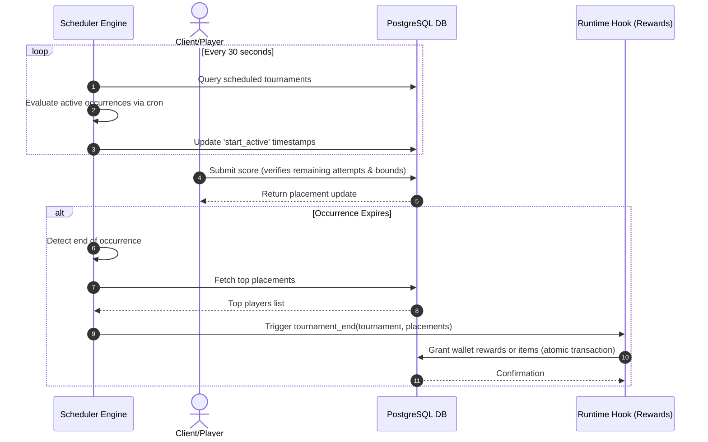

# TDD-06: Tournaments

> **Project:** Ultimate Game Engine — Multiplayer Game Server  
> **Technical Design:** Tournaments  
> **Version:** 1.0  
> **Last Updated:** 2026-07-01  
> **Status:** Draft  
> **Priority:** Technical Architecture

---

## 1. Purpose & Scope

Define the requirements for a tournament system that supports scheduled competitive events with entry limits, durations, multiple seasons, and rewards. Tournaments build on the leaderboard system to provide time-bounded competitive experiences.

---

Refer to [BRD-06](../BRD/06_tournaments.md) for the business requirements and [PRD-06](../PRD/06_tournaments.md) for the API surface.

---

## 2. Architecture & Design Flow

The tournament engine uses a background scheduler thread to manage open, active, and expired tournament phases according to Cron schedules. Leaderboard records store player entries, scoped to each tournament occurrences' boundary.

### Tournament Lifecycle and Reward Flow


---

## 3. Database Schema & Data Models

### Raw DDL Schemas

```sql
CREATE TABLE IF NOT EXISTS tournament (
    id                VARCHAR(128) PRIMARY KEY,
    title             VARCHAR(256) NOT NULL,
    description       TEXT,
    category          INT DEFAULT 0 NOT NULL,
    sort_order        INT DEFAULT 1 NOT NULL, -- 0=ascending, 1=descending
    operator          INT DEFAULT 0 NOT NULL, -- 0=best, 1=set, 2=increment
    duration          INT NOT NULL, -- Occurrence duration in seconds
    reset_schedule    VARCHAR(64), -- Cron expression
    start_time        TIMESTAMPTZ DEFAULT CURRENT_TIMESTAMP NOT NULL,
    end_time          TIMESTAMPTZ, -- Total tournament systems end
    max_size          INT DEFAULT 0 NOT NULL, -- Max players per sub-leaderboard (0 = infinite)
    max_num_score     INT DEFAULT 0 NOT NULL, -- Max score submissions allowed per player
    metadata          JSONB DEFAULT '{}'::jsonb NOT NULL,
    authoritative     BOOLEAN DEFAULT FALSE NOT NULL,
    start_active      TIMESTAMPTZ, -- Start of current active occurrence
    create_time       TIMESTAMPTZ DEFAULT CURRENT_TIMESTAMP NOT NULL
);

-- Backed by the leaderboard_record table for scoring (refer to TDD-05)
```

### Table Indexes

```sql
-- Index for quick scheduler check of active and pending tournaments
CREATE INDEX IF NOT EXISTS idx_tournament_active_schedule
ON tournament (start_time, end_time)
WHERE end_time IS NULL OR end_time > NOW();
```

---

## 4. Algorithmic Logic & Execution Flow

### Active Occurrence Scheduling Algorithm
1. Parse the `reset_schedule` cron pattern (e.g., `0 0 * * 1` for weekly on Mondays).
2. Given $T_{current} = \text{now}$:
   - Find the previous cron trigger time $T_{prev}$ and the next scheduled trigger $T_{next}$.
   - If $T_{current} \ge T_{prev}$ and $T_{current} < T_{prev} + \text{duration}$:
     - The occurrence is active.
     - Set $T_{expiry} = T_{prev} + \text{duration}$.
   - If $T_{current} \ge T_{prev} + \text{duration}$:
     - The occurrence is completed/inactive.
3. Write active occurrence metadata and update `expiry_time` in individual player `leaderboard_record` inserts to partition scores between occurrences.

### Go Tournament End Hook Example

```go
package main

import (
	"context"
	"database/sql"
	"fmt"
)

func OnTournamentEnd(ctx context.Context, logger interface{}, db *sql.DB, nk interface{}, tournamentID string, endActive int64, resetActive int64) error {
	// Fetch top 3 players from backing leaderboard
	// Simulated leaderboard record fetch for representation:
	records := []struct {
		OwnerID  string
		Username string
	}{
		{OwnerID: "user-uuid-1", Username: "shadow_ninja"},
		{OwnerID: "user-uuid-2", Username: "super_player"},
		{OwnerID: "user-uuid-3", Username: "racer_x"},
	}

	rewards := []map[string]int64{
		{"coins": 5000, "gems": 50}, // 1st place
		{"coins": 2500, "gems": 20}, // 2nd place
		{"coins": 1000, "gems": 5},  // 3rd place
	}

	for index, record := range records {
		if index >= len(rewards) {
			break
		}
		reward := rewards[index]
		if record.OwnerID != "" {
			// nk.WalletUpdate(ctx, record.OwnerID, reward, metadata)
			fmt.Printf("Rewarded player %s for rank %d\n", record.Username, index+1)
		}
	}

	return nil
}
```

---

## 5. Linked Documents
- [BRD-06](../BRD/06_tournaments.md) (Business Requirements Document)
- [PRD-06](../PRD/06_tournaments.md) (Product Requirements Document)
