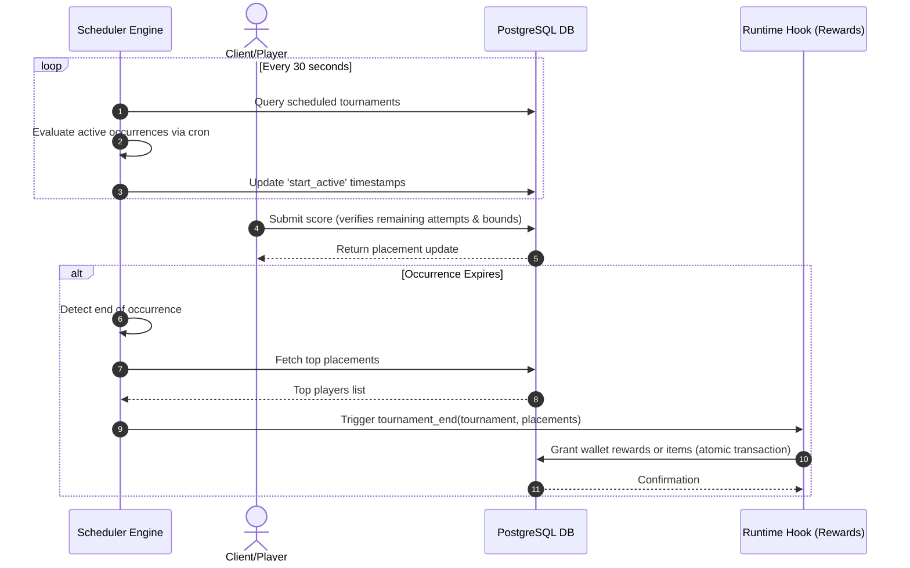

# TDD-06: Tournaments

> **Project:** Ultimate Game Engine — Multiplayer Game Server  
> **Technical Design:** Tournaments  
> **Version:** 1.0  
> **Last Updated:** 2026-07-01  
> **Status:** Draft  
> **Priority:** Technical Architecture

---

## 1. Purpose & Scope

Define the requirements for a tournament system that supports scheduled competitive events with entry limits, durations, multiple seasons, and rewards. Tournaments build on the leaderboard system to provide time-bounded competitive experiences.

---

Refer to [BRD-06](../BRD/06_tournaments.md) for the business requirements and [PRD-06](../PRD/06_tournaments.md) for the API surface.

---

## 2. Architecture & Design Flow

The tournament engine uses a background scheduler thread to manage open, active, and expired tournament phases according to Cron schedules. Leaderboard records store player entries, scoped to each tournament occurrences' boundary.

### Tournament Lifecycle and Reward Flow


---

## 3. Database Schema & Data Models

Tournaments do not use a standalone table. Instead, they are implemented as an extension of the `leaderboard` table (see [TDD-05](./05_leaderboards.md)), leveraging scheduling fields like `duration`, `start_time`, `end_time`, `join_required`, and `max_size`.

### Backing Records
Player scores are stored in `leaderboard_record` (see [TDD-05](./05_leaderboards.md)), scoped by the occurrence's `expiry_time`.

---

## 4. Algorithmic Logic & Execution Flow

### Active Occurrence Scheduling Algorithm
1. Parse the `reset_schedule` cron pattern (e.g., `0 0 * * 1` for weekly on Mondays).
2. Given $T_{current} = \text{now}$:
   - Find the previous cron trigger time $T_{prev}$ and the next scheduled trigger $T_{next}$.
   - If $T_{current} \ge T_{prev}$ and $T_{current} < T_{prev} + \text{duration}$:
     - The occurrence is active.
     - Set $T_{expiry} = T_{prev} + \text{duration}$.
   - If $T_{current} \ge T_{prev} + \text{duration}$:
     - The occurrence is completed/inactive.
3. Write active occurrence metadata and update `expiry_time` in individual player `leaderboard_record` inserts to partition scores between occurrences.

### Go Tournament End Hook Example

```go
package main

import (
	"context"
	"database/sql"
	"fmt"
)

func OnTournamentEnd(ctx context.Context, logger interface{}, db *sql.DB, nk interface{}, tournamentID string, endActive int64, resetActive int64) error {
	// Fetch top 3 players from backing leaderboard
	// Simulated leaderboard record fetch for representation:
	records := []struct {
		OwnerID  string
		Username string
	}{
		{OwnerID: "user-uuid-1", Username: "shadow_ninja"},
		{OwnerID: "user-uuid-2", Username: "super_player"},
		{OwnerID: "user-uuid-3", Username: "racer_x"},
	}

	rewards := []map[string]int64{
		{"coins": 5000, "gems": 50}, // 1st place
		{"coins": 2500, "gems": 20}, // 2nd place
		{"coins": 1000, "gems": 5},  // 3rd place
	}

	for index, record := range records {
		if index >= len(rewards) {
			break
		}
		reward := rewards[index]
		if record.OwnerID != "" {
			// nk.WalletUpdate(ctx, record.OwnerID, reward, metadata)
			fmt.Printf("Rewarded player %s for rank %d\n", record.Username, index+1)
		}
	}

	return nil
}
```

---

## 6. Performance & Security Considerations

### Performance
- **Scheduler Efficiency**: The 30-second scheduler loop queries all tournaments. Use a **next-fire-time priority queue** to avoid scanning completed/inactive tournaments.
- **Reward Distribution**: Distribute rewards in batched transactions (50 players per batch) to avoid long-held database locks during large tournament endings.
- **Leaderboard Record Expiry**: Ensure `expiry_time` is indexed and expired records are pruned within 1 hour of occurrence end to reclaim storage.
- **Concurrent Tournaments**: Support up to **100 active tournaments simultaneously** per server node.

### Security
- **Reward Idempotency**: Add a `rewarded_at` column (or occurrence-specific flag) to the tournament table. Before distributing rewards, check this flag within the same transaction. This prevents double-reward on scheduler restarts or duplicate fire events.
- **Authoritative Score Submission**: When `authoritative = TRUE`, only server-side match handlers can submit tournament scores. Client-submitted scores must be rejected.
- **Max Score Attempts**: Enforce `max_num_score` strictly. Track submission count per player per occurrence and reject excess submissions with `RESOURCE_EXHAUSTED`.
- **Input Validation**:
  - `duration`: Must be >0 and ≤604,800 (7 days in seconds).
  - `reset_schedule`: Validate cron expression syntax before persisting. Reject invalid patterns.
  - `max_size`: If >0, enforce capacity check atomically during score submission.

---

## 5. Linked Documents
- [BRD-06](../BRD/06_tournaments.md) (Business Requirements Document)
- [PRD-06](../PRD/06_tournaments.md) (Product Requirements Document)
