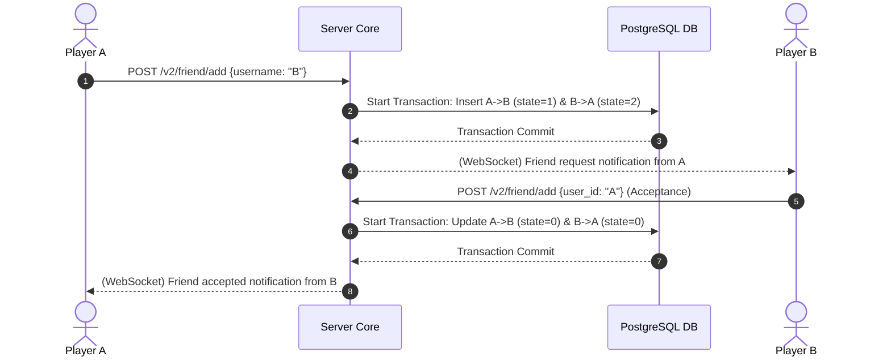

# TDD-07: Friends System

> **Project:** Ultimate Game Engine — Multiplayer Game Server  
> **Technical Design:** Friends System  
> **Version:** 1.0  
> **Last Updated:** 2026-07-01  
> **Status:** Draft  
> **Priority:** Technical Architecture

---

## 1. Purpose & Scope

Define the requirements for a built-in social graph enabling players to add friends, manage friend requests, block users, and track online status. The friends system is foundational to social features like party formation, direct messaging, and friend leaderboards.

---

Refer to [BRD-07](../BRD/07_friends_system.md) for the business requirements and [PRD-07](../PRD/07_friends_system.md) for the API surface.

---

## 2. Architecture & Design Flow

The social graph is modelled using a directed adjacency list in a relational database table (`user_edge`). Standard friend connections consist of two matching edges with inverse states.

### Bidirectional Edge State Flow


---

## 3. Database Schema & Data Models

### Raw DDL Schemas

```sql
CREATE TABLE IF NOT EXISTS user_edge (
    source_id        UUID NOT NULL REFERENCES users(id) ON DELETE CASCADE,
    destination_id   UUID NOT NULL REFERENCES users(id) ON DELETE CASCADE,
    state            SMALLINT NOT NULL, -- 0=friend, 1=invite_sent, 2=invite_received, 3=blocked
    position         BIGINT DEFAULT (EXTRACT(EPOCH FROM NOW()) * 1000)::bigint NOT NULL, -- Sorting helper
    update_time      TIMESTAMPTZ DEFAULT CURRENT_TIMESTAMP NOT NULL,
    PRIMARY KEY (source_id, state, destination_id)
);
```

### Table Indexes

```sql
-- Index for quick listing of user friends filtered by state
CREATE INDEX IF NOT EXISTS idx_user_edge_source_lookup
ON user_edge (source_id, state, position DESC);

-- Index for checking reverse relationships
CREATE INDEX IF NOT EXISTS idx_user_edge_dest_lookup
ON user_edge (destination_id, state);
```

---

## 4. Algorithmic Logic & Execution Flow

### Edge Transition State Matrix

| Action | Current State A $\to$ B | Target State A $\to$ B | Target State B $\to$ A |
|---|---|---|---|
| **A sends request to B** | None | `1` (invite_sent) | `2` (invite_received) |
| **B accepts A's request** | `2` (invite_received) | `0` (friend) | `0` (friend) |
| **A declines B's request** | `2` (invite_received) | None (Delete row) | None (Delete row) |
| **A deletes friend B** | `0` (friend) | None (Delete row) | None (Delete row) |
| **A blocks B** | Any / None | `3` (blocked) | None (Delete row) |

### Go Edge Mutation Transaction Example

```go
package main

import (
	"context"
	"database/sql"
)

func AddFriendTransaction(ctx context.Context, db *sql.DB, sourceID, destID string) error {
	tx, err := db.BeginTx(ctx, nil)
	if err != nil {
		return err
	}
	defer tx.Rollback()

	// 1. Insert or update source edge: invite_sent (state = 1)
	_, err = tx.ExecContext(ctx, `
		INSERT INTO user_edge (source_id, destination_id, state)
		VALUES ($1, $2, 1)
		ON CONFLICT (source_id, state, destination_id) DO UPDATE SET state = 1, update_time = NOW()`,
		sourceID, destID)
	if err != nil {
		return err
	}

	// 2. Insert or update destination edge: invite_received (state = 2)
	_, err = tx.ExecContext(ctx, `
		INSERT INTO user_edge (source_id, destination_id, state)
		VALUES ($1, $2, 2)
		ON CONFLICT (source_id, state, destination_id) DO UPDATE SET state = 2, update_time = NOW()`,
		destID, sourceID)
	if err != nil {
		return err
	}

	return tx.Commit()
}
```

---

## 6. Performance & Security Considerations

### Performance
- **Max Friends Per User**: Cap at **1,000 mutual friends** (state=0 edges) per user. Beyond this, reject new friend additions with `RESOURCE_EXHAUSTED`.
- **Edge Query Optimization**: Friend list queries use the composite index `idx_user_edge_source_lookup`. Ensure pagination is enforced (max 100 per page) and cursor-based to avoid OFFSET performance degradation.
- **Transaction Isolation**: Friend edge mutations use `READ COMMITTED` isolation level. The bidirectional insert transaction is lightweight (2 upserts) and should complete within 10ms.

### Security
- **Friend Request Spam Prevention**:
  - Max **100 pending outbound friend requests** (state=1) per user at any time.
  - Rate limit: Max **10 friend requests per minute** per user.
  - Exceeding either limit returns `RESOURCE_EXHAUSTED`.
- **Block Bypass Prevention**: Before inserting a friend request edge, check if the target has a `state=3` (blocked) edge against the requester. If blocked, return `NOT_FOUND` (do not reveal the block).
- **Mutual Consent**: Ensure the bidirectional edge model prevents unilateral friend additions. Both users must explicitly call the add endpoint.
- **Input Validation**:
  - `user_id` / `username`: Validate format (UUID for user_id, max 64 chars for username).
  - Prevent self-friending: reject if `source_id == destination_id`.
- **Privacy**: Friend list visibility should be configurable (public, friends-only, private) via user metadata.

---

## 5. Linked Documents
- [BRD-07](../BRD/07_friends_system.md) (Business Requirements Document)
- [PRD-07](../PRD/07_friends_system.md) (Product Requirements Document)
