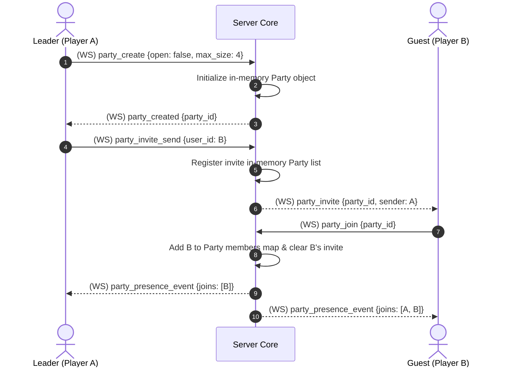

# TDD-08: Parties

> **Project:** Ultimate Game Engine — Multiplayer Game Server  
> **Technical Design:** Parties  
> **Version:** 1.0  
> **Last Updated:** 2026-07-01  
> **Status:** Draft  
> **Priority:** Technical Architecture

---

## 1. Purpose & Scope

Define the requirements for a party system enabling players to form temporary groups for co-op play, party matchmaking, party chat, and coordinated game activities. Parties are session-based, ephemeral groups that exist while members are online.

---

Refer to [BRD-08](../BRD/08_parties.md) for the business requirements and [PRD-08](../PRD/08_parties.md) for the API surface.

---

## 2. Architecture & Design Flow

Parties are ephemeral, session-based structures kept entirely in-memory. They use real-time WebSocket messaging and Stream registrations (see [PRD-17: Presence System](./17_presence_system.md)) to track member join/leave states and broadcast updates.

### Party Invite & Join Sequence Flow


---

## 3. Database Schema & Data Models

Because parties are strictly session-based and do not persist across server restarts, they do not write to PostgreSQL. They are represented in the server's shared in-memory memory map.

### Go Party State Structures

```go
package main

import "time"

type PartyMember struct {
	UserID     string                 `json:"user_id"`
	Username   string                 `json:"username"`
	SessionID  string                 `json:"session_id"`
	JoinedAt   time.Time              `json:"joined_at"`
	Properties map[string]interface{} `json:"properties"` // Ready status, selected character/class
}

type PartySession struct {
	PartyID     string                  `json:"party_id"`
	LeaderID    string                  `json:"leader_id"`
	Open        bool                    `json:"open"`
	MaxSize     int                     `json:"max_size"`
	Members     map[string]*PartyMember `json:"members"`     // Key: userId
	Invitations map[string]time.Time    `json:"invitations"` // Key: invited userId
	Metadata    map[string]interface{}  `json:"metadata"`    // Party settings, game match status
	Node        string                  `json:"node"`        // Server node IP hosting the party stream
}
```

---

## 4. Algorithmic Logic & Execution Flow

### Leader Promotion & Transfer Logic
When the current leader $L$ disconnects:
1. The server checks the `reconnect_grace_sec` window.
2. If $L$ fails to reconnect and is evicted from the session registry:
   - If the party has other active members:
     - Sort members by `joinedAt` timestamp ascending (longest serving member).
     - Select the first candidate $M$ and promote: `leaderId = M.userId`.
     - Broadcast a `party_leader` event to all remaining members.
   - If no other members are present:
     - Terminate the party session, remove all invitations, and delete the in-memory `PartySession` object.

### Go Party Member Status Update Handler

```go
package main

import "errors"

func UpdateMemberStatus(party *PartySession, userID string, newProperties map[string]interface{}) (*PartySession, error) {
	member, exists := party.Members[userID]
	if !exists {
		return nil, errors.New("MEMBER_NOT_FOUND")
	}

	// Merge new properties (e.g. ready status toggle)
	for k, v := range newProperties {
		member.Properties[k] = v
	}

	return party, nil
}
```

---

## 6. Performance & Security Considerations

### Performance
- **Max Parties Per Node**: Limit to **5,000 concurrent active parties** per server node.
- **Party Memory Budget**: Each `PartySession` should consume ≤8 KB (with max 16 members). Total party memory ≤40 MB per node.
- **Leader Promotion Latency**: Leader promotion on disconnect must complete within the same tick as the eviction event (<10ms).
- **Invitation Cleanup**: Pending invitations older than **5 minutes** should be auto-expired by a background sweep running every 30 seconds.

### Security
- **MaxSize Enforcement**: The `party_join` handler **must** validate `len(members) < maxSize` before adding a new member. Reject excess joins with `RESOURCE_EXHAUSTED`.
- **Leader-Only Operations**: Only the party leader can:
  - Send invitations (`party_invite_send`).
  - Kick members (`party_remove`).
  - Promote another member to leader (`party_promote`).
  - Modify party open/closed status.
- **Invitation Abuse Prevention**:
  - Max **20 pending invitations per party** at any time.
  - Rate limit: Max **5 invitations per minute** per party.
  - A user can only have **3 pending party invitations** at once to prevent invitation flooding.
- **Input Validation**:
  - `max_size`: Must be within `[2, 16]`.
  - `properties` map: Max 2 KB total size, max 10 keys.
- **Closed Party Security**: For closed parties (`open = false`), only invited users can join. Joining without an invitation returns `PERMISSION_DENIED`.

---

## 5. Linked Documents
- [BRD-08](../BRD/08_parties.md) (Business Requirements Document)
- [PRD-08](../PRD/08_parties.md) (Product Requirements Document)
