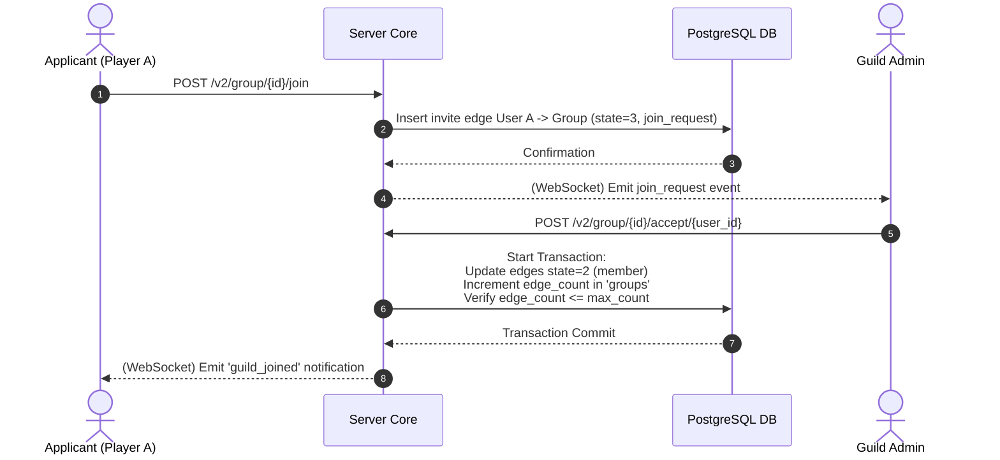

# TDD-09: Guilds & Clans

> **Project:** Ultimate Game Engine — Multiplayer Game Server  
> **Technical Design:** Guilds & Clans  
> **Version:** 1.0  
> **Last Updated:** 2026-07-01  
> **Status:** Draft  
> **Priority:** Technical Architecture

---

## 1. Purpose & Scope

Define the requirements for a persistent guild/clan system enabling players to form long-lived organizations with membership management, roles, permissions, chat, and metadata. Guilds provide a social structure beyond friends and parties, supporting cooperative gameplay and community building.

---

Refer to [BRD-09](../BRD/09_guilds_clans.md) for the business requirements and [PRD-09](../PRD/09_guilds_clans.md) for the API surface.

---

## 2. Architecture & Design Flow

The guild/clan system is persistent and relies on PostgreSQL. Relationships between players and groups are stored in `group_edge` using bidirectional edge pairs (Group $\to$ User, User $\to$ Group).

### Guild Application & Acceptance Sequence


---

## 3. Database Schema & Data Models

### Raw DDL Schemas

```sql
CREATE TABLE IF NOT EXISTS groups (
    id               UUID PRIMARY KEY DEFAULT gen_random_uuid(),
    creator_id       UUID REFERENCES users(id) ON DELETE SET NULL,
    name             VARCHAR(128) NOT NULL,
    description      VARCHAR(1024),
    avatar_url       VARCHAR(512),
    lang_tag         VARCHAR(18) DEFAULT 'en-US' NOT NULL,
    open             BOOLEAN DEFAULT TRUE NOT NULL,
    edge_count       INT DEFAULT 0 NOT NULL,
    max_count        INT DEFAULT 100 NOT NULL,
    metadata         JSONB DEFAULT '{}'::jsonb NOT NULL,
    state            SMALLINT DEFAULT 0 NOT NULL, -- 0=normal, 1=deleted
    create_time      TIMESTAMPTZ DEFAULT CURRENT_TIMESTAMP NOT NULL,
    update_time      TIMESTAMPTZ DEFAULT CURRENT_TIMESTAMP NOT NULL,
    disable_time     TIMESTAMPTZ
);

CREATE TABLE IF NOT EXISTS group_edge (
    source_id        UUID NOT NULL, -- user_id or group_id
    destination_id   UUID NOT NULL, -- group_id or user_id
    state            SMALLINT NOT NULL, -- 0=superadmin, 1=admin, 2=member, 3=join_request
    position         BIGINT DEFAULT (EXTRACT(EPOCH FROM NOW()) * 1000)::bigint NOT NULL,
    update_time      TIMESTAMPTZ DEFAULT CURRENT_TIMESTAMP NOT NULL,
    PRIMARY KEY (source_id, state, destination_id)
);
```

### Table Indexes

```sql
-- Enforce unique group names for active groups
CREATE UNIQUE INDEX IF NOT EXISTS idx_groups_name_active 
ON groups (name) 
WHERE state = 0;

-- Index for listing members of a group sorted by role and join date
CREATE INDEX IF NOT EXISTS idx_group_edge_membership
ON group_edge (source_id, state, position DESC);
```

---

## 4. Algorithmic Logic & Execution Flow

### Role-Based Privilege Hierarchies
Operations check user credentials before modifying edges:
- **Demote / Promote**: Only users with state `0` (superadmin) can promote/demote admins (`1`). Admins can promote members (`2`) to admins.
- **Kick**: Superadmin can kick anyone. Admins can kick members (`2`). Members cannot kick.

### SQL Transaction for Request Acceptance

```sql
BEGIN;

-- 1. Check member capacity constraints
SELECT edge_count, max_count FROM groups WHERE id = $1 FOR UPDATE;

-- 2. Update edge from Group -> User
INSERT INTO group_edge (source_id, destination_id, state, position)
VALUES ($1, $2, 2, (EXTRACT(EPOCH FROM NOW())*1000)::bigint)
ON CONFLICT (source_id, state, destination_id) DO UPDATE SET state = 2, update_time = NOW();

-- 3. Update edge from User -> Group
INSERT INTO group_edge (source_id, destination_id, state, position)
VALUES ($2, $1, 2, (EXTRACT(EPOCH FROM NOW())*1000)::bigint)
ON CONFLICT (source_id, state, destination_id) DO UPDATE SET state = 2, update_time = NOW();

-- 4. Update overall membership counter
UPDATE groups SET edge_count = edge_count + 1 WHERE id = $1;

COMMIT;
```

---

## 5. Linked Documents
- [BRD-09](../BRD/09_guilds_clans.md) (Business Requirements Document)
- [PRD-09](../PRD/09_guilds_clans.md) (Product Requirements Document)
