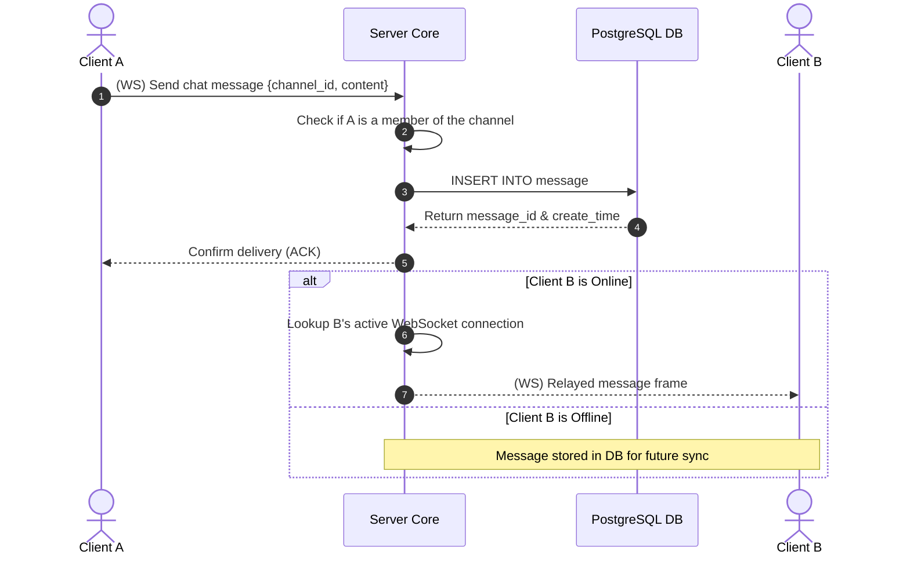

# TDD-10: Chat System

> **Project:** Ultimate Game Engine — Multiplayer Game Server  
> **Technical Design:** Chat System  
> **Version:** 1.0  
> **Last Updated:** 2026-07-01  
> **Status:** Draft  
> **Priority:** Technical Architecture

---

## 1. Purpose & Scope

Define the requirements for a comprehensive real-time chat system supporting direct messages, group channels, guild channels, party channels, match channels, and custom global channels. The system supports persistent history, moderation, and presence tracking.

---

Refer to [BRD-10](../BRD/10_chat_system.md) for the business requirements and [PRD-10](../PRD/10_chat_system.md) for the API surface.

---

## 2. Architecture & Design Flow

The chat system integrates WebSocket streams for real-time delivery with PostgreSQL for message history. Access controls are enforced dynamically before routing.

### Real-time Message Relay & History Retrieval Flow


---

## 3. Database Schema & Data Models

### Raw DDL Schemas

```sql
CREATE TABLE IF NOT EXISTS channel (
    id              UUID PRIMARY KEY DEFAULT gen_random_uuid(),
    type            SMALLINT NOT NULL, -- 1=DM, 2=group, 3=guild, 4=party, 5=match, 6=custom
    label           VARCHAR(256), -- Friendly name / identifier
    group_id        UUID, -- References groups(id) if type=3
    user_id_one     UUID REFERENCES users(id) ON DELETE SET NULL, -- if type=1
    user_id_two     UUID REFERENCES users(id) ON DELETE SET NULL, -- if type=1
    metadata        JSONB DEFAULT '{}'::jsonb NOT NULL,
    create_time     TIMESTAMPTZ DEFAULT CURRENT_TIMESTAMP NOT NULL,
    update_time     TIMESTAMPTZ DEFAULT CURRENT_TIMESTAMP NOT NULL,
    CONSTRAINT chk_channel_type CHECK (type BETWEEN 1 AND 6)
);

CREATE TABLE IF NOT EXISTS message (
    id              UUID PRIMARY KEY DEFAULT gen_random_uuid(),
    channel_id      UUID NOT NULL REFERENCES channel(id) ON DELETE CASCADE,
    sender_id       UUID NOT NULL REFERENCES users(id) ON DELETE CASCADE,
    username        VARCHAR(64) NOT NULL,
    content         JSONB NOT NULL,
    code            INT DEFAULT 0 NOT NULL, -- Developer-defined message code
    create_time     TIMESTAMPTZ DEFAULT CURRENT_TIMESTAMP NOT NULL,
    update_time     TIMESTAMPTZ DEFAULT CURRENT_TIMESTAMP NOT NULL,
    deleted         BOOLEAN DEFAULT FALSE NOT NULL
);
```

### Table Indexes

```sql
-- Optimal index for fetching paginated channel messages (newest first)
CREATE INDEX IF NOT EXISTS idx_message_channel_history
ON message (channel_id, create_time DESC)
WHERE deleted = FALSE;

-- Indexes to optimize direct message channel user lookups and deletion cascades
CREATE INDEX IF NOT EXISTS idx_channel_user_id_one ON channel(user_id_one) WHERE user_id_one IS NOT NULL;
CREATE INDEX IF NOT EXISTS idx_channel_user_id_two ON channel(user_id_two) WHERE user_id_two IS NOT NULL;

-- Index to optimize message sender lookup and deletion cascades
CREATE INDEX IF NOT EXISTS idx_message_sender ON message(sender_id);
```

---

## 4. Algorithmic Logic & Execution Flow

### Message Routing & Access Control Logic
1. Extract the `channel_id` from the client request.
2. Load the Channel structure from database/cache:
   - If channel `type = 1` (DM): verify caller $U$ is either `user_id_one` or `user_id_two`.
   - If channel `type = 3` (Guild/Group): query the `group_edge` table (see [TDD-09](./09_guilds_clans.md)) to verify $U$ is an active member.
   - If channel `type = 4` (Party) or `type = 5` (Match): verify $U$ is present in the corresponding in-memory registry.
3. If allowed, execute database INSERT to persist the message.
4. Route the message to active connection streams:
   - Obtain user IDs of all members belonging to the channel.
   - Query the routing directory to find active WebSocket sessions on the local node or cluster (using a message bus for inter-node communication).
   - Push WebSocket message frame containing sender and content.

### Go Message Persistence & Broadcast Example

```go
package main

import (
	"context"
	"database/sql"
	"encoding/json"
)

type ChatMessage struct {
	ChannelID string          `json:"channel_id"`
	Content   json.RawMessage `json:"content"`
	Code      int32           `json:"code"`
}

func SaveMessageAndBroadcast(ctx context.Context, db *sql.DB, senderID string, username string, msg ChatMessage) (string, error) {
	var messageID string
	err := db.QueryRowContext(ctx, `
		INSERT INTO message (channel_id, sender_id, username, content, code)
		VALUES ($1, $2, $3, $4, $5)
		RETURNING id`,
		msg.ChannelID, senderID, username, msg.Content, msg.Code).Scan(&messageID)

	if err != nil {
		return "", err
	}

	// Trigger broadcast logic (e.g. publish to redis or local ws session)
	return messageID, nil
}
```

---

## 6. Performance & Security Considerations

### Performance
- **Message History Retention**: Retain chat messages for **90 days** by default. A background daemon runs daily to purge messages older than the retention window using batched deletes (5,000 per batch).
- **Channel Member Cache**: Cache channel membership lookups in-memory (TTL 60 seconds) to avoid database queries on every message send.
- **Broadcast Fan-Out**: For channels with >50 members, batch outbound WebSocket writes using goroutine worker pools (max 10 concurrent writes per channel).
- **Message Table Partitioning**: For deployments exceeding 100M messages, partition the `message` table by `create_time` (monthly partitions) for efficient range scans and pruning.
- **Latency Target**: Message delivery (send → all recipients receive) p99 <20ms for channels with ≤50 online members.

### Security
- **Message Size Limit**: Max `content` JSONB payload: **4 KB** (4096 bytes). Reject oversized messages with `INVALID_ARGUMENT`.
- **Spam Rate Limiting**:
  - Max **5 messages per second per user** across all channels.
  - Max **30 messages per minute per user per channel**.
  - Exceeding limits returns `RESOURCE_EXHAUSTED` and increments a spam counter.
- **Content Moderation**: Provide a `beforeChannelMessageSend` hook point for developers to implement profanity filters, keyword blocking, or external moderation service calls.
- **Access Control Enforcement**: The channel membership check must happen on **every** message send, not just on join. Verify the sender has not been kicked or the channel has not been deleted.
- **XSS/Injection Prevention**: The `content` field is stored as JSONB, which is inherently safe against SQL injection. However, client applications must sanitize rendered content to prevent XSS.
- **DM Privacy**: For DM channels (type=1), ensure only `user_id_one` and `user_id_two` can read messages. No public listing of DM channels.
- **Message Deletion**: Soft-delete only (`deleted = TRUE`). Hard deletion requires admin API access. Deleted messages are excluded from history queries.

---

## 5. Linked Documents
- [BRD-10](../BRD/10_chat_system.md) (Business Requirements Document)
- [PRD-10](../PRD/10_chat_system.md) (Product Requirements Document)
