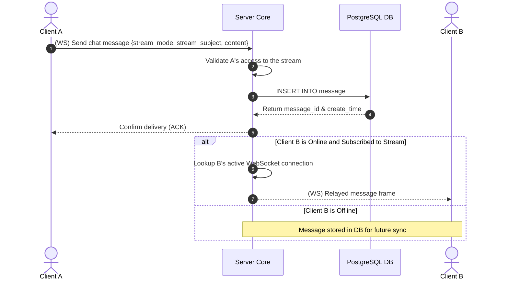

# TDD-10: Chat System

> **Project:** Ultimate Game Engine — Multiplayer Game Server  
> **Technical Design:** Chat System  
> **Version:** 1.0  
> **Last Updated:** 2026-07-09  
> **Status:** Draft  
> **Priority:** Technical Architecture

---

## 1. Purpose & Scope

Define the requirements for a comprehensive real-time chat system supporting direct messages, group/guild channels, party/match chat, and custom global streams. The system supports persistent history, moderation, and presence tracking utilizing a stream-based message model.

---

Refer to [BRD-10](../BRD/10_chat_system.md) for the business requirements and [PRD-10](../PRD/10_chat_system.md) for the API surface.

---

## 2. Architecture & Design Flow

The chat system integrates WebSocket streams for real-time delivery with PostgreSQL for message history. Active chats are mapped to virtual streams defined by combinations of `stream_mode`, `stream_subject`, `stream_descriptor`, and `stream_label`.

### Real-time Message Relay & History Retrieval Flow


---

## 3. Database Schema & Data Models

### Raw DDL Schemas

```sql
CREATE TABLE IF NOT EXISTS message (
    PRIMARY KEY (stream_mode, stream_subject, stream_descriptor, stream_label, create_time, id),
    FOREIGN KEY (sender_id) REFERENCES users (id) ON DELETE CASCADE,

    id                UUID         NOT NULL UNIQUE,
    code              SMALLINT     NOT NULL DEFAULT 0, -- chat(0), chat_update(1), chat_remove(2)...
    sender_id         UUID         NOT NULL,
    username          VARCHAR(128) NOT NULL,
    stream_mode       SMALLINT     NOT NULL,
    stream_subject    UUID         NOT NULL,
    stream_descriptor UUID         NOT NULL,
    stream_label      VARCHAR(128) NOT NULL,
    content           JSONB        NOT NULL DEFAULT '{}'::jsonb,
    create_time       TIMESTAMPTZ  NOT NULL DEFAULT now(),
    update_time       TIMESTAMPTZ  NOT NULL DEFAULT now(),

    UNIQUE (sender_id, id)
);
```

### Table Indexes

```sql
CREATE INDEX IF NOT EXISTS idx_message_sender ON message(sender_id);
```

---

## 4. Algorithmic Logic & Execution Flow

### Message Routing & Access Control Logic
1. Extract stream keys (`stream_mode`, `stream_subject`, `stream_descriptor`, `stream_label`) from the client request.
2. Verify access permission:
   - **Direct Message (Mode 0):** Ensure the sender is one of the participants.
   - **Group/Guild Chat (Mode 1):** Query the `group_edge` table to verify the user is a member of the group/guild.
   - **Match/Party Chat (Mode 2):** Verify the user is registered in the in-memory match registry or party registry.
3. If allowed, execute database INSERT to persist the message.
4. Route the message to all active WebSocket streams subscribed to the same virtual stream.

### Go Message Persistence & Broadcast Example

```go
package main

import (
	"context"
	"database/sql"
	"encoding/json"
	"time"
)

type ChatMessage struct {
	ID               string          `json:"id"`
	Code             int16           `json:"code"`
	SenderID         string          `json:"sender_id"`
	Username         string          `json:"username"`
	StreamMode       int16           `json:"stream_mode"`
	StreamSubject    string          `json:"stream_subject"`
	StreamDescriptor string          `json:"stream_descriptor"`
	StreamLabel      string          `json:"stream_label"`
	Content          json.RawMessage `json:"content"`
	CreateTime       time.Time       `json:"create_time"`
}

func SaveMessage(ctx context.Context, db *sql.DB, msg ChatMessage) error {
	_, err := db.ExecContext(ctx, `
		INSERT INTO message (id, code, sender_id, username, stream_mode, stream_subject, stream_descriptor, stream_label, content, create_time, update_time)
		VALUES ($1, $2, $3, $4, $5, $6, $7, $8, $9, $10, $10)`,
		msg.ID, msg.Code, msg.SenderID, msg.Username, msg.StreamMode, msg.StreamSubject, msg.StreamDescriptor, msg.StreamLabel, msg.Content, msg.CreateTime)
	return err
}
```

---

## 5. Performance & Security Considerations

### Performance
- **Message History Retention:** Retain chat messages for **90 days** by default. A background daemon runs daily to prune messages older than the retention window using batched deletes (5,000 per batch).
- **Composite Primary Key Optimization:** The primary key is structured as `(stream_mode, stream_subject, stream_descriptor, stream_label, create_time, id)` to optimize chronological range scans on individual streams without extra index overhead.
- **Broadcast Fan-Out:** For streams with >50 members, batch outbound WebSocket writes using goroutine worker pools.

### Security
- **Message Size Limit:** Max `content` JSONB payload: **4 KB** (4096 bytes). Reject oversized messages with `INVALID_ARGUMENT`.
- **Spam Rate Limiting:**
  - Max **5 messages per second per user** across all streams.
  - Max **30 messages per minute per user per stream**.
- **Access Control Enforcement:** Access checks must happen on **every** message send. Verify the sender is still a member of the group/guild or match/party.

---

## 6. Linked Documents
- [BRD-10](../BRD/10_chat_system.md) (Business Requirements Document)
- [PRD-10](../PRD/10_chat_system.md) (Product Requirements Document)
