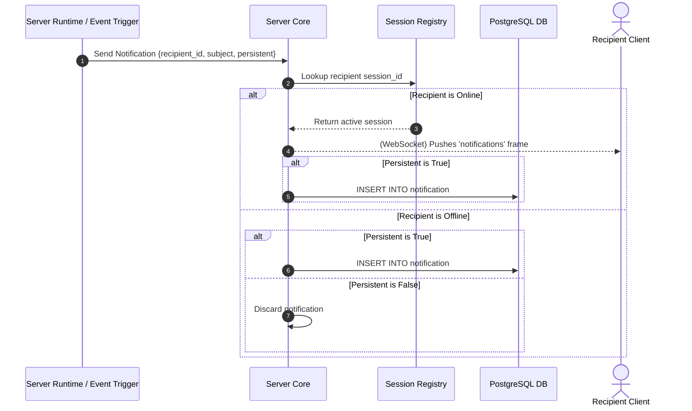

# TDD-11: Notifications

> **Project:** Ultimate Game Engine — Multiplayer Game Server  
> **Technical Design:** Notifications  
> **Version:** 1.0  
> **Last Updated:** 2026-07-01  
> **Status:** Draft  
> **Priority:** Technical Architecture

---

## 1. Purpose & Scope

Define the requirements for a server-driven notification system that delivers both real-time and persistent notifications to players. Notifications cover friend requests, tournament rewards, daily bonuses, game events, and custom developer-defined alerts.

---

Refer to [BRD-11](../BRD/11_notifications.md) for the business requirements and [PRD-11](../PRD/11_notifications.md) for the API surface.

---

## 2. Architecture & Design Flow

The notification engine routes messages dynamically. Real-time WebSocket delivery is preferred if the user session is active. If the user is offline and the message is persistent, it is written to PostgreSQL for later synchronization.

### Real-Time Routing vs. Storage flow


---

## 3. Database Schema & Data Models

### Raw DDL Schemas

```sql
CREATE TABLE IF NOT EXISTS notification (
    id              UUID NOT NULL CONSTRAINT notification_id_key UNIQUE,
    user_id         UUID NOT NULL REFERENCES users(id) ON DELETE CASCADE,
    subject         VARCHAR(255) NOT NULL,
    content         JSONB DEFAULT '{}'::jsonb NOT NULL,
    code            SMALLINT NOT NULL, -- Negative values are system reserved
    sender_id       UUID NOT NULL,
    create_time     TIMESTAMPTZ DEFAULT now() NOT NULL,
    PRIMARY KEY (user_id, create_time, id)
);
```

### Table Indexes

```sql
-- Optimal index for pulling notifications for a logged-in user sorted by creation time
CREATE INDEX IF NOT EXISTS idx_notification_user_id ON notification(user_id, create_time DESC);
```

---

## 4. Algorithmic Logic & Execution Flow

### TTL Expiry & Retention Cleanup Daemon
1. A background daemon runs every `1 hour`.
2. The daemon executes a query to delete expired notifications older than the configured retention period (e.g. 30 days):
   `DELETE FROM notification WHERE create_time < NOW() - INTERVAL '30 days';`
3. Additionally, a hard cap check is applied. If a user exceeds the maximum persistent notifications limit (e.g., 1000):
   - Query and retain only the 1000 newest records.
   - Delete older notifications.

### Go Custom Notification Dispatch Example

```go
package main

import (
	"context"
	"encoding/json"
)

type Notification struct {
	UserID     string
	Subject    string
	Content    string // JSON string payload
	Code       int
	SenderID   string
	Persistent bool
}

func SendFriendRequestNotification(ctx context.Context, nk interface{}, targetUserID string, senderUserID string, senderUsername string) error {
	contentMap := map[string]string{
		"user_id":  senderUserID,
		"username": senderUsername,
	}
	contentBytes, err := json.Marshal(contentMap)
	if err != nil {
		return err
	}

	notification := &Notification{
		UserID:     targetUserID,
		Subject:    "New Friend Request",
		Content:    string(contentBytes),
		Code:       100, // Predefined category code
		SenderID:   senderUserID,
		Persistent: true,
	}

	// In the Ultimate Game Engine Go runtime:
	// return nk.NotificationsSend(ctx, []*runtime.NotificationSend{...})
	_ = notification // simulated dispatch representation
	return nil
}
```

---

## 5. Performance & Security Considerations

### Performance
- **TTL Cleanup Optimization**: Since the primary key is `(user_id, create_time, id)`, lookups and deletion scans by `create_time` are highly efficient.
- **Batched Deletion**: The hourly cleanup daemon must delete in batches of **1,000 rows** per iteration with a 100ms sleep between batches to avoid write amplification and lock contention.
- **Per-User Cap Enforcement**: Implement the `max_persistent_per_user` (default 1,000) cleanup as: query the 1,001st oldest notification per user; if found, delete all older records.
- **Notification Table Partitioning**: For deployments with >50M notification records, partition by `create_time` (monthly).
- **Latency Target**: Real-time notification delivery p99 <10ms for online recipients.

### Security
- **Notification Flood Prevention**:
  - Max **50 notifications per recipient per hour** from server-side code.
  - Max **10 notifications per sender per minute** to any single recipient.
  - System-generated notifications (code < 0) are exempt from sender rate limits.
- **Content Validation**:
  - `subject`: Max 256 characters, strip HTML tags.
  - `content` JSONB: Max **2 KB**.
  - `code`: Must be within `[-128, 32767]` range (negative reserved for system).
- **Sender Impersonation Prevention**: The `sender_id` must be the authenticated user's ID or null (system). Clients cannot specify arbitrary sender IDs.
- **Sensitive Content**: Notification content may contain PII (usernames, friend requests). Ensure notification list endpoints require authentication and only return the authenticated user's notifications.

---

## 6. Linked Documents
- [BRD-11](../BRD/11_notifications.md) (Business Requirements Document)
- [PRD-11](../PRD/11_notifications.md) (Product Requirements Document)
