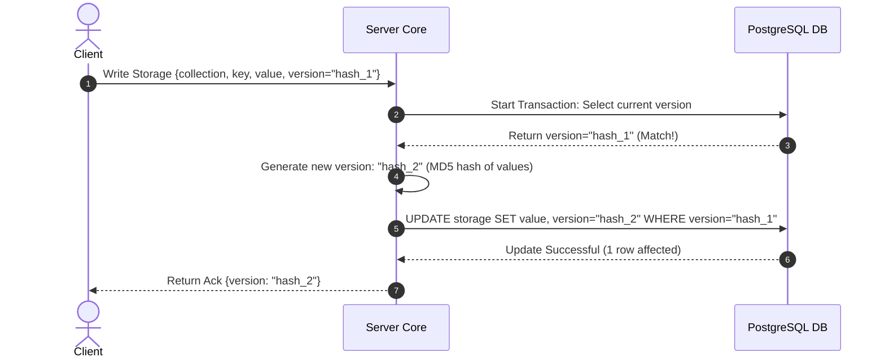

# TDD-12: Storage Engine

> **Project:** Ultimate Game Engine — Multiplayer Game Server  
> **Technical Design:** Storage Engine  
> **Version:** 1.0  
> **Last Updated:** 2026-07-01  
> **Status:** Draft  
> **Priority:** Technical Architecture

---

## 1. Purpose & Scope

Define the requirements for a NoSQL-style document storage layer that enables developers to store and retrieve arbitrary JSON data per user or globally. This system stores player inventory, settings, quest progress, character data, cosmetics, and any game-specific data.

---

Refer to [BRD-12](../BRD/12_storage_engine.md) for the business requirements and [PRD-12](../PRD/12_storage_engine.md) for the API surface.

---

## 2. Architecture & Design Flow

The storage engine provides key-value logic backed by PostgreSQL's `JSONB` format. Version checks implement optimistic concurrency to prevent race conditions during updates.

### Optimistic Concurrency Write Flow


---

## 3. Database Schema & Data Models

### Raw DDL Schemas

```sql
CREATE TABLE IF NOT EXISTS storage (
    collection       VARCHAR(128) NOT NULL,
    key              VARCHAR(128) NOT NULL,
    user_id          UUID NOT NULL REFERENCES users(id) ON DELETE CASCADE, -- System user UUID '00000000-0000-0000-0000-000000000000' seeded for global storage
    value            JSONB DEFAULT '{}'::jsonb NOT NULL,
    version          VARCHAR(32) NOT NULL, -- MD5 hash string (32 hex characters)
    permission_read  SMALLINT DEFAULT 1 NOT NULL, -- 0=no read, 1=owner only, 2=public
    permission_write SMALLINT DEFAULT 1 NOT NULL, -- 0=no write (server-only), 1=owner only
    create_time      TIMESTAMPTZ DEFAULT CURRENT_TIMESTAMP NOT NULL,
    update_time      TIMESTAMPTZ DEFAULT CURRENT_TIMESTAMP NOT NULL,
    PRIMARY KEY (collection, key, user_id)
);
```

### Table Indexes

```sql
-- Index for listing all objects in a collection for a specific user
CREATE INDEX IF NOT EXISTS idx_storage_user_collection
ON storage (user_id, collection);

-- Index for public read lookup (where permission_read = 2)
CREATE INDEX IF NOT EXISTS idx_storage_public_read
ON storage (collection, key)
WHERE permission_read = 2;

-- GIN index for querying inside arbitrary JSONB user storage data
CREATE INDEX IF NOT EXISTS idx_storage_value ON storage USING gin (value);
```

---

## 4. Algorithmic Logic & Execution Flow

### Optimistic Concurrency Control Check
When performing a write with an expected version:
1. Verify if `version` parameter is set.
2. If `version` is not set:
   - Perform unconditional upsert:
     ```sql
     INSERT INTO storage (collection, key, user_id, value, version, permission_read, permission_write, update_time)
     VALUES ($1, $2, $3, $4, $5, $6, $7, NOW())
     ON CONFLICT (collection, key, user_id) 
     DO UPDATE SET value = EXCLUDED.value, version = EXCLUDED.version, update_time = NOW();
     ```
3. If `version` is `"*"` (wildcard indicating insert-only):
   - Query if the record exists in the database.
   - If the record already exists, fail immediately with a version conflict error (HTTP 409 / gRPC `ABORTED`).
   - If the record does not exist, perform a standard `INSERT` without a conflicting update fallback (to guarantee creation only).
4. If `version` is a specific hash string (e.g., `"old_version_hash"`):
   - Attempt update with condition:
     ```sql
     UPDATE storage 
     SET value = $1, version = $2, update_time = NOW()
     WHERE collection = $3 AND key = $4 AND user_id = $5 AND version = $6;
     ```
   - Check rows affected. If `0`, rollback and throw HTTP `409 Conflict` (gRPC `ABORTED`).

### Go Version Hashing Example

```go
package main

import (
	"crypto/md5"
	"encoding/hex"
	"encoding/json"
)

func GenerateVersion(value interface{}) (string, error) {
	bytes, err := json.Marshal(value)
	if err != nil {
		return "", err
	}
	hash := md5.Sum(bytes)
	return hex.EncodeToString(hash[:]), nil
}
```

---

## 6. Performance & Security Considerations

### Performance
- **Object Size Limit**: Max `value` JSONB payload: **256 KB** per storage object. Reject writes exceeding this limit with `INVALID_ARGUMENT`.
- **Per-User Object Quota**: Max **10,000 storage objects per user** across all collections. Track via a counter or periodic count query.
- **Read Caching**: Frequently accessed public objects (`permission_read = 2`) should be cached in-memory with a TTL of 60 seconds.
- **Batch Operations**: Support batch read/write of up to **100 objects per request**. Beyond 100, return `INVALID_ARGUMENT`.
- **Latency Target**: Single object read p99 <10ms. Batch write (100 objects) p99 <200ms.
- **Version Hash Performance**: MD5 hashing is fast but consider SHA-256 for collision resistance in high-volume deployments.

### Security
- **Permission Enforcement**: The Go code examples must validate `permission_read` and `permission_write` before every operation:
  - `permission_write = 0`: Only server-side code can modify. Client writes rejected with `PERMISSION_DENIED`.
  - `permission_write = 1`: Only the owning user can modify.
  - `permission_read = 0`: Only server-side code can read. Client reads return `NOT_FOUND`.
  - `permission_read = 1`: Only the owning user can read.
  - `permission_read = 2`: Publicly readable by any authenticated user.
- **Input Validation**:
  - `collection`: Max 128 characters, alphanumeric and underscores only.
  - `key`: Max 128 characters, alphanumeric, underscores, and hyphens.
  - `value`: Must be valid JSON. Reject binary or non-JSON payloads.
  - JSON nesting depth: Max **10 levels**.
- **Concurrency Conflict Handling**: When version mismatch occurs on conditional writes, return `409 Conflict` with the current version hash so the client can retry.
- **Data Isolation**: Ensure collection/key queries are always scoped to `user_id`. Global objects (user_id = nil UUID) require server-side permissions.

---

## 5. Linked Documents
- [BRD-12](../BRD/12_storage_engine.md) (Business Requirements Document)
- [PRD-12](../PRD/12_storage_engine.md) (Product Requirements Document)
