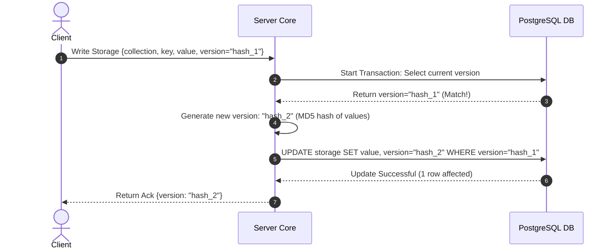

# TDD-12: Storage Engine

> **Project:** Ultimate Game Engine — Multiplayer Game Server  
> **Technical Design:** Storage Engine  
> **Version:** 1.0  
> **Last Updated:** 2026-07-01  
> **Status:** Draft  
> **Priority:** Technical Architecture

---

## 1. Purpose & Scope

Define the requirements for a NoSQL-style document storage layer that enables developers to store and retrieve arbitrary JSON data per user or globally. This system stores player inventory, settings, quest progress, character data, cosmetics, and any game-specific data.

---

Refer to [BRD-12](../BRD/12_storage_engine.md) for the business requirements and [PRD-12](../PRD/12_storage_engine.md) for the API surface.

---

## 2. Architecture & Design Flow

The storage engine provides key-value logic backed by PostgreSQL's `JSONB` format. Version checks implement optimistic concurrency to prevent race conditions during updates.

### Optimistic Concurrency Write Flow


---

## 3. Database Schema & Data Models

### Raw DDL Schemas

```sql
CREATE TABLE IF NOT EXISTS storage (
    collection       VARCHAR(128) NOT NULL,
    key              VARCHAR(128) NOT NULL,
    user_id          UUID NOT NULL, -- DEFAULT '00000000-0000-0000-0000-000000000000' for global
    value            JSONB DEFAULT '{}'::jsonb NOT NULL,
    version          VARCHAR(64) NOT NULL, -- MD5 hash string
    permission_read  SMALLINT DEFAULT 1 NOT NULL, -- 0=no read, 1=owner only, 2=public
    permission_write SMALLINT DEFAULT 1 NOT NULL, -- 0=no write (server-only), 1=owner only
    create_time      TIMESTAMPTZ DEFAULT CURRENT_TIMESTAMP NOT NULL,
    update_time      TIMESTAMPTZ DEFAULT CURRENT_TIMESTAMP NOT NULL,
    PRIMARY KEY (collection, key, user_id)
);
```

### Table Indexes

```sql
-- Index for listing all objects in a collection for a specific user
CREATE INDEX IF NOT EXISTS idx_storage_user_collection
ON storage (user_id, collection);

-- Index for public read lookup (where permission_read = 2)
CREATE INDEX IF NOT EXISTS idx_storage_public_read
ON storage (collection, key)
WHERE permission_read = 2;
```

---

## 4. Algorithmic Logic & Execution Flow

### Optimistic Concurrency Control Check
When performing a write with an expected version:
1. Verify if `version` parameter is set.
2. If `version` is not set:
   - Perform unconditional upsert:
     ```sql
     INSERT INTO storage (collection, key, user_id, value, version, permission_read, permission_write, update_time)
     VALUES ($1, $2, $3, $4, $5, $6, $7, NOW())
     ON CONFLICT (collection, key, user_id) 
     DO UPDATE SET value = EXCLUDED.value, version = EXCLUDED.version, update_time = NOW();
     ```
3. If `version` is provided (e.g., `"old_version_hash"`):
   - Attempt update with condition:
     ```sql
     UPDATE storage 
     SET value = $1, version = $2, update_time = NOW()
     WHERE collection = $3 AND key = $4 AND user_id = $5 AND version = $6;
     ```
   - Check rows affected. If `0`, rollback and throw HTTP `409 Conflict` (gRPC `ABORTED`).

### Go Version Hashing Example

```go
package main

import (
	"crypto/md5"
	"encoding/hex"
	"encoding/json"
)

func GenerateVersion(value interface{}) (string, error) {
	bytes, err := json.Marshal(value)
	if err != nil {
		return "", err
	}
	hash := md5.Sum(bytes)
	return hex.EncodeToString(hash[:]), nil
}
```

---

## 5. Linked Documents
- [BRD-12](../BRD/12_storage_engine.md) (Business Requirements Document)
- [PRD-12](../PRD/12_storage_engine.md) (Product Requirements Document)
