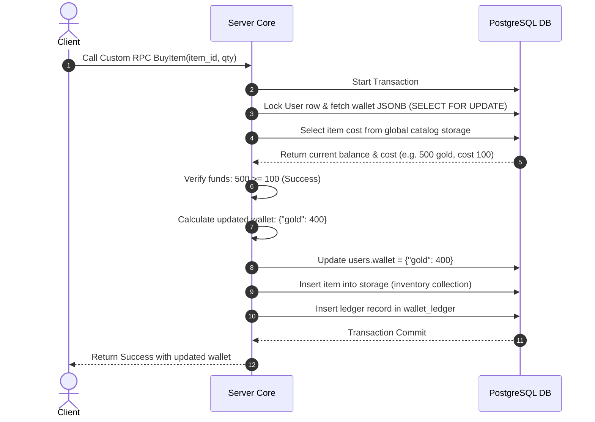

# TDD-13: Economy System

> **Project:** Ultimate Game Engine — Multiplayer Game Server  
> **Technical Design:** Economy System  
> **Version:** 1.0  
> **Last Updated:** 2026-07-01  
> **Status:** Draft  
> **Priority:** Technical Architecture

---

## 1. Purpose & Scope

Define the technical design for a game economy infrastructure supporting virtual currencies, player wallets, inventory management, item definitions, shops, crafting, and XP/leveling. While the server provides the foundational APIs and data structures, specific economy rules are implemented via server-side game logic.

---

Refer to [BRD-13](../BRD/13_economy_system.md) for the business requirements and [PRD-13](../PRD/13_economy_system.md) for the API surface.

---

## 2. Architecture & Design Flow

The economy system features atomic balance changes. Since wallet balances are stored as a JSONB map in `users.wallet`, mutations are performed within SQL database transactions to avoid race conditions.

### Atomicity and Purchase Flow


---

## 3. Database Schema & Data Models

### Wallet Column Definition
The player's active wallet balance is mapped in the `users` table as a `JSONB` column:
```sql
ALTER TABLE users ADD COLUMN IF NOT EXISTS wallet JSONB DEFAULT '{}'::jsonb NOT NULL;
```

### Wallet Ledger Schema

```sql
CREATE TABLE IF NOT EXISTS wallet_ledger (
    id              UUID PRIMARY KEY DEFAULT gen_random_uuid(),
    user_id         UUID NOT NULL REFERENCES users(id) ON DELETE CASCADE,
    changeset       JSONB NOT NULL, -- e.g., {"coins": 100} or {"gems": -10}
    metadata        JSONB DEFAULT '{}'::jsonb NOT NULL, -- e.g., {"reason": "quest_reward"}
    create_time     TIMESTAMPTZ DEFAULT CURRENT_TIMESTAMP NOT NULL
);
```

### Table Indexes

```sql
-- Optimal index for auditing wallet changesets (newest first)
CREATE INDEX IF NOT EXISTS idx_wallet_ledger_user_history
ON wallet_ledger (user_id, create_time DESC);
```

---

## 4. Algorithmic Logic & Execution Flow

### Atomic Wallet Mutation Algorithm
To modify balances without race conditions:
1. Begin SQL transaction.
2. Select and lock user record:
   ```sql
   SELECT wallet FROM users WHERE id = $1 FOR UPDATE;
   ```
3. Parse the existing wallet map and apply the changesets:
   - For each currency key in changeset:
     - New Balance = Current Balance + Changeset Value.
     - If New Balance < 0 and `economy.allow_negative_balances` is false:
       - Rollback transaction and return error `INSUFFICIENT_FUNDS`.
4. Update the user record with the merged JSONB map:
   ```sql
   UPDATE users SET wallet = $2 WHERE id = $1;
   ```
5. Write the delta to `wallet_ledger` for auditing.
6. Commit transaction.

### Go Atomic Wallet Transaction Example

```go
package main

import (
	"context"
	"database/sql"
	"encoding/json"
	"errors"
)

func UpdateWalletTx(ctx context.Context, db *sql.DB, userID string, changeset map[string]int64, metadata map[string]interface{}) (map[string]int64, error) {
	tx, err := db.BeginTx(ctx, nil)
	if err != nil {
		return nil, err
	}
	defer tx.Rollback()

	// 1. Lock user and select current wallet
	var walletBytes []byte
	err = tx.QueryRowContext(ctx, "SELECT wallet FROM users WHERE id = $1 FOR UPDATE", userID).Scan(&walletBytes)
	if err != nil {
		return nil, err
	}

	wallet := make(map[string]int64)
	if err := json.Unmarshal(walletBytes, &wallet); err != nil {
		return nil, err
	}

	// 2. Apply delta changesets
	for currency, delta := range changeset {
		current := wallet[currency]
		newBalance := current + delta
		if newBalance < 0 {
			return nil, errors.New("INSUFFICIENT_FUNDS")
		}
		wallet[currency] = newBalance
	}

	newWalletBytes, _ := json.Marshal(wallet)

	// 3. Save new balance
	_, err = tx.ExecContext(ctx, "UPDATE users SET wallet = $1 WHERE id = $2", newWalletBytes, userID)
	if err != nil {
		return nil, err
	}

	// 4. Log in ledger
	changesetBytes, _ := json.Marshal(changeset)
	metaBytes, _ := json.Marshal(metadata)
	_, err = tx.ExecContext(ctx, `
		INSERT INTO wallet_ledger (user_id, changeset, metadata)
		VALUES ($1, $2, $3)`,
		userID, changesetBytes, metaBytes)
	if err != nil {
		return nil, err
	}

	if err := tx.Commit(); err != nil {
		return nil, err
	}

	return wallet, nil
}
```

---

## 6. Performance & Security Considerations

### Performance
- **Transaction Lock Duration**: The `SELECT ... FOR UPDATE` on `users.wallet` must be held for <50ms. Minimize logic between lock acquisition and commit.
- **Ledger Table Growth**: The `wallet_ledger` table grows unboundedly. Implement a retention policy: archive records older than **180 days** to cold storage and prune from the primary table.
- **Ledger Index**: The `idx_wallet_ledger_user_history` index is critical. Monitor index bloat and schedule `REINDEX` during maintenance windows.
- **Batch Wallet Updates**: For tournament rewards or bulk grants, batch wallet updates in groups of 50 within a single transaction to reduce round-trips.
- **Latency Target**: Single wallet mutation p99 <20ms.

### Security
- **Integer Overflow Protection**: Before applying any changeset, validate:
  - Each individual delta: must be within `[-1,000,000,000, 1,000,000,000]` (±1B per transaction).
  - Resulting balance: must be within `[0, 9,999,999,999]` (10B max per currency). Reject with `INVALID_ARGUMENT` if overflow would occur.
- **Negative Balance Prevention**: Default `economy.allow_negative_balances = false`. When disabled, any changeset that would result in a negative balance must atomically fail the entire transaction.
- **Server-Only Wallet Operations**: Clients **must never** directly call wallet mutation endpoints. All wallet changes must flow through server-side logic (RPCs, hooks, match handlers). The REST/gRPC wallet endpoints should require `server_key` authentication.
- **Audit Trail**: Every wallet mutation **must** create a `wallet_ledger` entry. The `metadata` field must include at minimum: `source` (e.g., "iap", "quest_reward", "admin_grant"), `reference_id`, and `timestamp`.
- **Anomaly Detection**: Alert operators when:
  - A single user accumulates >100 transactions within 1 minute.
  - A single transaction delta exceeds 100× the median delta for that currency.
  - A wallet balance drops from >0 to exactly 0 more than 3 times in 1 hour.
- **Changeset Validation**: Reject changesets containing unknown currency keys (not in the configured currency whitelist).

---

## 5. Linked Documents
- [BRD-13](../BRD/13_economy_system.md) (Business Requirements Document)
- [PRD-13](../PRD/13_economy_system.md) (Product Requirements Document)
