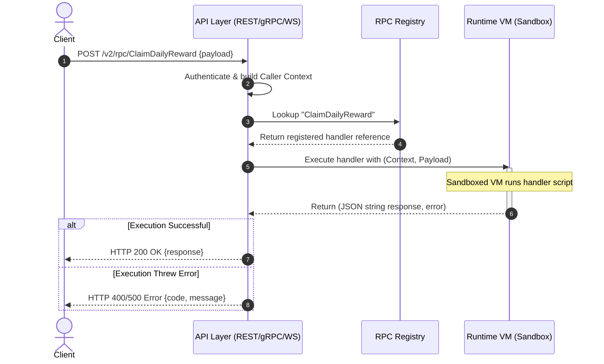

# TDD-14: RPC & Custom APIs

> **Project:** Ultimate Game Engine — Multiplayer Game Server  
> **Technical Design:** RPC & Custom APIs  
> **Version:** 1.0  
> **Last Updated:** 2026-07-01  
> **Status:** Draft  
> **Priority:** Technical Architecture

---

## 1. Purpose & Scope

Define the requirements for a Remote Procedure Call (RPC) system that allows developers to create custom backend functions callable from game clients or other server-side code. RPCs extend the server's functionality beyond built-in features, enabling game-specific business logic.

---

Refer to [BRD-14](../BRD/14_rpc_custom_apis.md) for the business requirements and [PRD-14](../PRD/14_rpc_custom_apis.md) for the API surface.

---

## 2. Architecture & Design Flow

The RPC gateway resolves target functions registered during the server initialization phase. Requests run within isolated JavaScript or Lua virtual machine contexts.

### Client-Server RPC Execution Flow


---

## 3. Database Schema & Data Models

RPC registrations are transient, in-memory function pointers mapped during server startup. They do not write metadata or definitions to PostgreSQL.

### In-Memory RPC Registry Data Structure

```typescript
interface RpcContext {
  userId?: string;       // Empty for unauthenticated RPCs
  username?: string;     // Empty for unauthenticated RPCs
  clientIp: string;
  clientPort: string;
  env: Record<string, string>; // Server configuration env vars
  headers: Record<string, string>;
  queryParams: Record<string, string[]>;
}

type RpcFunction = (
  ctx: RpcContext,
  logger: any,
  nk: any,
  payload: string
) => string; // Returns JSON string payload
```

---

## 4. Algorithmic Logic & Execution Flow

### Sandboxed Execution & Timeout Algorithm
1. Upon receiving an RPC request:
   - Instantiate/acquire a sandboxed virtual machine instance from the runtime pool.
   - Build the `RpcContext` object from the request headers and transport parameters.
2. Initialize execution monitoring:
   - Start a watchdog timer set to `rpc.execution_timeout_ms` (default: 5000ms).
3. Execute the target handler.
4. If the watchdog timer fires before completion:
   - Terminate the VM execution thread/coroutine immediately.
   - Reclaim the VM instance (or taint it and spin up a new one to prevent memory leaks).
   - Return a `504 Gateway Timeout` (gRPC `DEADLINE_EXCEEDED`) error to the client.
5. If completion occurs in time, return the JSON string response and recycle the VM back into the idle pool.

### Go RPC Invocation & Dispatcher Example

```go
package main

import (
	"context"
	"errors"
	"time"
)

type RpcRegistry struct {
	handlers map[string]func(ctx context.Context, payload string) (string, error)
}

func (r *RpcRegistry) Invoke(ctx context.Context, functionID string, payload string, timeout time.Duration) (string, error) {
	handler, exists := r.handlers[functionID]
	if !exists {
		return "", errors.New("RPC_NOT_FOUND")
	}

	// Enforce hard execution context timeouts
	timeoutCtx, cancel := context.WithTimeout(ctx, timeout)
	defer cancel()

	resultChan := make(chan string, 1)
	errChan := make(chan error, 1)

	go func() {
		res, err := handler(timeoutCtx, payload)
		if err != nil {
			errChan <- err
		} else {
			resultChan <- res
		}
	}()

	select {
	case res := <-resultChan:
		return res, nil
	case err := <-errChan:
		return "", err
	case <-timeoutCtx.Done():
		return "", errors.New("EXECUTION_TIMEOUT")
	}
}
```

---

## 6. Performance & Security Considerations

### Performance
- **VM Pool Size**: Configure `runtime.max_vms` based on expected concurrent RPC load. Default: **100 VMs**. Each VM consumes ~10 MB memory. Total: ~1 GB for the VM pool.
- **Execution Timeout**: Default `rpc.execution_timeout_ms = 5000`. For latency-critical RPCs, allow per-function timeout overrides via registration metadata.
- **VM Recycling**: After a timeout-terminated execution, taint the VM instance and replace it with a fresh one (avoid memory corruption from interrupted state).
- **Concurrency Queuing**: When all VMs are busy, queue up to **500 pending RPC requests**. Beyond this, return `503 Service Unavailable`.
- **Latency Target**: RPC round-trip (request → response) p99 <200ms for typical game logic functions.

### Security
- **Payload Size Limits**:
  - Max RPC request payload: **16 KB**.
  - Max RPC response payload: **16 KB**.
  - Reject oversized payloads before dispatching to the handler VM.
- **Environment Variable Exposure**: The RPC context `env` map must be **whitelisted**. Only expose non-sensitive configuration keys. Never include: database URLs, API secrets, private keys, or admin credentials.
- **Per-Function Rate Limiting**: Allow rate limit configuration per RPC function:
  - Default: **100 calls per minute per user** per function.
  - High-frequency functions (e.g., heartbeat): configurable up to 600/min.
  - Sensitive functions (e.g., purchase): max 10/min.
- **Unauthenticated RPCs**: RPCs registered with `allowUnauthenticated = true` must still be rate-limited by IP address (max 30/min per IP).
- **Input Sanitization**: RPC payload strings must be validated for maximum length and character encoding (UTF-8 only). Reject payloads with null bytes or invalid codepoints.
- **Error Information Leakage**: RPC error responses must not expose internal stack traces, database queries, or file paths. Return sanitized error codes and messages only.

---

## 5. Linked Documents
- [BRD-14](../BRD/14_rpc_custom_apis.md) (Business Requirements Document)
- [PRD-14](../PRD/14_rpc_custom_apis.md) (Product Requirements Document)
