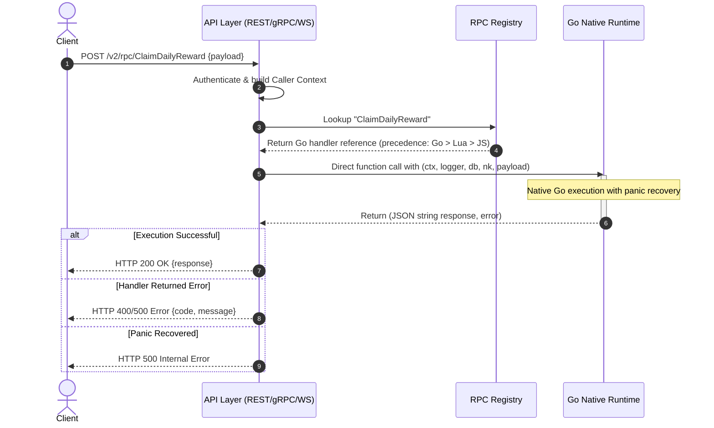
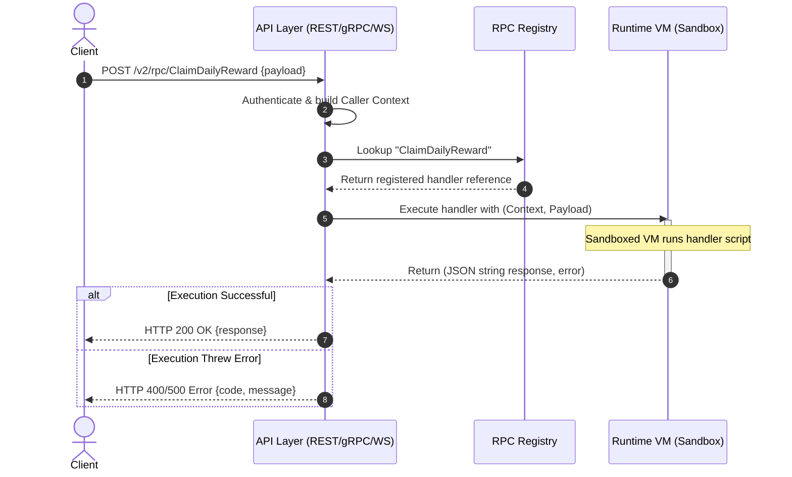

# TDD-14: RPC & Custom APIs

> **Project:** Ultimate Game Engine — Multiplayer Game Server  
> **Technical Design:** RPC & Custom APIs  
> **Version:** 1.1  
> **Last Updated:** 2026-07-09  
> **Status:** Draft  
> **Priority:** Technical Architecture

---

## 1. Purpose & Scope

Define the requirements for a Remote Procedure Call (RPC) system that allows developers to create custom backend functions callable from game clients or other server-side code. RPCs extend the server's functionality beyond built-in features, enabling game-specific business logic.

The RPC system supports two distinct execution models:
- **Go Native Runtime**: Compiled `.so` plugin modules running natively within the server process. No VM sandboxing. Direct `*sql.DB` database access.
- **VM Sandbox Runtime**: Lua and JavaScript/TypeScript scripts executing within isolated virtual machine contexts with enforced memory and CPU limits.

When the same RPC function name is registered in multiple runtimes, the evaluation precedence is **Go → Lua → JavaScript**.

---

Refer to [BRD-14](../BRD/14_rpc_custom_apis.md) for the business requirements and [PRD-14](../PRD/14_rpc_custom_apis.md) for the API surface.

---

## 2. Architecture & Design Flow

### 2.1 Go Native RPC Execution Flow

Go RPC handlers execute as direct native function calls within the server process. There is no VM overhead, no instruction budget, and no memory sandbox. The server wraps all Go handler invocations with `recover()` to prevent panics from crashing the process.



### 2.2 VM Sandbox RPC Execution Flow (Lua/JavaScript)

Lua and JavaScript RPC handlers execute within isolated virtual machine contexts with enforced resource limits.



---

## 3. Data Models & Function Signatures

RPC registrations are transient, in-memory function pointers mapped during server startup. They do not write metadata or definitions to PostgreSQL.

### 3.1 Go Native Runtime Signatures

#### InitModule Entry Point

All Go modules must export this function. It is invoked once at server startup when the `.so` plugin is loaded.

```go
// InitModule is the required entry point for Go runtime modules.
func InitModule(ctx context.Context, logger runtime.Logger, db *sql.DB, nk runtime.Module, initializer runtime.Initializer) error {
    if err := initializer.RegisterRpc("ClaimDailyReward", ClaimDailyReward); err != nil {
        return err
    }
    return nil
}
```

#### Go RPC Handler Signature

```go
// RPCHandler is the function signature for Go native RPC handlers.
// All parameters are provided by the server at invocation time.
type RPCHandler func(
    ctx    context.Context,  // Request context with user ID, session ID, client IP
    logger runtime.Logger,   // Structured logger
    db     *sql.DB,          // Direct PostgreSQL database handle
    nk     runtime.Module,   // Server runtime API (storage, wallet, leaderboards, etc.)
    payload string,          // JSON string from client
) (string, error)            // Returns JSON string response or error
```

#### Go RPC Context Keys

The `ctx` parameter contains request-scoped values accessible via standard Go context keys:

| Context Key | Type | Description |
|-------------|------|-------------|
| `runtime.RUNTIME_CTX_USER_ID` | `string` | Caller's user ID (empty for unauthenticated RPCs) |
| `runtime.RUNTIME_CTX_USERNAME` | `string` | Caller's username |
| `runtime.RUNTIME_CTX_USER_SESSION_ID` | `string` | Active session identifier |
| `runtime.RUNTIME_CTX_CLIENT_IP` | `string` | Caller's IP address |
| `runtime.RUNTIME_CTX_CLIENT_PORT` | `string` | Caller's port |
| `runtime.RUNTIME_CTX_ENV` | `map[string]string` | Server environment variables (whitelisted) |
| `runtime.RUNTIME_CTX_HEADERS` | `map[string][]string` | HTTP headers (REST only) |
| `runtime.RUNTIME_CTX_QUERY_PARAMS` | `map[string][]string` | URL query parameters (REST only) |

### 3.2 VM Sandbox Runtime Signatures (Lua/TypeScript)

```typescript
interface RpcContext {
  userId?: string;       // Empty for unauthenticated RPCs
  username?: string;     // Empty for unauthenticated RPCs
  clientIp: string;
  clientPort: string;
  env: Record<string, string>; // Server configuration env vars
  headers: Record<string, string>;
  queryParams: Record<string, string[]>;
}

type RpcFunction = (
  ctx: RpcContext,
  logger: any,
  nk: any,
  payload: string
) => string; // Returns JSON string payload
```

---

## 4. Algorithmic Logic & Execution Flow

### 4.1 Go Native RPC Dispatcher Algorithm

Go RPCs bypass the VM pool entirely. They execute as direct function calls with panic recovery:

1. Upon receiving an RPC request:
   - Look up the function in the registry. Check Go registry first (precedence: Go → Lua → JS).
   - If found in Go registry, proceed with native dispatch.
2. Build the caller context from request headers and transport parameters.
3. Execute the Go handler within a `recover()` wrapper:
   ```go
   func (r *GoRuntimeManager) InvokeRPC(ctx context.Context, id string, payload string) (result string, err error) {
       handler, exists := r.rpcHandlers[id]
       if !exists {
           return "", errors.New("RPC_NOT_FOUND")
       }

       // Panic recovery — prevents Go module crashes from killing the server
       defer func() {
           if r := recover(); r != nil {
               err = fmt.Errorf("RPC panic recovered: %v", r)
           }
       }()

       return handler(ctx, r.logger, r.db, r.nk, payload)
   }
   ```
4. If the handler returns an error, map it to the appropriate gRPC/HTTP status code.
5. If a panic is recovered, log the stack trace and return `500 Internal Server Error`.

### 4.2 VM Sandbox Execution & Timeout Algorithm (Lua/JavaScript)

1. Upon receiving an RPC request (not found in Go registry):
   - Instantiate/acquire a sandboxed virtual machine instance from the runtime pool.
   - Build the `RpcContext` object from the request headers and transport parameters.
2. Initialize execution monitoring:
   - Start a watchdog timer set to `rpc.execution_timeout_ms` (default: 5000ms).
3. Execute the target handler.
4. If the watchdog timer fires before completion:
   - Terminate the VM execution thread/coroutine immediately.
   - Reclaim the VM instance (or taint it and spin up a new one to prevent memory leaks).
   - Return a `504 Gateway Timeout` (gRPC `DEADLINE_EXCEEDED`) error to the client.
5. If completion occurs in time, return the JSON string response and recycle the VM back into the idle pool.

### 4.3 Runtime Precedence Resolution

When an RPC function name is looked up, the registry checks runtimes in order:

```go
func (r *RuntimeRegistry) GetRPC(id string) (RPCHandler, RuntimeType, bool) {
    // 1. Check Go native runtime first (highest performance)
    if handler, ok := r.goRPCs[id]; ok {
        return handler, RuntimeGo, true
    }
    // 2. Check Lua VM runtime
    if handler, ok := r.luaRPCs[id]; ok {
        return handler, RuntimeLua, true
    }
    // 3. Check JavaScript VM runtime
    if handler, ok := r.jsRPCs[id]; ok {
        return handler, RuntimeJS, true
    }
    return nil, 0, false
}
```

---

## 5. Go Module Loading Lifecycle

### Plugin Loading at Startup

1. **Scan Directory**: Read all `.so` files from the configured `runtime.path` directory.
2. **Checksum Verification**: Verify each `.so` file's SHA-256 checksum against the approved plugin manifest (if configured).
3. **Load Plugin**: Call `plugin.Open(path)` to load the shared object into the server process.
4. **Resolve Symbol**: Look up the exported `InitModule` function via `plugin.Lookup("InitModule")`.
5. **Type Assert**: Assert the symbol matches the `InitModuleFunc` type signature.
6. **Execute**: Call `InitModule(ctx, logger, db, nk, initializer)` — the initializer captures all registrations.
7. **Error Handling**: If `InitModule` returns an error, log `ERROR` and skip the module. Do not crash the server.

```go
type InitModuleFunc func(ctx context.Context, logger Logger, db *sql.DB, nk RuntimeModule, initializer Initializer) error

func (m *GoRuntimeManager) LoadPlugin(path string) error {
    p, err := plugin.Open(path)
    if err != nil {
        return fmt.Errorf("failed to open plugin %s: %w", path, err)
    }

    sym, err := p.Lookup("InitModule")
    if err != nil {
        return fmt.Errorf("plugin %s missing InitModule: %w", path, err)
    }

    initFn, ok := sym.(InitModuleFunc)
    if !ok {
        return fmt.Errorf("plugin %s InitModule has wrong signature", path)
    }

    return initFn(m.ctx, m.logger, m.db, m.nk, m.initializer)
}
```

---

## 6. Performance & Security Considerations

### Performance

#### Go Native Runtime
- **Zero VM Overhead**: Go RPCs execute as native function calls. No VM instantiation, no instruction counting, no memory sandbox overhead.
- **Latency Target**: Go RPC p99 < 50ms (significantly faster than VM-based RPCs due to no sandbox overhead).
- **Concurrency**: Go handlers can leverage goroutines for internal parallelism, but must be careful with shared state in a multi-node cluster.
- **No Pool Sizing**: Unlike VMs, Go handlers do not consume VM pool slots. They run on the server's goroutine scheduler.

#### VM Sandbox Runtime (Lua/JavaScript)
- **VM Pool Size**: Configure `runtime.max_vms` based on expected concurrent RPC load. Default: **100 VMs**. Each VM consumes ~10 MB memory. Total: ~1 GB for the VM pool.
- **Execution Timeout**: Default `rpc.execution_timeout_ms = 5000`. For latency-critical RPCs, allow per-function timeout overrides via registration metadata.
- **VM Recycling**: After a timeout-terminated execution, taint the VM instance and replace it with a fresh one (avoid memory corruption from interrupted state).
- **Concurrency Queuing**: When all VMs are busy, queue up to **500 pending RPC requests**. Beyond this, return `503 Service Unavailable`.
- **Latency Target**: RPC round-trip (request → response) p99 <200ms for typical game logic functions.

### Security

#### Go Native Runtime
- **No Sandboxing**: Go modules run natively with full system access. Faulty code can crash the server, corrupt memory, or access the filesystem.
- **Panic Recovery**: All Go handler invocations are wrapped with `recover()` to catch panics and return errors instead of crashing the server process.
- **Plugin Verification**: Before loading `.so` plugins, verify the file's SHA-256 checksum against a manifest of approved plugins. Reject unsigned or tampered plugins.
- **Go Version Pinning**: Plugins must be compiled with the exact same Go version as the server binary. Version mismatches cause load failures.

#### VM Sandbox Runtime (Lua/JavaScript)
- **Payload Size Limits**:
  - Max RPC request payload: **16 KB**.
  - Max RPC response payload: **16 KB**.
  - Reject oversized payloads before dispatching to the handler VM.
- **Environment Variable Exposure**: The RPC context `env` map must be **whitelisted**. Only expose non-sensitive configuration keys. Never include: database URLs, API secrets, private keys, or admin credentials.
- **Per-Function Rate Limiting**: Allow rate limit configuration per RPC function:
  - Default: **100 calls per minute per user** per function.
  - High-frequency functions (e.g., heartbeat): configurable up to 600/min.
  - Sensitive functions (e.g., purchase): max 10/min.
- **Unauthenticated RPCs**: RPCs registered with `allowUnauthenticated = true` must still be rate-limited by IP address (max 30/min per IP).
- **Input Sanitization**: RPC payload strings must be validated for maximum length and character encoding (UTF-8 only). Reject payloads with null bytes or invalid codepoints.
- **Error Information Leakage**: RPC error responses must not expose internal stack traces, database queries, or file paths. Return sanitized error codes and messages only.

---

## 7. Linked Documents
- [BRD-14](../BRD/14_rpc_custom_apis.md) (Business Requirements Document)
- [PRD-14](../PRD/14_rpc_custom_apis.md) (Product Requirements Document)
- [ADR-0006](../Architecture/ADR/0006-go-native-runtime-architecture.md) (Go Native Runtime Architecture Decision)

---

## Version History

| Version | Date | Author | Changes |
|---------|------|--------|---------|
| 1.0 | 2026-07-01 | Engineering | Initial TDD |
| 1.1 | 2026-07-09 | Engineering | Added Go native runtime execution path, Go function signatures, InitModule lifecycle, runtime precedence (Go → Lua → JS), panic recovery dispatcher, separated Go vs VM performance/security considerations |
