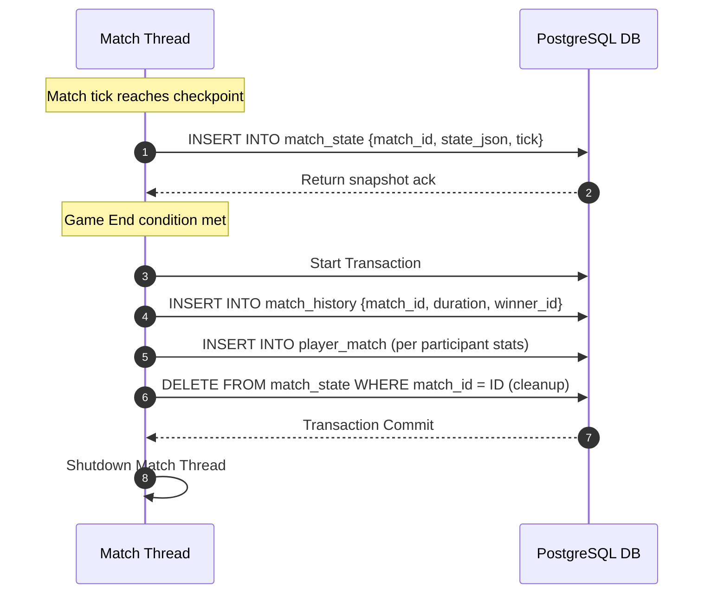

# TDD-15: Match State & Persistence

> **Project:** Ultimate Game Engine — Multiplayer Game Server  
> **Technical Design:** Match State & Persistence  
> **Version:** 1.0  
> **Last Updated:** 2026-07-01  
> **Status:** Draft  
> **Priority:** Technical Architecture

---

## 1. Purpose & Scope

Define the technical design for persisting match state snapshots, match history records, and player-match outcome analytics. This system allows match resumption after server interruptions and provides queryable historical match results.

---

Refer to [BRD-15](../BRD/15_match_state_persistence.md) for the business requirements and [PRD-15](../PRD/15_match_state_persistence.md) for the API surface.

---

## 2. Architecture & Design Flow

Active authoritative matches persist checkpoint snapshots directly to PostgreSQL. At match termination, final statistics and win/loss records are committed within an atomic transaction.

### State Snapshot & Match Termination Flow


---

## 3. Database Schema & Data Models

### Raw DDL Schemas

```sql
CREATE TABLE IF NOT EXISTS match_state (
    match_id         UUID NOT NULL,
    snapshot_index   INT NOT NULL,
    state            BYTEA NOT NULL, -- Compressed binary state payload
    tick             BIGINT DEFAULT 0 NOT NULL,
    players          UUID[] NOT NULL,
    metadata         JSONB DEFAULT '{}'::jsonb NOT NULL,
    create_time      TIMESTAMPTZ DEFAULT CURRENT_TIMESTAMP NOT NULL,
    PRIMARY KEY (match_id, snapshot_index)
);

CREATE TABLE IF NOT EXISTS match_history (
    match_id         UUID PRIMARY KEY,
    match_type       VARCHAR(64) NOT NULL,
    players          JSONB NOT NULL, -- Array of player objects
    winner_id        UUID,
    duration         INT NOT NULL, -- duration in seconds
    start_time       TIMESTAMPTZ NOT NULL,
    end_time         TIMESTAMPTZ NOT NULL,
    metadata         JSONB DEFAULT '{}'::jsonb NOT NULL,
    result           JSONB DEFAULT '{}'::jsonb NOT NULL,
    create_time      TIMESTAMPTZ DEFAULT CURRENT_TIMESTAMP NOT NULL
);

CREATE TABLE IF NOT EXISTS player_match (
    user_id          UUID NOT NULL REFERENCES users(id) ON DELETE CASCADE,
    match_id         UUID NOT NULL REFERENCES match_history(match_id) ON DELETE CASCADE,
    stats            JSONB DEFAULT '{}'::jsonb NOT NULL,
    outcome          VARCHAR(16) NOT NULL, -- win, loss, draw
    score            BIGINT DEFAULT 0 NOT NULL,
    PRIMARY KEY (user_id, match_id)
);
```

### Table Indexes

```sql
-- Optimal index for pulling paginated match history for a specific player
CREATE INDEX IF NOT EXISTS idx_player_match_history_lookup
ON player_match (user_id, match_id DESC);
```

---

## 4. Algorithmic Logic & Execution Flow

### State Checkpointing and Restoration Logic
- **Save Checkpoint**:
  - The authoritative loop tracks ticks. Every $N$ ticks (e.g., 600 ticks for 1 minute checks), capture the active memory state map.
  - Serialize state to JSON and compress using `zlib` to reduce DB storage overhead.
  - Insert row in `match_state` with incremental `snapshot_index`.
- **Load Checkpoint**:
  - Upon recovery, query `match_state` for the maximum `snapshot_index` matching the `match_id`.
  - Decompress binary payload, parse JSON values into VM memory, and set start tick value.
  - Resume tick loops.

### Go Atomic History Persistence Example

```go
package main

import (
	"context"
	"database/sql"
	"encoding/json"
)

type PlayerResult struct {
	UserID  string `json:"user_id"`
	Outcome string `json:"outcome"`
	Score   int64  `json:"score"`
	Stats   string `json:"stats"` // JSON string
}

func SaveMatchHistoryTx(ctx context.Context, db *sql.DB, matchID string, matchType string, duration int, winnerID string, players []PlayerResult) error {
	tx, err := db.BeginTx(ctx, nil)
	if err != nil {
		return err
	}
	defer tx.Rollback()

	playersJSON, _ := json.Marshal(players)

	// 1. Insert global match history record
	_, err = tx.ExecContext(ctx, `
		INSERT INTO match_history (match_id, match_type, players, winner_id, duration, start_time, end_time)
		VALUES ($1, $2, $3, $4, $5, NOW() - INTERVAL '1 second' * $5, NOW())`,
		matchID, matchType, playersJSON, sql.NullString{String: winnerID, Valid: winnerID != ""}, duration)
	if err != nil {
		return err
	}

	// 2. Insert individual player results
	for _, p := range players {
		_, err = tx.ExecContext(ctx, `
			INSERT INTO player_match (user_id, match_id, stats, outcome, score)
			VALUES ($1, $2, $3, $4, $5)`,
			p.UserID, matchID, p.Stats, p.Outcome, p.Score)
		if err != nil {
			return err
		}
	}

	// 3. Clear temporary checkpoints
	_, err = tx.ExecContext(ctx, "DELETE FROM match_state WHERE match_id = $1", matchID)
	if err != nil {
		return err
	}

	return tx.Commit()
}
```

---

## 5. Linked Documents
- [BRD-15](../BRD/15_match_state_persistence.md) (Business Requirements Document)
- [PRD-15](../PRD/15_match_state_persistence.md) (Product Requirements Document)
