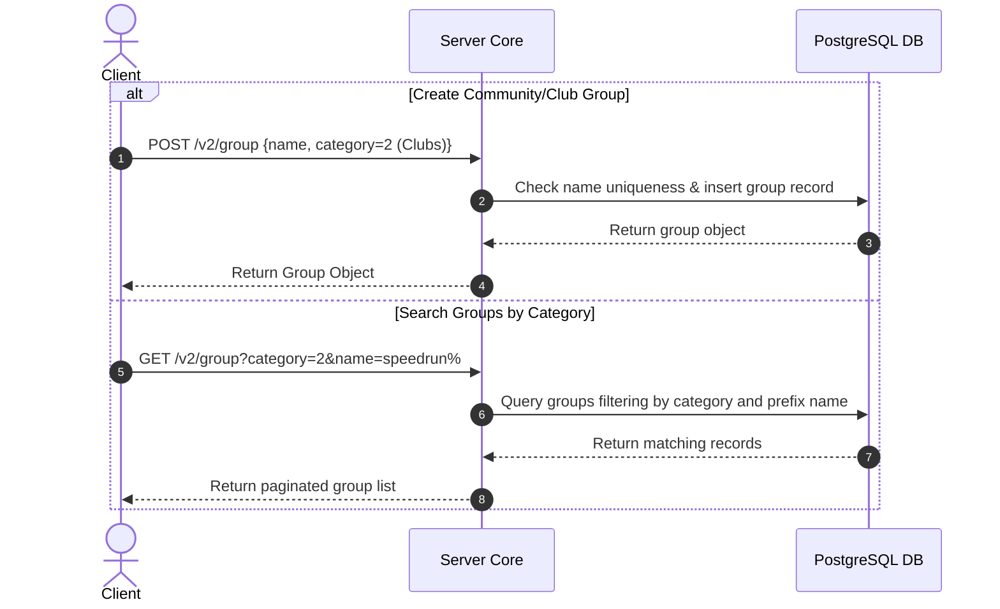

# TDD-16: Groups

> **Project:** Ultimate Game Engine — Multiplayer Game Server  
> **Technical Design:** Groups  
> **Version:** 1.0  
> **Last Updated:** 2026-07-01  
> **Status:** Draft  
> **Priority:** Technical Architecture

---

## 1. Purpose & Scope

Define the requirements for a general-purpose group system, distinct from guilds/clans, for organizing players into communities, clubs, schools, teams, and other non-competitive associations. Groups share the same underlying data model as guilds but serve different use cases.

---

Refer to [BRD-16](../BRD/16_groups.md) for the business requirements and [PRD-16](../PRD/16_groups.md) for the API surface.

---

## 2. Architecture & Design Flow

General-purpose groups leverage the same underlying database engine as Guilds & Clans. Separate application constraints are enforced dynamically by filtering on the `category` field.

### Group Creation & Search Flow


---

## 3. Database Schema & Data Models

### Shared Table Representation
Groups utilize the `groups` and `group_edge` tables specified in [TDD-09: Guilds & Clans](./09_guilds_clans.md#3-database-schema--data-models). The `category` column defines the group's concrete sub-type.

### Table Indexes

```sql
-- Index for quick category searches and filtering out deleted groups
CREATE INDEX IF NOT EXISTS idx_groups_category_search
ON groups (category, state, edge_count)
WHERE state = 0;
```

---

## 4. Algorithmic Logic & Execution Flow

### Category-Specific Join Limits Validation
Users can belong to multiple groups simultaneously, unlike competitive guilds which are restricted to one. When a player requests to join a group of category $C$:
1. Query the database to find how many groups the user belongs to:
   ```sql
   SELECT COUNT(ge.destination_id) 
   FROM group_edge ge 
   JOIN groups g ON ge.destination_id = g.id 
   WHERE ge.source_id = $1 AND ge.state < 3 AND g.category = $2;
   ```
2. If the count exceeds the configured limit for category $C$ (e.g., `group.max_non_guild_joined`), block the request and return an `INVALID_ARGUMENT` error.
3. If valid, proceed with standard edge insertion.

### Go Group Join Count Validation Example

```go
package main

import (
	"context"
	"database/sql"
)

func ValidateJoinLimit(ctx context.Context, db *sql.DB, userID string, category int, maxAllowed int) (bool, error) {
	var joinedCount int
	err := db.QueryRowContext(ctx, `
		SELECT COUNT(ge.destination_id) 
		FROM group_edge ge 
		JOIN groups g ON ge.destination_id = g.id 
		WHERE ge.source_id = $1 AND ge.state <= 2 AND g.category = $2`, 
		userID, category).Scan(&joinedCount)
	if err != nil {
		return false, err
	}

	return joinedCount < maxAllowed, nil
}
```

---

## 5. Linked Documents
- [BRD-16](../BRD/16_groups.md) (Business Requirements Document)
- [PRD-16](../PRD/16_groups.md) (Product Requirements Document)
