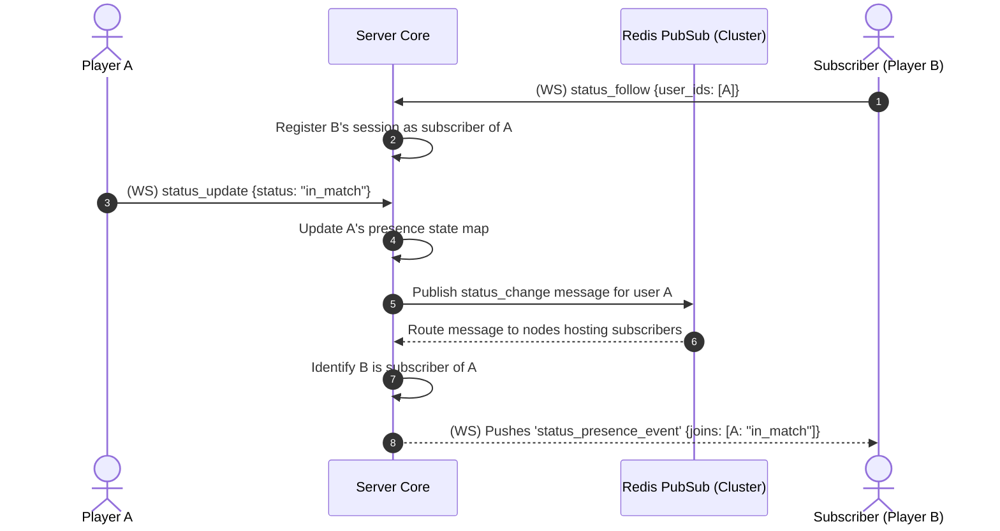

# TDD-17: Presence System

> **Project:** Ultimate Game Engine — Multiplayer Game Server  
> **Technical Design:** Presence System  
> **Version:** 1.0  
> **Last Updated:** 2026-07-01  
> **Status:** Draft  
> **Priority:** Technical Architecture

---

## 1. Purpose & Scope

Define the requirements for a real-time presence system that tracks the online status, current activity, match participation, party status, and other live state information of connected users. Presence is foundational to social features, matchmaking, and real-time coordination.

---

Refer to [BRD-17](../BRD/17_presence_system.md) for the business requirements and [PRD-17](../PRD/17_presence_system.md) for the API surface.

---

## 2. Architecture & Design Flow

Presence tracking operates as an in-memory subscription engine. Active connection states are tracked using Stream modes. In a clustered deployment, status changes are fanned out across nodes using Redis Pub/Sub or a clustered Gossip protocol.

### Status Subscription & Status Update Flow


---

## 3. Database Schema & Data Models

Real-time presence is highly volatile and is held entirely in-memory to prevent disk write bottlenecks. No persistent PostgreSQL schemas are utilized.

### Go Presence Data Structures

```go
package main

import "time"

type Stream struct {
	Mode       int    `json:"mode"`       // 0=status, 1=custom, 2=chat, 3=party, 4=match
	Subject    string `json:"subject"`    // Unique identifier (e.g. matchId, partyId, channelId)
	Subcontext string `json:"subcontext"` // Additional subcategory identifier
	Label      string `json:"label"`      // Metadata descriptor
}

type PresenceRecord struct {
	UserID    string    `json:"user_id"`
	SessionID string    `json:"session_id"`
	Username  string    `json:"username"`
	Node      string    `json:"node"`
	Status    string    `json:"status"` // Current JSON status string
	JoinedAt  time.Time `json:"joined_at"`
}

// In-Memory Registry Representations
type StreamPresences map[string][]PresenceRecord // Key: string representation of Stream
type UserSubscriptions map[string][]string      // Key: watched userId, Value: slice of subscriber sessionIds
```

---

## 4. Algorithmic Logic & Execution Flow

### Stream-based Observer Fan-Out Algorithm
1. When a client performs a `status_follow(target_ids)`:
   - For each target ID, insert the client's `session_id` into the target's `UserSubscriptions` observer set.
   - Look up if the target is currently online: check active presence registry. If online, immediately send a status join event back to the subscriber.
2. When a client performs `status_update(status_payload)`:
   - Update the client's active status value in the memory registry.
   - Fetch the list of subscriber session IDs from `UserSubscriptions` for the client.
   - If in a multi-node cluster, publish the update to the cluster-wide Pub/Sub channel.
   - Loop through active local sessions and write the WebSocket presence frame.

### Go Custom Stream Join & Send Example

```go
package main

import (
	"context"
	"encoding/json"
	"errors"
)

func JoinCustomStream(ctx context.Context, nk interface{}, stream Stream, userID string, sessionID string) error {
	// Join the specified real-time stream via the Nakama framework
	// success, err := nk.StreamUserJoin(stream.Mode, stream.Subject, stream.Subcontext, stream.Label, userID, sessionID, false, false, "")
	success := true
	if !success {
		return errors.New("STREAM_JOIN_FAILED")
	}

	eventPayload := map[string]string{
		"event":   "user_joined",
		"user_id": userID,
	}
	payloadBytes, err := json.Marshal(eventPayload)
	if err != nil {
		return err
	}

	// nk.StreamSend(stream.Mode, stream.Subject, stream.Subcontext, stream.Label, string(payloadBytes), nil, false)
	_ = payloadBytes
	return nil
}
```

---

## 6. Performance & Security Considerations

### Performance
- **Fan-Out Throttling**: For users with >1,000 subscribers, batch status update notifications into groups of 100 with a 1ms yield between batches to prevent event loop blocking.
- **Max Subscribers Per User**: Cap at **5,000 subscribers** per user. Beyond this, reject new `status_follow` requests with `RESOURCE_EXHAUSTED`.
- **Status Update Debouncing**: If a user sends multiple `status_update` calls within 100ms, coalesce into a single update (last-write-wins) to reduce fan-out volume.
- **Memory Budget**: Each `PresenceRecord` consumes ~200 bytes. With 50,000 concurrent users, total presence registry memory ≈10 MB.
- **Cluster Pub/Sub**: In multi-node deployments, use Redis Pub/Sub with message deduplication. Max Pub/Sub message size: **4 KB**.
- **Latency Target**: Status update propagation to all local subscribers p99 <5ms. Cross-node propagation p99 <20ms.

### Security
- **Status Update Rate Limiting**: Max **1 status update per second per user**. Excess updates are silently dropped.
- **Status Payload Validation**:
  - Max `status` string length: **2 KB**.
  - Must be valid JSON (if structured) or plain text.
  - Strip or reject control characters and null bytes.
- **Follow Abuse Prevention**: Max **100 `status_follow` calls per minute per user**. Prevents subscription enumeration attacks.
- **Privacy Controls**: Users should be able to configure who can follow their status:
  - `everyone` (default): Any authenticated user.
  - `friends_only`: Only mutual friends (state=0 in `user_edge`).
  - `nobody`: Disable all status follows.
- **Presence Spoofing Prevention**: The `UserID` and `SessionID` in `PresenceRecord` must always be injected server-side from the authenticated session. Never accept client-provided values.

---

## 5. Linked Documents
- [BRD-17](../BRD/17_presence_system.md) (Business Requirements Document)
- [PRD-17](../PRD/17_presence_system.md) (Product Requirements Document)
