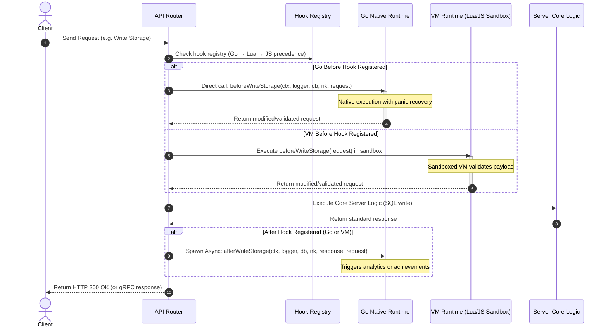

# TDD-18: Server Runtime & Hooks

> **Project:** Ultimate Game Engine — Multiplayer Game Server  
> **Technical Design:** Server Runtime & Hooks  
> **Version:** 1.1  
> **Last Updated:** 2026-07-09  
> **Status:** Draft  
> **Priority:** Technical Architecture

---

## 1. Purpose & Scope

Define the requirements for the server runtime environment that enables developers to write custom business logic, respond to system events, and extend built-in features. The runtime supports multiple programming languages and provides hooks into all major server events.

The server supports two distinct runtime execution models:
- **Go Native Runtime**: Compiled `.so` plugin modules loaded via `plugin.Open()` at startup. Native execution without VM sandboxing. Direct `*sql.DB` database access and full Go ecosystem.
- **VM Sandbox Runtime**: Lua and JavaScript/TypeScript scripts executing within isolated virtual machine contexts with enforced memory and CPU limits.

When the same hook or function name is registered across multiple runtimes, the evaluation precedence is **Go → Lua → JavaScript**.

---

Refer to [BRD-18](../BRD/18_server_runtime_hooks.md) for the business requirements and [PRD-18](../PRD/18_server_runtime_hooks.md) for the API surface.

---

## 2. Architecture & Design Flow

The runtime manager intercepts incoming and outgoing gateway packets. Hooks execute synchronously (before hooks) or asynchronously (after hooks/events). Go native hooks are dispatched as direct function calls; VM hooks are dispatched through the sandbox pool.

### 2.1 Before/After Hook Lifecycle Pipeline



---

## 3. Data Models & Registration Interfaces

Hooks, custom RPC functions, and runtime modules are configured and stored in memory during server startup. No database persistence is used for registrations.

### 3.1 Go Initializer Interface

The `Initializer` interface is provided to Go modules during `InitModule` execution. It provides type-safe registration methods for all extensibility points. The `Initializer` must **not** be cached or used after `InitModule` returns.

```go
// Initializer provides registration methods during module initialization.
// Available only during InitModule execution — do not store globally.
type Initializer interface {
	// RPC registration
	RegisterRpc(id string, fn func(ctx context.Context, logger Logger, db *sql.DB, nk RuntimeModule, payload string) (string, error)) error

	// Match handler registration
	RegisterMatch(name string, fn func(ctx context.Context, logger Logger, db *sql.DB, nk RuntimeModule) (Match, error)) error

	// Before hooks — intercept and modify/reject client requests
	RegisterBeforeRt(id string, fn func(ctx context.Context, logger Logger, db *sql.DB, nk RuntimeModule, envelope *Envelope) (*Envelope, error)) error
	RegisterBeforeAuthenticateEmail(fn func(ctx context.Context, logger Logger, db *sql.DB, nk RuntimeModule, in *AuthenticateEmailRequest) (*AuthenticateEmailRequest, error)) error
	RegisterBeforeWriteStorageObjects(fn func(ctx context.Context, logger Logger, db *sql.DB, nk RuntimeModule, in *WriteStorageObjectsRequest) (*WriteStorageObjectsRequest, error)) error
	RegisterBeforeAddFriends(fn func(ctx context.Context, logger Logger, db *sql.DB, nk RuntimeModule, in *AddFriendsRequest) (*AddFriendsRequest, error)) error
	RegisterBeforeJoinGroup(fn func(ctx context.Context, logger Logger, db *sql.DB, nk RuntimeModule, in *JoinGroupRequest) (*JoinGroupRequest, error)) error

	// After hooks — trigger side effects post-processing
	RegisterAfterRt(id string, fn func(ctx context.Context, logger Logger, db *sql.DB, nk RuntimeModule, out *Envelope, in *Envelope) error) error
	RegisterAfterAuthenticateEmail(fn func(ctx context.Context, logger Logger, db *sql.DB, nk RuntimeModule, out *Session, in *AuthenticateEmailRequest) error) error
	RegisterAfterWriteStorageObjects(fn func(ctx context.Context, logger Logger, db *sql.DB, nk RuntimeModule, out *StorageObjectAcks, in *WriteStorageObjectsRequest) error) error
	RegisterAfterAddFriends(fn func(ctx context.Context, logger Logger, db *sql.DB, nk RuntimeModule, in *AddFriendsRequest) error) error
	RegisterAfterJoinGroup(fn func(ctx context.Context, logger Logger, db *sql.DB, nk RuntimeModule, in *JoinGroupRequest) error) error

	// Event hooks — asynchronous system events
	RegisterEvent(fn func(ctx context.Context, logger Logger, evt *Event)) error
	RegisterEventSessionStart(fn func(ctx context.Context, logger Logger, evt *Event)) error
	RegisterEventSessionEnd(fn func(ctx context.Context, logger Logger, evt *Event)) error
	RegisterMatchmakerMatched(fn func(ctx context.Context, logger Logger, db *sql.DB, nk RuntimeModule, entries []MatchmakerEntry) (string, error)) error
	RegisterLeaderboardReset(fn func(ctx context.Context, logger Logger, db *sql.DB, nk RuntimeModule, leaderboard *Leaderboard, reset int64) error) error
	RegisterTournamentEnd(fn func(ctx context.Context, logger Logger, db *sql.DB, nk RuntimeModule, tournament *Tournament, end int64, reset int64) error) error
	RegisterTournamentReset(fn func(ctx context.Context, logger Logger, db *sql.DB, nk RuntimeModule, tournament *Tournament, end int64, reset int64) error) error
}
```

### 3.2 Go Runtime Handler Type Definitions

```go
// Logger provides structured logging for runtime modules.
type Logger interface {
	Debug(format string, args ...interface{})
	Info(format string, args ...interface{})
	Warn(format string, args ...interface{})
	Error(format string, args ...interface{})
}

// RuntimeModule provides access to all server-side APIs from runtime code.
type RuntimeModule interface {
	// Account & Users
	AccountGetId(ctx context.Context, userID string) (*Account, error)
	AccountsGetId(ctx context.Context, userIDs []string) ([]*Account, error)
	AccountUpdateId(ctx context.Context, userID, username string, metadata map[string]interface{}, displayName, timezone, location, langTag, avatarURL string) error
	AccountDeleteId(ctx context.Context, userID string, recorded bool) error
	UsersGetId(ctx context.Context, userIDs []string) ([]*User, error)
	UsersGetUsername(ctx context.Context, usernames []string) ([]*User, error)
	UsersBanId(ctx context.Context, userIDs []string) error
	UsersUnbanId(ctx context.Context, userIDs []string) error

	// Storage Engine
	StorageRead(ctx context.Context, reads []*StorageRead) ([]*StorageObject, error)
	StorageWrite(ctx context.Context, writes []*StorageWrite) ([]*StorageObjectAck, error)
	StorageDelete(ctx context.Context, deletes []*StorageDelete) error
	StorageList(ctx context.Context, callerID, userID, collection string, limit int, cursor string) ([]*StorageObject, string, error)
	StorageIndexList(ctx context.Context, callerID, indexName, query string, limit int, order []string, cursor string) ([]*StorageObject, string, error)

	// Wallet & Economy
	WalletUpdate(ctx context.Context, userID string, changeset map[string]int64, metadata map[string]interface{}, updateLedger bool) (map[string]int64, map[string]int64, error)
	WalletsUpdate(ctx context.Context, updates []*WalletUpdate, updateLedger bool) ([]*WalletUpdateResult, error)
	WalletLedgerUpdate(ctx context.Context, itemID string, metadata map[string]interface{}) (*WalletLedgerItem, error)
	WalletLedgerList(ctx context.Context, userID string, limit int, cursor string) ([]*WalletLedgerItem, string, error)

	// Leaderboards
	LeaderboardCreate(ctx context.Context, id string, authoritative bool, sortOrder, operator, resetSchedule string, metadata map[string]interface{}, enableRanks bool) error
	LeaderboardDelete(ctx context.Context, id string) error
	LeaderboardRecordsList(ctx context.Context, id string, ownerIDs []string, limit int, cursor string, expiry int64) (records []*LeaderboardRecord, ownerRecords []*LeaderboardRecord, nextCursor, prevCursor string, err error)
	LeaderboardRecordWrite(ctx context.Context, id, ownerID, username string, score, subscore int64, metadata map[string]interface{}) (*LeaderboardRecord, error)
	LeaderboardRecordDelete(ctx context.Context, id, ownerID string) error

	// Tournaments
	TournamentCreate(ctx context.Context, id string, authoritative bool, sortOrder, operator, resetSchedule string, metadata map[string]interface{}, title, description string, category, startTime, endTime, duration, maxSize, maxNumScore int, joinRequired, enableRanks bool) error
	TournamentDelete(ctx context.Context, id string) error
	TournamentAddAttempt(ctx context.Context, id, ownerID string, count int) error
	TournamentJoin(ctx context.Context, id, ownerID, username string) error
	TournamentRecordsList(ctx context.Context, tournamentID string, ownerIDs []string, limit int, cursor string, overrideExpiry int64) (records []*LeaderboardRecord, ownerRecords []*LeaderboardRecord, prevCursor, nextCursor string, err error)
	TournamentRecordWrite(ctx context.Context, id, ownerID, username string, score, subscore int64, metadata map[string]interface{}) (*LeaderboardRecord, error)
	TournamentRecordDelete(ctx context.Context, id, ownerID string) error

	// Groups & Guilds
	GroupsGetId(ctx context.Context, groupIDs []string) ([]*Group, error)
	GroupCreate(ctx context.Context, userID, name, creatorID, langTag, description, avatarURL string, open bool, metadata map[string]interface{}, maxCount int) (*Group, error)
	GroupUpdate(ctx context.Context, id, userID, name, creatorID, langTag, description, avatarURL string, open bool, metadata map[string]interface{}, maxCount int) error
	GroupDelete(ctx context.Context, id string) error
	GroupUserJoin(ctx context.Context, groupID, userID, username string) error
	GroupUserLeave(ctx context.Context, groupID, userID, username string) error
	GroupUsersAdd(ctx context.Context, callerID, groupID string, userIDs []string) error
	GroupUsersKick(ctx context.Context, callerID, groupID string, userIDs []string) error
	GroupUsersPromote(ctx context.Context, callerID, groupID string, userIDs []string) error
	GroupUsersDemote(ctx context.Context, callerID, groupID string, userIDs []string) error
	GroupUsersList(ctx context.Context, id string, limit int, state *int, cursor string) ([]*GroupUser, string, error)
	GroupsList(ctx context.Context, name, langTag string, members *int, open *bool, limit int, cursor string) ([]*Group, string, error)

	// Social & Friends
	FriendsList(ctx context.Context, userID string, limit int, state *int, cursor string) ([]*Friend, string, error)
	FriendsAdd(ctx context.Context, userID, username string) error
	FriendsDelete(ctx context.Context, userID, username string) error
	FriendsBlock(ctx context.Context, userID, username string) error

	// In-App Purchases & Subscriptions
	PurchaseValidateApple(ctx context.Context, userID, receipt string, persist bool, passwordOverride ...string) (*ValidatePurchaseResponse, error)
	PurchaseValidateGoogle(ctx context.Context, userID, receipt string, persist bool, overrides ...GooglePurchaseOverride) (*ValidatePurchaseResponse, error)
	PurchasesList(ctx context.Context, userID string, limit int, cursor string) ([]*ValidatedPurchase, string, error)
	SubscriptionValidateApple(ctx context.Context, userID, receipt string, persist bool, passwordOverride ...string) (*ValidateSubscriptionResponse, error)
	SubscriptionValidateGoogle(ctx context.Context, userID, receipt string, persist bool, overrides ...GooglePurchaseOverride) (*ValidateSubscriptionResponse, error)

	// WebSocket Streams
	StreamUserList(mode uint8, subject, subcontext, label string, includeHidden, includeNotHidden bool) ([]Presence, error)
	StreamUserJoin(mode uint8, subject, subcontext, label, userID, sessionID string, hidden, persistence bool, status string) (bool, error)
	StreamUserLeave(mode uint8, subject, subcontext, label, userID, sessionID string) error
	StreamSend(mode uint8, subject, subcontext, label, data string, presences []Presence, reliable bool) error
	StreamSendRaw(mode uint8, subject, subcontext, label string, msg *Envelope, presences []Presence, reliable bool) error

	// Match & Session
	MatchCreate(ctx context.Context, module string, params map[string]interface{}) (string, error)
	MatchGet(ctx context.Context, id string) (*Match, error)
	MatchList(ctx context.Context, limit int, authoritative bool, label string, minSize, maxSize *int, query string) ([]*Match, error)
	MatchSignal(ctx context.Context, id string, data string) (string, error)
	SessionDisconnect(ctx context.Context, sessionID string, reason ...PresenceReason) error

	// Utilities
	NotificationSend(ctx context.Context, userID, subject string, content map[string]interface{}, code int, senderID string, persistent bool) error
	CronNext(expression string, timestamp int64) (int64, error)
	CronPrev(expression string, timestamp int64) (int64, error)
}

// CronJob represents a scheduled event job.
type CronJob struct {
	Schedule string
	Handler  func(ctx context.Context, logger Logger, db *sql.DB, nk RuntimeModule) error
}

// HookRegistry stores registered Go native RPCs, before/after hooks, and cron jobs.
type HookRegistry struct {
	mu              sync.RWMutex
	beforeHooks     map[string]BeforeHook
	afterHooks      map[string]AfterHook
	rpcHandlers     map[string]RPCHandler
	eventHandlers   []EventHandler
	cronJobs        map[string]*CronJob
}
```

### 3.3 VM Registry Structures (Lua/TypeScript)

VM-based registrations store script file references and function names that are resolved at execution time within the sandbox pool.

```go
type VMHookRegistry struct {
	BeforeHooks map[string]interface{}
	AfterHooks  map[string]interface{}
	EventHooks  map[string][]interface{}
	CronJobs    map[string]*CronJob
}
```

---

## 4. Algorithmic Logic & Execution Flow

### 4.1 Go Module Boot Lifecycle Algorithm

1. **Module Discovery**: Scan the configured runtime directory (e.g., `modules/*.so`) for Go shared object files.
2. **Checksum Verification**: Verify each `.so` file's SHA-256 checksum against the approved plugin manifest. Reject unsigned or tampered plugins.
3. **Plugin Loading**: Load the shared library using `plugin.Open(path)`.
4. **Symbol Resolution**: Look up and type-assert the exported `InitModule` function:
   ```go
   type InitModuleFunc func(ctx context.Context, logger Logger, db *sql.DB, nk RuntimeModule, initializer Initializer) error
   ```
5. **Registration Phase**: Call `InitModule(ctx, logger, db, nk, initializer)`. The initializer captures all registrations (RPCs, hooks, match modules) into the Go hook registry.
6. **Error Handling**: If `InitModule` returns an error, log `ERROR` and skip the module. Do not crash the server. Continue loading remaining modules.

### 4.2 VM Module Boot Lifecycle Algorithm (Lua/JavaScript)

1. **Module Discovery**: Scan the configured runtime directories for script files:
   - Lua: `modules/*.lua`
   - TypeScript: `modules/*.ts` (compiled to JS via built-in TSC/Babel)
2. **Compilation/Instantiation**:
   - For Lua: Spin up a boot Lua VM, parse files, and load them into memory.
   - For TypeScript: Compile files using the built-in compiler into raw JavaScript.
3. **Registration Phase**: The runtime calls the script's entry point. The initializer registers RPCs, hooks, and match modules into the VM registry.
4. **Execution Pool**: Spin up a configured number of VM instances (e.g. `runtime.max_vms = 100`) to process concurrent requests. If an instance is busy, queue requests or spawn transient sandboxes.

### 4.3 Go Before Hook Interceptor Example

```go
package main

import (
	"context"
	"database/sql"
	"errors"
	"strings"

	"github.com/heroiclabs/nakama-common/runtime"
)

// Intercept email auth to enforce domain restrictions.
// Receives full runtime context: logger, db, and nk.
func BeforeAuthenticateEmail(ctx context.Context, logger runtime.Logger, db *sql.DB, nk runtime.Module, in *runtime.AuthenticateEmailRequest) (*runtime.AuthenticateEmailRequest, error) {
	if !strings.HasSuffix(in.Account.Email, "@example.com") {
		logger.Warn("Rejected email auth from unauthorized domain: %s", in.Account.Email)
		return nil, errors.New("UNAUTHORIZED_EMAIL_DOMAIN")
	}

	// Return the data (optionally modified) to proceed
	return in, nil
}
```

---

## 5. Go Runtime Panic Recovery

All Go handler invocations (RPCs, before/after hooks, event handlers) are wrapped with `recover()` to prevent panics from crashing the server process:

```go
func (m *GoRuntimeManager) safeInvoke(fn func() error) (err error) {
	defer func() {
		if r := recover(); r != nil {
			err = fmt.Errorf("runtime panic recovered: %v\n%s", r, debug.Stack())
			m.logger.Error("Go runtime panic: %v", r)
		}
	}()
	return fn()
}
```

---

## 6. Performance & Security Considerations

### Performance

#### Go Native Runtime
- **Zero VM Overhead**: Go hooks execute as direct function calls. No VM instantiation, no instruction counting.
- **Before Hook Latency**: Go before hooks add < 1ms overhead (vs up to 5ms for VM hooks).
- **No Pool Sizing**: Go handlers run on the server's goroutine scheduler, not VM pool slots.

#### VM Sandbox Runtime
- **VM Pool Sizing**: Default `runtime.max_vms = 100`. Each JavaScript VM instance consumes ~10 MB. Total pool memory budget: ~1 GB. Scale pool size linearly with expected concurrent hook/RPC load.
- **Before Hook Timeout**: Before hooks execute synchronously and block the request pipeline. Max execution time: **5,000ms** (configurable). Hooks exceeding this are terminated and the request proceeds without modification.
- **After Hook Async Execution**: After hooks run asynchronously and must not block request responses. Use a bounded goroutine pool (max 200 concurrent after-hook executions).
- **Module Load Time**: All runtime modules must be loaded within **30 seconds** of server boot. If module compilation exceeds this, log `ERROR` and skip the module.
- **Cron Job Concurrency**: Cron-scheduled jobs must not overlap. If a previous execution is still running when the next trigger fires, skip the trigger and log `WARN`.

### Security

#### Go Native Runtime
- **No Sandboxing**: Go modules run natively with full system access (filesystem, network, third-party libraries). This is by design for maximum performance and flexibility.
- **Panic Recovery**: All invocations wrapped with `recover()` to prevent server crashes.
- **Plugin Verification**: Before loading `.so` plugins, verify the file's SHA-256 checksum against a manifest of approved plugins. Reject unsigned or tampered plugins.
- **Go Version Pinning**: Plugins must be compiled with the exact same Go version and compatible dependencies as the server binary.
- **Platform Support**: Go's `plugin` package supports Linux and macOS only. Windows is not supported.

#### VM Sandbox Runtime
- **Lua Sandbox Hardening**: In addition to disabling `os`, `io`, `dofile`:
  - Disable `debug` library entirely.
  - Set memory limit per Lua VM: **64 MB**.
  - Set instruction count limit: **10,000,000 instructions** per execution to prevent infinite loops.
- **Hook Error Isolation**: If a before hook throws an error, the error must be caught and returned as a gRPC/HTTP error to the client. It must **not** crash the server or corrupt shared state.
- **Module Hot-Reload Security**: If runtime module hot-reloading is supported (Lua/TypeScript only), require admin authentication and audit logging for all reload operations.
- **Context Isolation**: Ensure each hook/RPC execution receives an isolated context. Shared mutable state between concurrent executions is forbidden — use the Ultimate Game Engine storage engine or database for shared data.

---

## 7. Linked Documents
- [BRD-18](../BRD/18_server_runtime_hooks.md) (Business Requirements Document)
- [PRD-18](../PRD/18_server_runtime_hooks.md) (Product Requirements Document)
- [ADR-0006](../Architecture/ADR/0006-go-native-runtime-architecture.md) (Go Native Runtime Architecture Decision)

---

## Version History

| Version | Date | Author | Changes |
|---------|------|--------|---------|
| 1.0 | 2026-07-01 | Engineering | Initial TDD |
| 1.1 | 2026-07-09 | Engineering | Added Go native runtime Initializer interface, Go handler signatures with (ctx, logger, db, nk) params, Go module boot lifecycle, panic recovery, runtime precedence (Go → Lua → JS), separated Go vs VM performance/security |
