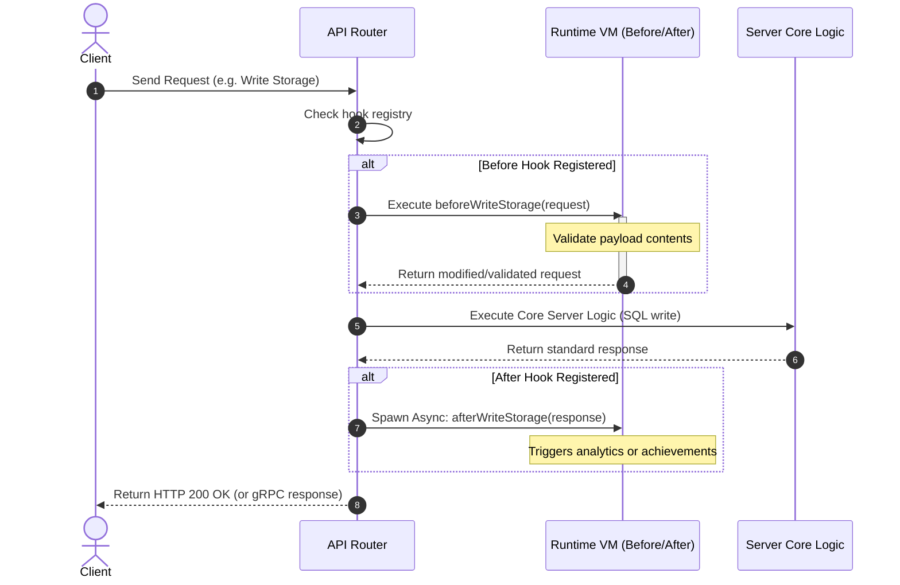

# TDD-18: Server Runtime & Hooks

> **Project:** Ultimate Game Engine — Multiplayer Game Server  
> **Technical Design:** Server Runtime & Hooks  
> **Version:** 1.0  
> **Last Updated:** 2026-07-01  
> **Status:** Draft  
> **Priority:** Technical Architecture

---

## 1. Purpose & Scope

Define the requirements for the server runtime environment that enables developers to write custom business logic, respond to system events, and extend built-in features. The runtime supports multiple programming languages and provides hooks into all major server events.

---

Refer to [BRD-18](../BRD/18_server_runtime_hooks.md) for the business requirements and [PRD-18](../PRD/18_server_runtime_hooks.md) for the API surface.

---

## 2. Architecture & Design Flow

The runtime manager intercepts incoming and outgoing gateway packets. Hooks execute synchronously (before hooks) or asynchronously (after hooks/events).

### Before/After Hook Lifecycle Pipeline


---

## 3. Database Schema & Data Models

Hooks, custom RPC functions, and runtime modules are configured and stored in memory during server startup. No database persistence is used for registrations.

### Go Initializer Registry Structures

```go
package main

type CronJob struct {
	Schedule string
	Handler  func()
}

type HookRegistry struct {
	BeforeHooks map[string]interface{}
	AfterHooks  map[string]interface{}
	EventHooks  map[string][]interface{}
	CronJobs    map[string]*CronJob
}
```

---

## 4. Algorithmic Logic & Execution Flow

### Runtime Boot Lifecycle Algorithm
1. **Module Discovery**: Scan the configured runtime directories (e.g., `modules/*.js`, `modules/*.lua`, `modules/*.so`) for files.
2. **Compilation/Instantiation**:
   - For Go plugins: Load shared library (`.so`) using `plugin.Open()`. Resolve and execute the `InitModule` function.
   - For Lua: Spin up a boot Lua VM, parse files, and load them into memory.
   - For TypeScript: Compile files using the built-in Babel/TSC compiler into raw JavaScript.
3. **Registration Phase**: The runtime calls the `InitModule(ctx, logger, nk, initializer)` entry point. The initializer registers RPCs, hooks, and match modules into the memory registry.
4. **Execution Pool**: Spin up a configured number of VM instances (e.g. `runtime.max_vms = 100`) to process concurrent requests. If an instance is busy, queue requests or spawn transient sandboxes.

### Go Before Hook Interceptor Example

```go
package main

import (
	"context"
	"database/sql"
	"errors"
	"strings"
)

type AuthenticateEmailRequest struct {
	Account struct {
		Email string
	}
}

// Intercept email auth to enforce domain restrictions
func BeforeAuthenticateEmail(ctx context.Context, logger interface{}, db *sql.DB, nk interface{}, in *AuthenticateEmailRequest) (*AuthenticateEmailRequest, error) {
	if !strings.HasSuffix(in.Account.Email, "@example.com") {
		// Return error to reject request and return code to client
		return nil, errors.New("UNAUTHORIZED_EMAIL_DOMAIN")
	}

	// Return the data (optionally modified) to proceed
	return in, nil
}
```

---

## 5. Linked Documents
- [BRD-18](../BRD/18_server_runtime_hooks.md) (Business Requirements Document)
- [PRD-18](../PRD/18_server_runtime_hooks.md) (Product Requirements Document)
