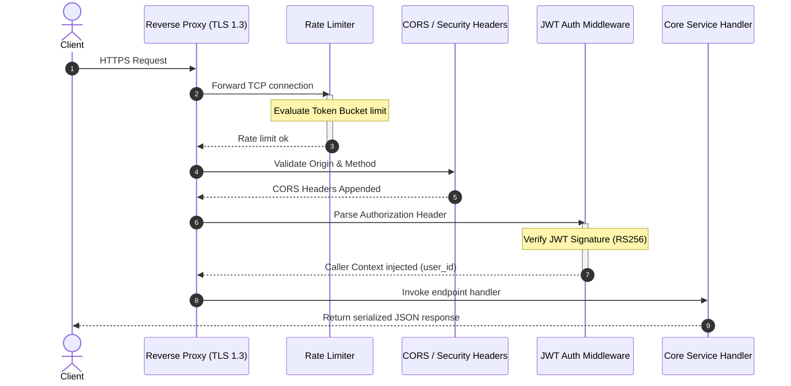

# TDD-19: API Layer (REST, gRPC, WebSocket)

> **Project:** Ultimate Game Engine — Multiplayer Game Server  
> **Technical Design:** API Layer  
> **Version:** 1.0  
> **Last Updated:** 2026-07-01  
> **Status:** Draft  
> **Priority:** Technical Architecture

---

## 1. Purpose & Scope

Define the requirements for the server's communication layer supporting HTTP REST, WebSocket, and gRPC protocols. The API layer serves as the gateway for all client-server and server-to-server interactions, providing consistent, secure, and performant access to all server features.

---

Refer to [BRD-19](../BRD/19_api_layer.md) for the business requirements and [PRD-19](../PRD/19_api_layer.md) for the API surface.

---

## 2. Architecture & Design Flow

The API gateway manages request routing. Incoming connections pass through a sequential pipeline of middleware interceptors before reaching application endpoint handlers.

### Middleware Execution Pipeline


---

## 3. Database Schema & Data Models

The API layer is stateless and does not maintain persistent tables in PostgreSQL. Rate-limit statistics are tracked in-memory (using a fast concurrent map) or distributed across nodes using Redis cache keys.

### Token Bucket In-Memory Structure

```go
type TokenBucket struct {
	tokens         float64
	maxTokens      float64
	refillRate     float64 // tokens per second
	lastRefillTime time.Time
	sync.Mutex
}
```

---

## 4. Algorithmic Logic & Execution Flow

### Rate Limiting Token Bucket Algorithm
To check if request from user $U$ is rate-limited:
1. Load $U$'s active `TokenBucket` state from cache. If not found, initialize with `maxTokens = 100`, `refillRate = 10.0`.
2. Refill tokens based on elapsed time:
   $$\text{elapsed} = \text{now} - \text{lastRefillTime}$$
   $$\text{tokens} = \min(\text{maxTokens}, \text{tokens} + \text{elapsed} \times \text{refillRate})$$
   $$\text{lastRefillTime} = \text{now}$$
3. Check token availability:
   - If $\text{tokens} \ge 1.0$:
     - Decrement: $\text{tokens} = \text{tokens} - 1.0$.
     - Allow request.
   - If $\text{tokens} < 1.0$:
     - Deny request; return HTTP `429 Too Many Requests` (gRPC `RESOURCE_EXHAUSTED`).

### Go Auth Middleware Handler Example

```go
package main

import (
	"context"
	"net/http"
	"strings"
	"github.com/golang-jwt/jwt/v4"
)

type Claims struct {
	UserID   string `json:"sub"`
	Username string `json:"usn"`
	jwt.RegisteredClaims
}

func AuthMiddleware(secretKey string, next http.Handler) http.Handler {
	return http.HandlerFunc(func(w http.ResponseWriter, r *http.Request) {
		authHeader := r.Header.Get("Authorization")
		if authHeader == "" || !strings.HasPrefix(authHeader, "Bearer ") {
			http.Error(w, "Unauthorized", http.StatusUnauthorized)
			return
		}

		tokenStr := strings.TrimPrefix(authHeader, "Bearer ")
		claims := &Claims{}

		token, err := jwt.ParseWithClaims(tokenStr, claims, func(t *jwt.Token) (interface{}, error) {
			return []byte(secretKey), nil
		})

		if err != nil || !token.Valid {
			http.Error(w, "Unauthorized", http.StatusUnauthorized)
			return
		}

		// Inject UserID into request context
		ctx := context.WithValue(r.Context(), "userId", claims.UserID)
		ctx = context.WithValue(ctx, "username", claims.Username)
		next.ServeHTTP(w, r.WithContext(ctx))
	})
}
```

---

## 5. Linked Documents
- [BRD-19](../BRD/19_api_layer.md) (Business Requirements Document)
- [PRD-19](../PRD/19_api_layer.md) (Product Requirements Document)
