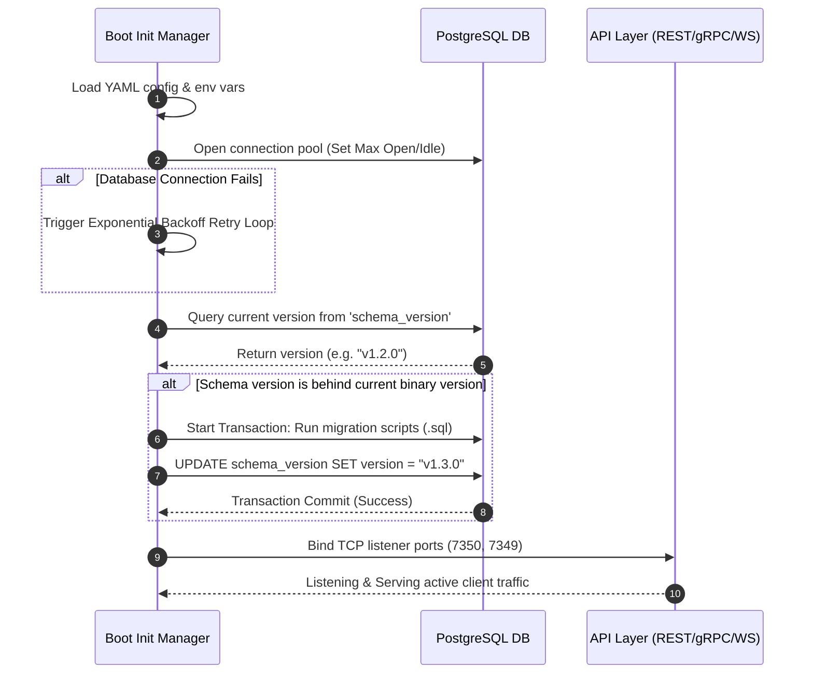

# TDD-20: Database & Infrastructure

> **Project:** Ultimate Game Engine — Multiplayer Game Server  
> **Technical Design:** Database & Infrastructure  
> **Version:** 1.0  
> **Last Updated:** 2026-07-01  
> **Status:** Draft  
> **Priority:** Technical Architecture

---

## 1. Purpose & Scope

Define the requirements for the database layer, server infrastructure, deployment, scaling, monitoring, and operational tooling. PostgreSQL serves as the primary database, with additional infrastructure supporting high availability, observability, and enterprise-grade operations.

---

Refer to [BRD-20](../BRD/20_database_infrastructure.md) for the business requirements and [PRD-20](../PRD/20_database_infrastructure.md) for the API surface.

---

## 2. Architecture & Design Flow

The server boots up by checking database connectivity. Before serving requests, it verifies schema versions and runs migrations transactionally.

### Migration & Boot Sequence Flow


---

### Multi-Node Scaling Architecture

The game server is designed to scale horizontally across multiple instances to support high concurrency and fault tolerance.

- **Stateless Application Nodes:** Game servers run statelessly behind a Load Balancer. Client sessions are validated via JWTs without requiring database lookups.
- **In-Memory Distributed State:** Transient features, such as Matchmaker queues and Realtime Presence, are managed via a distributed in-memory mesh (e.g., Redis cluster) rather than PostgreSQL.
- **Inter-Node Communication:** WebSocket connections terminating on one node can route actions to Authoritative Matches hosted on other nodes via an internal pub/sub or gRPC mesh.
- **Horizontally Scalable Storage:** PostgreSQL handles persistent state (wallets, leaderboards, storage). Read replicas absorb read-heavy traffic. CockroachDB is natively supported for true active-active multi-region scalability.

---

## 3. Database Schema & Data Models

### Raw DDL Schemas

```sql
CREATE TABLE IF NOT EXISTS schema_version (
    version          VARCHAR(64) PRIMARY KEY,
    migration_time   TIMESTAMPTZ DEFAULT CURRENT_TIMESTAMP NOT NULL
);
```

### Table Indexes
Optimal indexing on application tables is detailed in the respective feature TDDs:
- `idx_users_email` (see [TDD-01](./01_user_authentication.md))
- `idx_matchmaking_ticket_lookup` (see [TDD-02](./02_multiplayer_matchmaking.md))
- `idx_leaderboard_record_ranking` (see [TDD-05](./05_leaderboards.md))
- `idx_user_edge_source_lookup` (see [TDD-07](./07_friends_system.md))
- `idx_message_channel_history` (see [TDD-10](./10_chat_system.md))
- `idx_notification_user_unread` (see [TDD-11](./11_notifications.md))
- `idx_storage_user_collection` (see [TDD-12](./12_storage_engine.md))
- `idx_wallet_ledger_user_history` (see [TDD-13](./13_economy_system.md))

---

## 4. Algorithmic Logic & Execution Flow

### Database Connection Retry Algorithm (Exponential Backoff)
When attempting to connect to PostgreSQL at startup:
1. Initialize variables: $\text{retryCount} = 0$, $\text{maxRetries} = 5$, $\text{delay} = 1.0\text{ second}$.
2. Loop while $\text{retryCount} < \text{maxRetries}$:
   - Attempt `db.Ping()`.
   - If successful, return database pool pointer and proceed.
   - If failed:
     - Log error warning.
     - Calculate next wait time: $\text{delay} = \text{delay} \times 2$.
     - Increment $\text{retryCount} = \text{retryCount} + 1$.
     - Sleep for $\text{delay}$ duration.
3. If loop exits without success, raise fatal error and abort startup.

### Go Database Connection Pooling Initialization Example

```go
package main

import (
	"context"
	"database/sql"
	"log"
	"time"
)

func InitDatabasePool(driverName string, dataSourceName string, maxOpen int, maxIdle int, maxLifetime time.Duration) (*sql.DB, error) {
	db, err := sql.Open(driverName, dataSourceName)
	if err != nil {
		return nil, err
	}

	// Configure pool parameters
	db.SetMaxOpenConns(maxOpen)
	db.SetMaxIdleConns(maxIdle)
	db.SetConnMaxLifetime(maxLifetime)

	// Verify connectivity using backoff
	retryDelay := 1 * time.Second
	var pingErr error
	for i := 0; i < 5; i++ {
		ctx, cancel := context.WithTimeout(context.Background(), 2*time.Second)
		pingErr = db.PingContext(ctx)
		cancel()
		if pingErr == nil {
			log.Println("Database connection established successfully")
			return db, nil
		}
		log.Printf("Database connection attempt failed: %v. Retrying in %v...", pingErr, retryDelay)
		time.Sleep(retryDelay)
		retryDelay *= 2
	}

	return nil, pingErr
}
```

---

## 6. Performance & Security Considerations

### Performance
- **Connection Pool Tuning**:
  - `MaxOpenConns`: Set to **2× CPU cores** on the database server (e.g., 32 for a 16-core server).
  - `MaxIdleConns`: Set to 50% of `MaxOpenConns`.
  - `ConnMaxLifetime`: **5 minutes** to prevent stale connections from accumulating.
- **Statement Timeout**: Set PostgreSQL `statement_timeout = 30000` (30 seconds) to prevent runaway queries from holding connections indefinitely.
- **Connection Health Check**: Use `db.PingContext()` with a 2-second timeout before returning connections from the idle pool.
- **Read Replica Routing**: Route all `SELECT` queries (leaderboard reads, friend lists, match history) to read replicas. Only `INSERT`/`UPDATE`/`DELETE` and transactional reads hit the primary.
- **Query Monitoring**: Enable `pg_stat_statements` to track slow queries. Alert on queries exceeding 500ms.
- **Vacuum & Analyze**: Schedule `VACUUM ANALYZE` nightly on high-write tables (`notification`, `message`, `wallet_ledger`, `leaderboard_record`).

### Security
- **Encryption at Rest**: Enable PostgreSQL TDE (Transparent Data Encryption) or use encrypted EBS/disk volumes for all database storage.
- **Encryption in Transit**: Enforce SSL connections between the game server and PostgreSQL (`sslmode=require` minimum, `sslmode=verify-full` recommended).
- **Database Credentials**: Store database connection strings in environment variables or a secrets manager. Rotate credentials every 90 days.
- **Backup & Recovery**:
  - Automated daily backups with **30-day retention**.
  - WAL archiving for point-in-time recovery (PITR) with a 5-minute RPO.
  - Monthly backup restoration tests to verify recoverability.
- **Migration Safety**: Schema migrations must run within a transaction. If any migration step fails, the entire migration must roll back. Never run DDL changes (e.g., `ALTER TABLE`) without a maintenance window for tables with >10M rows.
- **Access Control**: Use separate PostgreSQL roles for the application (limited to DML) and admin (DDL access). The application role must not have `CREATE`, `DROP`, or `ALTER` permissions.
- **Audit Logging**: Enable PostgreSQL `pgaudit` extension to log all DDL changes and superuser operations.

---

## 5. Linked Documents
- [BRD-20](../BRD/20_database_infrastructure.md) (Business Requirements Document)
- [PRD-20](../PRD/20_database_infrastructure.md) (Product Requirements Document)
