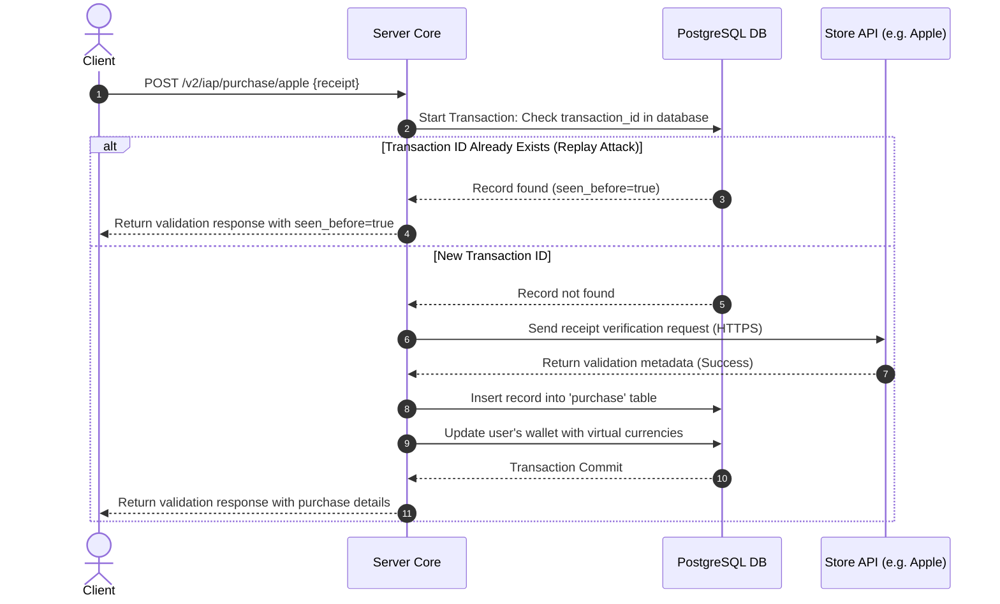

# TDD-21: In-App Purchase (IAP) Validation

> **Project:** Ultimate Game Engine — Multiplayer Game Server  
> **Technical Design:** In-App Purchase Validation  
> **Version:** 1.0  
> **Last Updated:** 2026-07-01  
> **Status:** Draft  
> **Priority:** Technical Architecture  
> **Reference:** [Nakama IAP Validation](https://heroiclabs.com/docs/nakama/concepts/iap-validation/)

---

## 1. Purpose & Scope

Define the technical design for a built-in server-side in-app purchase (IAP) validation system. This system validates purchase receipts from Apple App Store, Google Play, Huawei AppGallery, and Facebook Instant Games, preventing fraud through replay attack detection and receipt verification. This is a built-in feature of the game server, not a custom implementation.

---

Refer to [BRD-21](../BRD/21_iap_validation.md) for the business requirements and [PRD-21](../PRD/21_iap_validation.md) for the API surface.

---

## 2. Architecture & Design Flow

The IAP validation module sits between the API layer and external store services. It parses receipts, validates signatures, checks for replay attacks against historical transactions, and updates player accounts.

### Purchase Receipt Validation Sequence


---

## 3. Database Schema & Data Models

### Raw DDL Schemas

```sql
CREATE TABLE IF NOT EXISTS purchase (
    user_id          UUID NOT NULL REFERENCES users(id) ON DELETE CASCADE,
    product_id       VARCHAR(256) NOT NULL,
    transaction_id   VARCHAR(256) PRIMARY KEY,
    store            SMALLINT NOT NULL, -- 0=Apple, 1=Google, 2=Huawei, 3=Facebook
    raw_response     JSONB DEFAULT '{}'::jsonb NOT NULL,
    purchase_time    TIMESTAMPTZ NOT NULL,
    refund_time      TIMESTAMPTZ,
    environment      SMALLINT DEFAULT 0 NOT NULL, -- 0=unknown, 1=sandbox, 2=production
    seen_before      BOOLEAN DEFAULT FALSE NOT NULL,
    create_time      TIMESTAMPTZ DEFAULT CURRENT_TIMESTAMP NOT NULL,
    update_time      TIMESTAMPTZ DEFAULT CURRENT_TIMESTAMP NOT NULL
);

CREATE TABLE IF NOT EXISTS subscription (
    user_id          UUID NOT NULL REFERENCES users(id) ON DELETE CASCADE,
    product_id       VARCHAR(256) NOT NULL,
    original_txn_id  VARCHAR(256) PRIMARY KEY,
    store            SMALLINT NOT NULL,
    raw_response     JSONB DEFAULT '{}'::jsonb NOT NULL,
    purchase_time    TIMESTAMPTZ NOT NULL,
    expiry_time      TIMESTAMPTZ NOT NULL,
    refund_time      TIMESTAMPTZ,
    environment      SMALLINT DEFAULT 0 NOT NULL,
    active           BOOLEAN DEFAULT TRUE NOT NULL,
    create_time      TIMESTAMPTZ DEFAULT CURRENT_TIMESTAMP NOT NULL,
    update_time      TIMESTAMPTZ DEFAULT CURRENT_TIMESTAMP NOT NULL
);
```

### Table Indexes

```sql
-- Index for listing all purchases made by a specific player
CREATE INDEX IF NOT EXISTS idx_purchase_user_history
ON purchase (user_id, create_time DESC);

-- Index for checking active subscription durations
CREATE INDEX IF NOT EXISTS idx_subscription_expiry
ON subscription (user_id, expiry_time DESC)
WHERE active = TRUE;
```

---

## 4. Algorithmic Logic & Execution Flow

### Replay Attack and Verification Logic
1. Receive receipt validation request. Parse raw fields and extract the distinct transaction identifier ($T_{id}$).
2. Start database transaction. Query table `purchase` for $T_{id}$ to prevent fraud:
   ```sql
   SELECT user_id, seen_before FROM purchase WHERE transaction_id = $1 FOR UPDATE;
   ```
3. If record exists:
   - Mark `seen_before = true`.
   - Rollback transaction and return response back to client with `seen_before = true` indicator (prevents duplicate rewards).
4. If record does not exist:
   - Dispatch HTTP POST request to App Store/Google Play API containing credentials and receipt payload.
   - Verify signatures and return values. Ensure the bundle ID matches the application.
   - Insert transaction metadata into `purchase` table.
   - Perform atomic wallet modification (see [TDD-13](./13_economy_system.md)) to credit purchased goods.
   - Commit transaction.

### Go Store Response Parsing & Validation Example

```go
package main

import (
	"context"
	"database/sql"
	"errors"
	"time"
)

type StorePurchase struct {
	TransactionID string
	ProductID     string
	PurchaseTime  time.Time
	Environment   int
}

func ProcessAppleValidationTx(ctx context.Context, db *sql.DB, userID string, p StorePurchase, rawResponse string) error {
	tx, err := db.BeginTx(ctx, nil)
	if err != nil {
		return err
	}
	defer tx.Rollback()

	// 1. Check duplicate
	var existingUser string
	err = tx.QueryRowContext(ctx, "SELECT user_id FROM purchase WHERE transaction_id = $1", p.TransactionID).Scan(&existingUser)
	if err == nil {
		return errors.New("TRANSACTION_SEEN_BEFORE")
	}

	// 2. Insert validated transaction log
	_, err = tx.ExecContext(ctx, `
		INSERT INTO purchase (user_id, product_id, transaction_id, store, raw_response, purchase_time, environment, seen_before)
		VALUES ($1, $2, $3, 0, $4, $5, $6, false)`,
		userID, p.ProductID, p.TransactionID, rawResponse, p.PurchaseTime, p.Environment)
	if err != nil {
		return err
	}

	// 3. Trigger wallet credit (e.g. 50 gems for gems_pack_100)
	var coinsDelta int64 = 0
	if p.ProductID == "gems_pack_100" {
		coinsDelta = 100
	}
	if coinsDelta > 0 {
		_, err = tx.ExecContext(ctx, `
			UPDATE users 
			SET wallet = jsonb_set(wallet, '{gems}', (COALESCE((wallet->>'gems')::int, 0) + $1)::text::jsonb)
			WHERE id = $2`,
			coinsDelta, userID)
		if err != nil {
			return err
		}
	}

	return tx.Commit()
}
```

---

## 5. Linked Documents
- [BRD-21](../BRD/21_iap_validation.md) (Business Requirements Document)
- [PRD-21](../PRD/21_iap_validation.md) (Product Requirements Document)
