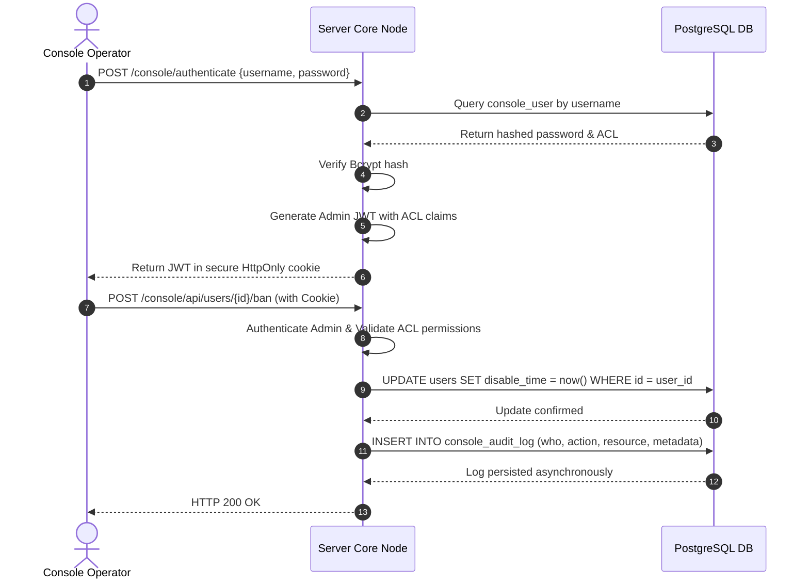

# TDD-22: Console Admin

> **Project:** Ultimate Game Engine — Multiplayer Game Server  
> **Technical Design:** Console Admin  
> **Version:** 1.0  
> **Last Updated:** 2026-07-09  
> **Status:** Draft  
> **Priority:** Technical Architecture

---

## 1. Purpose & Scope

The Console Admin system provides administrative tools, system metrics, configuration options, and player moderation interfaces for developers, operators, and customer support representatives. It is designed to run securely and independently of game client traffic.

---

Refer to [BRD-22](../BRD/22_console_admin.md) for the business requirements and [PRD-22](../PRD/22_console_admin.md) for the API surface.

---

## 2. Architecture & Design Flow

The Console Admin runs as an integrated service on server nodes, exposing its REST API on a separate, dedicated port (default: `7351`) to isolate administrative traffic and allow firewall/VPN shielding. 

Authentication is separate from player sessions. It uses admin JWTs containing fine-grained permission claims, stored in secure `HttpOnly` cookies.

### Admin Authentication and Mutation Flow


---

## 3. Database Schema & Data Models

### Raw DDL Schemas

```sql
-- Console User Table
CREATE TABLE IF NOT EXISTS console_user (
    PRIMARY KEY (id),

    id                  UUID NOT NULL,
    username            VARCHAR(128) NOT NULL CONSTRAINT console_user_username_uniq UNIQUE,
    email               VARCHAR(255) NOT NULL CONSTRAINT console_user_email_uniq UNIQUE,
    password            BYTEA CHECK (length(password) < 32000),
    acl                 JSONB NOT NULL DEFAULT '{"admin":false}'::jsonb,
    metadata            JSONB NOT NULL DEFAULT '{}',
    create_time         TIMESTAMPTZ NOT NULL DEFAULT now(),
    update_time         TIMESTAMPTZ NOT NULL DEFAULT now(),
    disable_time        TIMESTAMPTZ NOT NULL DEFAULT '1970-01-01 00:00:00 UTC',
    mfa_secret          BYTEA DEFAULT NULL,
    mfa_recovery_codes  BYTEA DEFAULT NULL,
    mfa_required        BOOLEAN DEFAULT FALSE
);

-- Console Audit Log Table (No FK to allow user deletion while preserving immutable log)
CREATE TABLE IF NOT EXISTS console_audit_log (
    PRIMARY KEY (create_time, console_username, action, resource, id),
    UNIQUE (id),

    id                  UUID NOT NULL,
    console_user_id     UUID NOT NULL,
    console_username    TEXT NOT NULL,
    email               TEXT NOT NULL,
    action              TEXT NOT NULL,
    resource            TEXT NOT NULL,
    message             TEXT NOT NULL,
    metadata            JSONB NOT NULL DEFAULT '{}',
    create_time         TIMESTAMPTZ NOT NULL DEFAULT now()
);

-- Console ACL Template Table
CREATE TABLE IF NOT EXISTS console_acl_template (
    PRIMARY KEY (id),

    id                  UUID NOT NULL,
    name                VARCHAR(64) NOT NULL CHECK (length(name) > 0) CONSTRAINT template_name_uniq UNIQUE,
    description         VARCHAR(64) NOT NULL DEFAULT '',
    acl                 JSONB NOT NULL DEFAULT '{}',
    create_time         TIMESTAMPTZ NOT NULL DEFAULT now(),
    update_time         TIMESTAMPTZ NOT NULL DEFAULT now()
);

-- Setting Table
CREATE TABLE IF NOT EXISTS setting (
    PRIMARY KEY (name),

    name                VARCHAR(64) NOT NULL CHECK (length(name) > 0) CONSTRAINT setting_name_uniq UNIQUE,
    value               JSONB NOT NULL DEFAULT '{}',
    update_time         TIMESTAMPTZ NOT NULL DEFAULT now()
);

-- Users Notes Table
CREATE TABLE IF NOT EXISTS users_notes (
    PRIMARY KEY (user_id, create_time, id),
    FOREIGN KEY (user_id) REFERENCES users(id) ON DELETE CASCADE,
    UNIQUE (id),

    id                  UUID NOT NULL,
    user_id             UUID NOT NULL,
    create_time         TIMESTAMPTZ NOT NULL DEFAULT now(),
    update_time         TIMESTAMPTZ NOT NULL DEFAULT now(),
    note                TEXT NOT NULL,
    create_id           UUID DEFAULT NULL,
    update_id           UUID DEFAULT NULL
);
```

### Table Indexes

```sql
CREATE INDEX IF NOT EXISTS idx_users_notes_user_id ON users_notes(user_id);
```

---

## 4. Algorithmic Logic & Execution Flow

### Fine-Grained ACL Permission Check
1. The request context contains the authenticated administrator's `acl` JSONB payload.
2. The permission verification middleware evaluates specific path action rules:
   - For example, when calling `POST /console/api/users/{id}/ban`, verify if `acl.admin == true` or `acl.write_players == true`.
3. If the boolean permission flag evaluates to `true`, the middleware continues to the target handler.
4. If not, the request terminates immediately with `403 Forbidden`.

### Player Search Query Implementation
Admin search requests use ILIKE pattern matching or Bleve full-text indexing. To avoid database degradation:
1. Trigram index `idx_users_display_name_trgm` supports fast database substring searches on `display_name`.
2. A hard execution timeout of **5 seconds** and a limit of **50 records** are enforced.
3. If search inputs are too generic (e.g., less than 3 characters), the API rejects database-level searches to prevent performance spikes.
4. For advanced querying and logging indexation, the system uses Bleve (`github.com/blevesearch/bleve`) to build full-text search indexes on player metadata, console settings, and audit logs. This provides fuzzy matching and pagination capabilities offloaded from the primary datastore.

---

## 5. Performance & Security Considerations

### Performance
- **Separate Port Multiplexing:** Console endpoints run on port `7351` using a dedicated HTTP listener thread, preventing admin query volume from consuming the main port `7350` connection slots.
- **Audit Log Write Path:** Write operations to `console_audit_log` are executed asynchronously using a non-blocking queue to prevent write latency from delaying admin response times.
- **No Cascade on Audit Log:** The `console_audit_log` does not reference `console_user(id)` via foreign key constraint, preventing table lock conflicts and slow user deletions.

### Security
- **MFA Enforcement:** Supports Multi-Factor Authentication via TOTP. When `mfa_required` is true, authentication requests must supply a valid one-time code verified against `mfa_secret`.
- **Audit Immutability:** The audit log table is insert-only. No UPDATE or DELETE privileges are granted on this table to standard database roles.
- **XSS & CSRF Mitigation:** Session tokens are transmitted exclusively in `HttpOnly` and `SameSite=Strict` cookies.

---

## 6. Linked Documents
- [BRD-22](../BRD/22_console_admin.md) (Business Requirements Document)
- [PRD-22](../PRD/22_console_admin.md) (Product Requirements Document)
